## 三、UVM

### 1. 基础

[参见 《uvm实战》速查 ](#Ctrl跳转8)


### 2. 框架

分层的 验证环境结构

```verilog
"""UVM 框架结构"""
## [数据]
	Object:
                    tr  -- uvm_sequence_item        // 子弹
					seq -- uvm_sequence #(seq_item)       // 弹夹
## [组件]
	Component:
                   seqr -- uvm_sequencer #(seq_item)     // 手枪
                 driver -- uvm_driver #(seq_item)                                                
                     if -- interface...endinterface  
                monitor -- uvm_monitor                                                     
                   fifo -- module...endmodule       
        reference model -- uvm_component              // component最大类
             scoreboard -- uvm_scoreboard
                  agent -- uvm_agent
                    env -- uvm_env
                     tc -- uvm_test
                     tp -- module...endmodule       
                adapter -- uvm_reg_adapter            // 寄存器   
## [连接]
                           uvm_*_port	
                           uvm_*_socket        // uvm 2.0

## [如何 run起来UVM、如何结束？]
1、编译： -ntb_opts uvm-1.1
2、仿真：+UVM_TESTNAME=tc_name     // class中factory注册的名称
3、《top.sv》：  initial begin  
    				run_test();
				end
## []
```


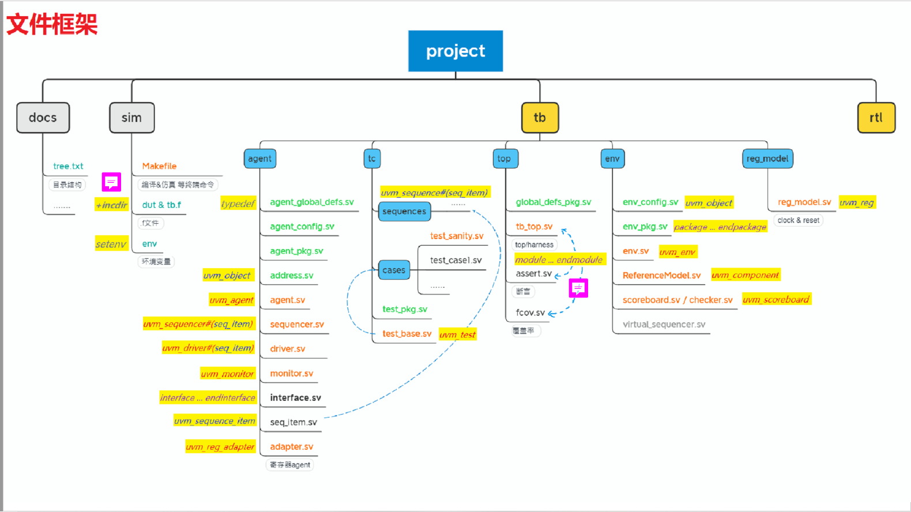


## <a name="Ctrl跳转8">四、《uvm实战》速查</a>

### Ch. 2_框架

<font color=red>**要点总结**：</font>

#### ◻ interface 

- 主要作用：存放变量（输入/输出)

- 注意事项：`interface`内部不能还有`module`，但是可以有 `interface`、<font color=red>`modport` </font>(捆绑信号&定义信号方向)

- 优点缺点：

  ```apl
  """接口的优缺点"""
  【优点】
  ### 核心：接口带来的好处是所有的[声明集中]在一个地方，减少了出错的几率。
  1、便于设计重用：
  	- 2个模块之间超过2个以上的信号，并使用特定的协议通信，应用接口
  	- 如果信号组一次又一次地重复出现（例如网络交换机），应用 虚拟接口（virtual interface）
  2、可以用来替代原来需要在模块/程序中 [反复声明] 并且 位于代码内部的一系列信号，[减少]了连接[错误]的可能性。
  3、要增加新的信号时，在接口中[只需要声明一次]，不需要在更高层的模块层声明，这进一步减少了错误
  4、modport 允许一个模块很方便地将接口中的[一系列信号捆绑到一起]，也可以[为信号指定方向]以方便工具自动检查。
  
  【缺点】
  1、对于点对点的连接，使用modport的接口描述跟使用信号列表的端口一样的冗长。
  2、必须同时使用 [信号名] 和 [接口名]，可能会使模块变得更加[冗长]
  3、如果要连接的2个模块使用的是一个不会被重用的专用协议，那么使用接口需要做比端口连线更多的工作
  4、连接2个不同的接口很困难：一个新的接口（bus_if）可能包含了现有接口（arb_if）的所有信号并新增了信号（地址、数据等等）。你需要拆分出独立的信号并正确的驱动它们。
  ```

  

- 示例代码：

  ```verilog
  """interface示例"""
  ## 《interface代码》定义
  interface my_if(input bit clk);
      logic [1:0] grant,request;
      logic rst;    
  endinterface
  
  
  ## 《RTL代码》使用interface
  //@@ 未使用接口
  module arb(output logic [1:0] grant,
                  input logic [1:0] request,
                  input logic rst,
                  input logic clk);
      ...
      always @(posedge clk or posedge rst) begin
          if (rst)
              grant <= 2'b00;
          else
              ...
      end
  endmodule
  
  //@@ 使用接口
  module arb(my_if  myif);
      ...
      always @(posedge myif.clk or posedge myif.rst) begin
          if (myif.rst)
              myif.grant <= 2'b00;
          else
              myif.grant <= next_grant;
          ...
      end
  endmodule
              
              
  ## 《test_bench代码》使用interface
  module top;
      bit clk;
      
      always #5 clk = ~clk;
  
      my_if  myif(clk);
  
      // 设计代码例化：此处为接口
      arb_port  a1(.grant     (myif.grant),
                   .request   (myif.request),
                   .rst       (myif.rst),
                   .clk       (myif.clk));
      
       // test case 例化
      test  t1(myif);
  
  endmodule
  ```

  


##### ▨  clocking  时钟块

- 功能： 定义时间的 <font color=blue>触发条件 @</font>

- 示例

  ```verilog
  """clocking 时钟块 是 interface 的子模块"""
  ##《interface代码》
  interface my_if(input bit clk);
      logic [1:0] grant,request;
      logic rst;
      
      //@@ 定义时钟块
      clocking cb @(posedge clk);        //@@ 声明cb
          output request;
          input grant;
      endclocking 
      
      //@@ 时钟块被引用
      modport TEST(clocking cb,    //@@ 
                   output rst);
      
      modport DUT(input request,rst,
                  output grant);
      
  endinterface
          
  ##《test_bench代码》使用时钟块
  module test(my_if.TEST myif);        
  	initial begin
      	myif.cb.request <= 0;
          @myif.cb;            //@@ 参照上面，本质是 @(posedge clk)
          $display("@%0t:Grant=%b",$time,myif.cb.grant);       //@@ 
      end
  endmodule
  ```

  


##### ▨ virtual interface

- 应用场景

  如果信号组一次又一次地重复出现（例如网络交换机），应该用 虚拟接口（virtual interface）

- 示例：

  在 **<font color=blue>driver</font>**、**<font color=blue>monitor</font>** 里面 用的都是 `virtual interface `

  原因是：
  ①  可以保持 `testbench` 和 `rtl `是 <font color=blue>动态分割开的 2个环境</font>
  ②  只有 <font color=blue>在使用时</font>，使用 `virtual interface`去连接2个真实的环境，并不是真正的实际的连接，所以是虚拟的`virtual`


##### ▨ modport

- 功能 

  允许一个模块很方便地将接口中的一系列 <font color=blue>信号捆绑</font> 到一起，也可以为<font color=blue>信号指定方向（input / output）</font>以方便工具自动检查。

- 示例

  ```verilog
  """modport 是 interface 的子模块"""
  ## 《interface代码》
  interface my_if(input bit clk);
      logic [1:0] grant,request;
      logic rst;
      
      modport TEST(output request,rst,
                   input grant,clk);
      
      modport DUT(input request,rst,clk,
                  output grant);
      
      modport MONITOR(input request,grant,rst,clk);
      
  endinterface
  
  
  ##《test_bech代码》使用modport
  module arb(my_if.DUT myif);
  	...
  endmodule
  ```


补充：

- interface  高阶： [参见【10.1.1 interface】 ](#Ctrl跳转3)


### Ch. 3_uvm基础

<font color=red>**要点总结**：</font><font color=red>field_automation机制</font>、<font color=red>report机制</font>、<font color=red>config_db机制</font>

#### 3.1~3.2 树形结构

- 派生类

  - `uvm_objec`

    - `config`

      直接派生自 `uvm_object`

      

    - `uvm_phase`

      派生自 `uvm_object`， 其主要作用为控制`uvm_component` 的行为方式

    

    - <font color=blue>寄存器（register model）相关类</font>

      ```verilog
      uvm_reg_item
      uvm_reg_map
      uvm_mem            // 比较特殊
      uvm_reg_field
      uvm_reg
      uvm_reg_file
      uvm_reg_block
      ```

    

  - `uvm_component`

    - `uvm_monitor`

      `monitor`则是 <font color=blue>从DUT的`pin`上</font> 接收数据，并且把接收到的数据转换成`transaction`级别的`sequence_item`，再把转换后的数据发送给`scoreboard`

      

    - `reference model`

      模仿DUT，完成与DUT相同的功能
      具备SV高级语言的特性，同时还可以通过DPI等接口  <font color=blue>调用其他语言</font>	

      

    - `uvm_agent`

      从 <font color=blue>代码可重用性</font> 角度考量
      与`uvm_component` 相比，`uvm_agent` 的最大改动在于引入了一个<font color=blue>（结构性枚举变量）变量 `is_active`</font>：

    

    - `uvm_test`

      任何一个派生出的测试用例中，都要实例化`env`， 只有这样，当测试用例在运行的时候，才能把数据正常地发给DUT，并正常地接收DUT的数据。

    

- 相关的宏	

  —— `component`  与之 一一对应

  | object 相关宏                       | 注释                                                         | 备注                                                         |
  | ----------------------------------- | ------------------------------------------------------------ | ------------------------------------------------------------ |
  | `uvm_object_utils                   | object类 注册到factory                                       |                                                              |
  | `uvm_object_param_utils             | object <font color=red>参数化类</font> 注册到factory         | 参数化的类，示例：<br />class A#(int WIDTH=32) extends uvm_object; |
  | `uvm_object_utils_begin (my_object) | object类 注册到factory，且某些成员变量需要使用field_automation机制<br /><font color=blue>搭配：`uvm_object_utils_end</font> |                                                              |
  | `uvm_object_param_utils_begin       | object <font color=red>参数化类</font> 注册到factory，且某些成员变量需要使用field_automation机制<br /><font color=blue>搭配：`uvm_object_utils_end</font> |                                                              |

  

- `uvm_component`  vs  `uvm_object`

  - 派生自`uvm_object`,  但`uvm_component`有两大特性是`uvm_object`所没有的：

    ​	①  一是通过在`new`的时候指定`parent`参数来形成一种 <font color=blue>树形的组织结构</font>
    ​	②  二是有`phase`的自动执行特点

  - `uvm_object`可以使用 `clone函数`，`uvm_component` 不行（但是可以使用 `copy函数`）

    <font color=blue>  `clone` =  `new`   + `copy`  </font>

    `copy`  的前提是，必须已经例化，分配了内存空间

    `clone` 不用，它可以指向一个 <font color=red>空指针</font>

    

  - `uvm_component` 的另外一个限制是：

    位于同一个父结点下的不同的`component`，在  <font color=blue>实例化时不能使用相同的名字</font> 

    

  - `uvm_component` 在整个 <font color=blue>仿真中 </font>是一直存在的

  

- 树结构

  - `uvm_component` 中的 <font color=red>`parent参数`</font>  ==》  实现 <font color=blue> 树结构 </font>

    在例化指定`parent`的同时，会在 `component`类中 维护一个数组<font color=red> `m_children` </font>

    ```verilog
    """通过 parent参数，实现树结构"""
    //@@ A 是 b_inst 的 parent
    class B extends uvm_component;
        … 
    endclass
    
    class A extends uvm_component; 
    	B b_inst;
    	virtual function void build_phase(uvm_phase phase); 
            b_inst = new("b_inst", this);  //@@ 此处的this，代表的就是A类。  即  A类是 b_inst 的 parent
            //@@ 当b_inst实例化的时候，指定一个parent的变量，同时在每一个component的内部维护一个数组m_children
        endfunction 
    endclass
    ```

    

  - 树根

    ①  树根不是 `uvm_test`，而是 <font color=blue>全局变量</font> <font color=red>`uvm_top`</font>（<font color=red>`uvm_root`</font> 的唯一实例，`uvm_root` 派生自 `uvm_component`）

    ②  `uvm_test_top` 的 `parent` 是 `uvm_top`

    ③  `uvm_top` 的 `parent` 则是<font color=red> `null`</font>（若指定`parent`是 `null`，那都会到 `uvm_top`下面，，确保了整个平台只有一棵树）

    ④  `uvm_top` 是一个 全局变量，可以直接使用。

    ```verilog
    """uvm_root采用的是单例模式/单态模式"""
    	uvm_root	 top; 
    	top=uvm_root::get();
    ```

     

    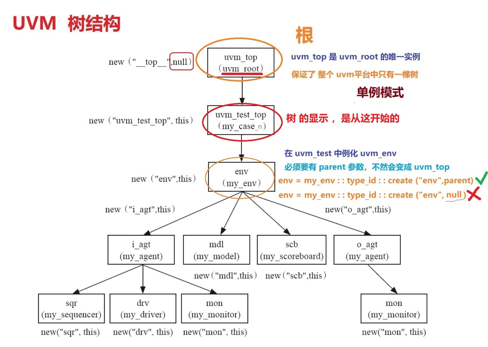

  
  - 相关函数

    ——访问UVM树中的结点

    | uvm代码                                                 | 注释                                                         |
    | ------------------------------------------------------- | ------------------------------------------------------------ |
    | get_parent ();                                          | 得到子组件 的 （父组件类）`parent`类                         |
    | get_child (<string childname>)                          | 得到父组件 的    子组件`childname`的 指针<br />`name` 是该 <font color=blue>子组件</font> 例化时指定的名字 |
    | get_children（<ref    uvm_component      children[$]>） | 得到父组件 的     所有`child` 的 指针，放入名为`children`的数组<br /><font color=blue>`children[$]` 是作为 `ref` 类型传递</font> |
    | get_first_child (<ref string childname>)                | 得到父组件  的  第一个子组件  的指针，放入 `childname` <br /><font color=blue>`name` 是作为 `ref` 类型传递</font> |
    | get_next_child (<ref string childname>)                 | 得到父组件  的  下一个子组件  的指针，放入 `childname`<br /><font color=blue>`name` 是作为 `ref` 类型传递</font> |
    | get_num_children ();                                    | 得到类 的所有`child` 的数量                                  |
    | has_child                                               | 返回1，有子组件； <br />返回0，无子组件                      |
    | get_depth                                               | 返回该`component`深度（从`uvm_test_top`开始算）              |

    ```verilog
    """函数应用示例"""
    ## 《get_children》
        uvm_component     array[$];
    
        my_comp.get_children(array);    //@@ 
        foreach(array[i])
            do_something(array[i]);
    
    ##《get_first_child 、get_next_child》
    string 			  name;      
    
    uvm_component	 child;
    if (comp.get_first_child(name))        //@@   得到父组件  的  第一个子组件  的指针，放入 `name`
        do begin
            child = comp.get_child(name);       //@@
            child.print();
        end while (comp.get_next_child(name));      //@@
    ```

    


#### 3.3 field_automation机制

- 作用：
  ①  对`tr` 进行`factory`注册，可以直接调用 <font color=blue>`copy`、`compare`、`print`、`record`、`pack` </font> 函数

  ②  能 <font color=blue>简化</font> `driver`和 `monitor` <font color=blue>代码</font>

  ③  `field automation` 机制还提供  <font color=blue>自动得到</font>  使用`config_db：：set`设置的参数的功能，
        <a name="Ctrl跳转4">此时</a>可以 <font color=red>省略 `config_db::get`，但是有3个前提条件：</font>
  				a.    组件进行过 <font color=blue>`factory`  </font>登记注册           （例如：uvm_component_utils（my_driver)）
          		b.    变量进行过<font color=blue> `field_automation` </font>注册 （例如： uvm_field_int(pre_num)）
                  c.     **set** 函数中的 <font color=blue>第三个参数</font>必须与 **get** 函数中的 名称相同（变量名称相同）

  ​	  那么，当在 `build_phase`  函数 中调用	<font color=red>  `super.build_phase(phase) ` </font>时， 自动  `get`了变量值，不再需要以下代码：
  
  ```verilog
  """被省略掉的config_db::get代码"""
  uvm_config_db#(int)::get(this,"", "pre_num", pre_num);
  ```
  
  

- `field_automation `**宏**

  <font color=red>**注册factory**</font>

  | uvm代码                                                      | 注释                                                         |
  | ------------------------------------------------------------ | ------------------------------------------------------------ |
  | <font color=blue>**常规**</font>                             |                                                              |
  | \`uvm_field_int     (ARG,   FLAG)                            | 注册   整数型  变量：`ARG` ，标志位：`FLAG`                  |
  | `uvm_field_real   (ARG,   FLAG)                              | <font color=violet>**......................实数型/浮点数.......**</font> |
  | `uvm_field_enum   (T,    ARG,   FLAG)                        | ......................枚举型.....................，  <font color=blue>有3个参数，分别是：类、变量、权限操作</font> |
  | `uvm_field_object   (ARG,   FLAG)                            | ......................object.....................            |
  | `uvm_field_event    (ARG,   FLAG)                            | <font color=violet>**......................事件........................**</font> |
  | `uvm_field_string    (ARG,   FLAG)                           | ......................字符串....................             |
  | <font color=blue>**动态数组**</font>                         |                                                              |
  | `uvm_field\_<font color=violet>**array**</font>\_int  (ARG,    FLAG) | ......................动态数组-整数型...............         |
  | `uvm_field_array_enum   (ARG,    FLAG)                       | ......................动态数组-枚举型...............，  <font color=blue>2个参数</font> |
  | `uvm_field_array_object   (ARG,    FLAG)                     | ......................动态数组-object................        |
  | `uvm_field_array_string   (ARG,   FLAG)                      | ......................动态数组-字符串................        |
  | <font color=blue>**静态数组**</font>                         |                                                              |
  | `uvm_field\_<font color=violet>**sarray**</font>\_int  (ARG,    FLAG) | ......................静态数组-整数型...............         |
  | `uvm_field_sarray_enum   (ARG,FLAG)                          | ......................静态数组-枚举型...............，  <font color=blue>2个参数</font> |
  | `uvm_field_sarray_object  (ARG,FLAG)                         | ......................静态数组-object................        |
  | `uvm_field_sarray_string  (ARG,FLAG)                         | ......................静态数组-字符串................        |
  | <font color=blue>**队列**</font>                             |                                                              |
  | `uvm_field\_<font color=violet>**queue**</font>\_int  (ARG,    FLAG) | ......................队列-整数型...............             |
  | `uvm_field_queue_enum   (ARG,FLAG)                           | ......................队列-枚举型...............，  <font color=blue>2个参数</font> |
  | `uvm_field_queue_object  (ARG,FLAG)                          | ......................队列-object................            |
  | `uvm_field_queue_string  (ARG,FLAG)                          | ......................队列-字符串................            |
  | <font color=blue>**联合数组（共15种）**</font>               | <font color=red>**索引**：大类只能是 **数值/字符串**<br />**值**：可以是 **int**、**string**、**object**</font><br />第1个是  **<font color=red>存储数据</font>**类型，第2个是 **<font color=red>索引</font>**的类型 |
  | <font color=gree> **值：int <br />索引：xx** </font>         |                                                              |
  | `uvm_field\_<font color=violet>**aa**</font>\_int\_<font color=violet>**int**</font>  (ARG, FLAG) | ..........联合数组-存储数据：int，索引：int<font color=greay>（双态，32位）</font> ..... |
  | `uvm_field_aa_int_int_unsigned  (ARG, FLAG)                  | ..........联合数组-<font color=blue>存储数据：int，索引：无符号int </font>       .............. |
  | `uvm_field_aa_int\_<font color=violet>**byte**</font>  (ARG, FLAG) | ..........联合数组-存储数据：int，索引：byte<font color=greay>（双态，8位）</font>...... |
  | `uvm_field_aa_int_byte_unsigned  (ARG, FLAG)                 | ..........联合数组-存储数据：int，索引：无符号byte       .............. |
  | `uvm_field_aa_int\_<font color=violet>**integer**</font>  (ARG, FLAG) | ..........联合数组-存储数据：int，索引：integer<font color=greay>（四态，32位）</font>.. |
  | `uvm_field_aa_int_integer_unsigned(ARG, FLAG)                | ..........联合数组-存储数据：int，索引：无符号integer       .......... |
  | `uvm_field_aa_int\_<font color=violet>**shortint**</font>  (ARG, FLAG) | ..........联合数组-存储数据：int，索引：shortint<font color=greay>（双态，16位）</font>.. |
  | `uvm_field_aa_int_shortint_unsigned(ARG, FLAG)               | ..........联合数组-存储数据：int，索引：无符号shortint    .............. |
  | `uvm_field_aa_int\_<font color=violet>**longint**</font>  (ARG, FLAG) | ..........联合数组-存储数据：int，索引：longint<font color=greay>（双态，64位）</font>.. |
  | `uvm_field_aa_int_longint_unsigned(ARG, FLAG)                | ..........联合数组-存储数据：int，索引：无符号longint    .............. |
  | `uvm_field_aa_int\_<font color=violet>**string**</font>  (ARG, FLAG) | ..........联合数组-存储数据：int，索引：string                  .............. |
  | <font color=gree>**值：string**<br />**索引： xx** </font>   |                                                              |
  | `uvm_field_aa_string_<font color=violet>**int**</font>  (ARG, FLAG) | ...........联合数组-存储数据：string，索引：int              ............. |
  | `uvm_field_aa_string_<font color=violet>**string**</font>  (ARG, FLAG) | ...........联合数组-存储数据：string，索引：string        ............. |
  | <font color=gree>**值：object**<br />**索引： xx** </font>   |                                                              |
  | `uvm_field_aa_object_<font color=violet>**int**</font>  (ARG, FLAG) | ...........联合数组-存储数据：object，索引：int          .............. |
  | `uvm_field_aa_object_<font color=violet>**string**</font>  (ARG, FLAG) | ...........联合数组-存储数据：object，索引：string    .............. |

  枚举类型-示例

  ```verilog
  """field_automation:枚举类型-示例 """
  ## 《常规的》
  typedef enum {TB_TRUE, TB_FALSE} 	tb_bool_e;
  	…
  	tb_bool_e tb_flag;
  	…
      `uvm_field_enum(tb_bool_e,	 tb_flag,	 UVM_ALL_ON)   //@@ 类，变量，Flag
  ```


- `field_automation `**标志位  `FLAG `**

  ```verilog
  """标志位 `FLAG`"""
  UVM_ALL_ON       //@@ 打开`copy`、`compare`、`print`、`record`、`pack`功能       
  
  UVM_COPY        //@@ 复制（copy）     
  UVM_NOCOPY      
  
  UVM_COMPARE     //@@ 比较（compare）    
  UVM_NOCOMPARE   
  
  UVM_PRINT       //@@ 打印（print）
  UVM_NOPRINT
  
  UVM_RECORD      //@@ 记录（record）
  UVM_NORECORD
  
  UVM_PACK        //@@ 打包（pack）
  UVM_NOPACK
  ```

  

  

- `field_automation `**函数**

  | 函数                                     | 公式                                                         | 注释                                                         | 示例                                |
  | ---------------------------------------- | ------------------------------------------------------------ | ------------------------------------------------------------ | ----------------------------------- |
  | copy                                     | copy (uvm_object     rhs)                                    | 实例复制，使用前必须例化（new）过                            | B.copy（A）    把A实例复制到B实例中 |
  | compare                                  | compare (uvm_object     rhs,     uvm_comparer comparer=null) | 比较两个实例是否一样，一样返回1，否则0                       | A.compare（B）                      |
  | print                                    |                                                              | 打印所有的字段                                               |                                     |
  | clone                                    | clone ()                                                     | clone = new +copy                                            | A.clone()                           |
  | pack                                     | pack (ref bit bitstream[],     <br />input uvm_packer packer=null) | 将所有的字段打包成 <font color=blue>bit流</font>             |                                     |
  | unpack                                   | unpack (ref bit bitstream[],  <br />                input uvm_packer packer=null) | 将一个 bit流  逐一恢复到某个类的实例中                       |                                     |
  | pack_<font color=violet>**bytes**</font> | pack_bytes (<br />ref byte unsigned bytestream[],<br />input uvm_packer packer=null  ) | 将所有的字段打包成 <font color=blue>byte流</font>            |                                     |
  | unpack_bytes                             | unpack_bytes (<br />ref byte unsigned bytestream[],<br />input uvm_packer packer=null) | 将一个 byte流  逐一恢复到某个类的实例中                      |                                     |
  | pack_<font color=violet>**ints**</font>  | pack_ints (<br />ref int unsigned intstream[],<br />input uvm_packer packer=null) | 将所有的字段打包成  <font color=blue>int</font>（4个byte，或者dword）流 |                                     |
  | unpack_ints                              | unpack_ints (<br />ref int unsigned intstream[],<br />input uvm_packer packer=null) | 用于将一个int流逐一恢复到某个类的实例中                      |                                     |


- `field_automation ` + `if`

  ```verilog
  """field_automation  + if  示例"""	
  ##《my_transaction代码》
  class my_transaction extends uvm_sequence_item;
  	rand bit[47:0] 	dmac;
  	rand bit[47:0]	 smac;
  	rand bit[15:0] 	vlan_info1;
      rand bit[2:0] 	vlan_info2;
      rand bit 		vlan_info3;
      rand bit[11:0] 	vlan_info4;
      rand bit[15:0] 	ether_type;
      rand byte 		pload[];
      rand bit[31:0] 	crc; 
  	rand bit 		is_vlan;           //@@ 标志位
  
      `uvm_object_utils_begin(my_transaction)
      	`uvm_field_int(dmac, UVM_ALL_ON)
  		`uvm_field_int(smac, UVM_ALL_ON)
      
  		if(is_vlan)begin
              `uvm_field_int(vlan_info1, UVM_ALL_ON)
  			`uvm_field_int(vlan_info2, UVM_ALL_ON)
  			`uvm_field_int(vlan_info3, UVM_ALL_ON)
  			`uvm_field_int(vlan_info4, UVM_ALL_ON)
  		end
  		`uvm_field_int(ether_type, UVM_ALL_ON)
  		`uvm_field_array_int(pload, UVM_ALL_ON)
  		`uvm_field_int(crc, UVM_ALL_ON UVM_NOPACK)
  		`uvm_field_int(is_vlan, UVM_ALL_ON UVM_NOPACK)
  	`uvm_object_utils_end
  endclass
  
  ##《seq》
  	my_transaction	 tr; 
  	tr = new();
  	assert(tr.randomize() with {vlan.size() == 1;});    //@@ 根据这个标志位  去注册登记不同的变量
  ```

  


#### 3.4 report机制

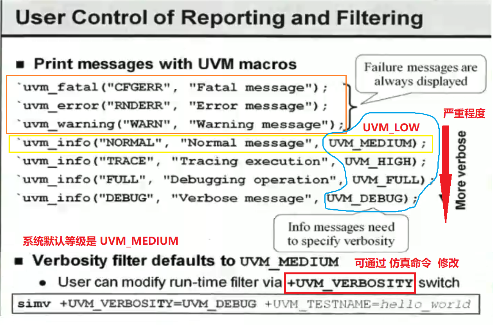

##### ◻ 冗余度阈值

——打印等级

- 3.4.1 设置打印信息的冗余度阈值

   <font color=red>低于 </font>/ <font color=red>等于</font> 冗余度阈值的信息都会被打印出来

  ```verilog
  """冗余度阈值/打印等级"""
  UVM_NONE = 0,
  UVM_LOW = 100,
  UVM_MEDIUM = 200,            //@@ 一般 默认项
  UVM_HIGH = 300,
  UVM_FULL = 400,
  UVM_DEBUG = 500
  ```

  <font color=red> `(get/set)_report_(verbosity_level/id_verbosity)` </font>
  
  | 函数                                                      | 注释                                                         |
  | --------------------------------------------------------- | ------------------------------------------------------------ |
  | get_report_<font color=violet>**verbosity\_level**</font> | <font color=blue>得到</font> 某个`component`的冗余度阈值<br />例如：`drv.get_report_verbosity_level()` |
  | set_report_verbosity_level                                | <font color=blue>设置</font> 某个特定`component`的默认冗余度阈值<br />若涉及 **层次引用**，需要<font color=red>在`connect_phase`及以后 </font>的`phase`才能调用这个函数<br />若不涉及（如设置当前`component`的）也可以在`connect_phase`之前<br />例如：`agt.set_report_verbosity_level(UVM_HIGH)` |
  | set_report_verbosity_level_hier                           | 递归设置 ....其及以下子`component`<br />例如：`agt.set_report_verbosity_level_hier(UVM_HIGH)` |
  | <font color=gree>根据：信息ID</font>                      |                                                              |
| set_report\_<font color=violet>**id**</font>_verbosity    | <font color=blue>设置</font> 某个特定`component`的 某个特定的  <font color=blue>信息ID</font> 的默认冗余度阈值<br />例如：`agt.set_report_id_verbosity ("ID1",  UVM_HIGH)` |
  | set_report_id_verbosity_hier                              | 递归设置 ....<br />例如：`agt.set_report_id_verbosity_hier("ID1", UVM_HIGH)` |
  | <font color=blue>**编译命名**</font>                      | <sim command> +UVM_VERBOSITY=UVM_HIGH    设置整个验证平台的冗余度阈值<br /><sim command> +UVM_VERBOSITY=HIGH |
  
  

##### ◻ 严重性

- 3.4.2 重载打印信息的严重性

  | （严重性）宏 | 注释                                                         |
  | ------------ | ------------------------------------------------------------ |
  | UVM_INFO     | 打印 信息<br />基本格式：<font color=blue>信息id  + 打印信息 + 打印等级</font> |
  | UVM_WARNING  | 打印  警告                                                   |
  | UVM_ERROR    | 打印  错误                                                   |
  | UVM_FATAL    | 打印   致命错误                                              |

  严重性 <font color=red>重载</font>
<font color=red> `set_report_*_override` </font>
  
  | （重载-严重性）函数                                          | 注释                                                         |
  | ------------------------------------------------------------ | ------------------------------------------------------------ |
  | set_report\_<font color=violet>**severity**</font>_override  | 根据  <font color=blue>严重性</font>  进行打印重载<br />例如：`drv.set_report_severity_override(UVM_WARNING, UVM_ERROR)`<br />            把 `driver` 中所有的 `UVM_WARNING` 显示为 `UVM_ERROR` |
  | set_report\_<font color=violet>**severity_id**</font>_override | 根据  <font color=blue>严重性 </font>和 <font color=blue>信息ID</font>  进行打印重载<br />例如：`drv.set_report_severity_id_override(UVM_WARNING, "my_driver", UVM_ERROR)`<br />            把 `driver` 中所有的信息ID为 `my_driver`的  `UVM_WARNING` 显示为 `UVM_ERROR` |
  | <font color=blue>**补充说明**</font>                         | 与设置冗余度不同，UVM  <font color=red>不提供递归的</font> 严重性重载函数。严重性重载用的较少，一般的只会对某个`component`内使用，不会递归的使用。 |
| <font color=blue>**编译命名**</font>                         | <sim command> +uvm_set_<font color=blue>severity</font>=<comp>,<id>,<current severity>,<new severity><br />说明：所有的ID，可以用  <font color=red>**\_ALL\_**</font><br />例如：<sim command> +uvm_set_severity="uvm_test_top.env.i_agt.drv,\_ALL\_,UVM_WARNING,UVM_ERROR" |
  
  

##### ◻ 控制行为

- 3.4.4~3.4.7  计数、断点、导出文件

  ```verilog
  """控制行为"""
  UVM_NO_ACTION = 'b000000             //@@ 不做任何操作   
  UVM_DISPLAY = 'b000001               //@@ 输出（到标准输出[控制台]上）
  UVM_LOG = 'b000010                   //@@ 输出到日志文件，[它能工作的前提是设置好了日志文件]
  UVM_COUNT = 'b000100                 //@@ 作为计数目标
  UVM_EXIT = 'b001000                  //@@ 停止仿真
  UVM_CALL_HOOK = 'b010000             //@@ 调用一个回调函数
  UVM_STOP = 'b100000                  //@@ 停止仿真，进入命令行交互模式
  
  """默认情况下的系统设置[源代码]"""
  set_severity_action(UVM_INFO,      UVM_DISPLAY);
  set_severity_action(UVM_WARNING,   UVM_DISPLAY);
  set_severity_action(UVM_ERROR,     UVM_DISPLAY | UVM_COUNT);
  set_severity_action(UVM_FATAL,     UVM_DISPLAY | UVM_EXIT);
  //@@  当然也可以手动设置更改：drv.set_report_severity_action(UVM_INFO, UVM_NO_ACTION);   //什么信息都不输出
  ```

  

##### ◻ 计数（UVM_COUNT）

——控制行为-计数

- 3.4.3~3.4.4  UVM_ERROR到达一定数量结束仿真、UVM_* 也可加入

  - UVM_ERROR

    ①  系统默认：`build_phase` 及之前 , 出现1次即结束仿真
    ②  可以更改，用以下函数

    | uvm函数                                                  | 注释                                                         |
    | -------------------------------------------------------- | ------------------------------------------------------------ |
    | set\_<font color=violet>**report**</font>_max_quit_count | <font color=blue>设置</font> 某个<font color=red>`case`</font> 中，UVM_ERROR 结束仿真的出现指标<br />例如：在`base_test::build_phase`中  `set_report_max_quit_count(5)`    //当出现5个UVM_ERROR时，会自动退出<br /><font color=blue>特别注意</font>：如果测试用例与`base_test`中同时设置了，则  <font color=red>以测试用例中的设置为准</font> |
    | get_max_quit_count                                       | <font color=blue>获得</font> 当前`case`中 UVM_ERROR 结束仿真的出现指标 |
    | <font color=blue>**编译命名**</font>                     | <sim command> +UVM_MAX_QUIT_COUNT=6,NO  <br />第2个参数：NO表示此值是不可以被后面的设置语句重载，YES：表示可以 |

    

  - 加入计数目标

    <font color=red> `set_*_action` :  UVM_COUNT</font>
    
    | uvm函数                                                      | 注释                                                         |
    | ------------------------------------------------------------ | ------------------------------------------------------------ |
    | <font color=gree>根据：严重性</font>                         |                                                              |
    | set_report\_<font color=violet>**severity**</font>_action    | 将 某个`component`中的 某种 <font color=blue>严重性</font> 加入到计数目标中 / <font color=red>移除</font><br /><br />第1个参数：可以是<font color=blue> UVM_WARNING、UVM_INFO、UVM_ERROR</font><br />例如：`drv.set_report_severity_action(UVM_WARNING, UVM_DISPLAY|UVM_COUNT); `       // 将 warning加入到计数目标 和 error一起计数<br />`drv.set_report_severity_action(UVM_ERROR, UVM_DISPLAY)`   // 将 error 移除出计数目标 |
    | set_report_severity_action_hier                              | 递归的....                                                   |
    | <font color=gree>根据：信息ID</font>                         |                                                              |
    | set_report\_<font color=violet>**id**</font>_action          | 将 某个`component`中的某种 <font color=blue>信息ID</font> 加入到计数目标中 / <font color=red>移除</font><br />第1个参数：可以是<font color=blue> UVM_WARNING、UVM_INFO、UVM_ERROR</font>、<font color=red>UVM_FATAL</font><br />例如：`drv.set_report_id_action("my_drv", UVM_DISPLAY| UVM_COUNT);` |
    | set_report_id_action_hier                                    | 递归的....                                                   |
    | <font color=gree>根据：严重性+信息ID</font>                  |                                                              |
    | set_report\_<font color=violet>**severity_id**</font>_action | 例如：`drv.set_report_severity_id_action(UVM_WARNING, "my_driver", UVM_DISPLAY| UVM_COUNT);` |
  | .set_report_severity_id_action_hier                          | 递归的....                                                   |
    | <font color=blue>**编译命名**</font>                         | <sim command> +uvm_set\_<font color=blue>action</font>=<comp>,<id>,<severity>,<action><br />说明：所有的ID，可以用  <font color=red>**\_ALL\_**</font><br />例如：<sim command> +uvm_set_action="uvm_test_top.env.i_agt.drv,\_ALL_,UVM_WARNING,UVM_DISPLAY\|UVM_COUNT" |

  

  

  

  
  
  

##### ◻ 断点（UVM_STOP）

- 3.4.5 UVM的断点功能

  <font color=blue>函数</font>，同上方 【计数（UVM_COUNT）-加入计数目标】章节  <font color=red>**set\_*_action**</font>

  ```verilog
  """示例"""
  ##《base_test代码》connect_phase
  virtual function void connect_phase(uvm_phase phase);
      env.i_agt.drv.set_report_severity_action(UVM_WARNING, UVM_DISPLAY| UVM_STOP);    //@@ 根据严重性设置UVM_STOP
  endfunction
  
  //@@ 编译命令还是 uvm_set_action,   只是将 UVM_COUNT 替换为 UVM_STOP 即可
  ```

  

  


##### ◻ 导出到文件（UVM_LOG）

- 3.4.6 将输出信息导入文件中
  —— **UVM_LOG**： 输出到日志文件，它能工作的前提是  <font color=blue>设置好了日志文件</font>  <font color=red> <`set_*_action`  +   `set_*_file` > </font>
  <font color=red> `set_*_action` :  UVM_LOG </font>
  <font color=red> `set_*_file` : 文件名 </font>

  | uvm函数                                                    | 注释                                                         |
  | ---------------------------------------------------------- | ------------------------------------------------------------ |
  | <font color=gree>根据：严重性</font>                       |                                                              |
  | set_report\_<font color=violet>**severity**</font>_file    | 将 某个`component` 的某种 <font color=blue>严重性</font>，输出到 <font color=blue>指定名称</font> 的日志文件中<br />例如：`drv.set_report_severity_file(UVM_INFO, info_log)` |
  | set_report_severity_file_hier                              | 递归的.....                                                  |
  | <font color=gree>根据：信息ID</font>                       |                                                              |
  | set_report\_<font color=violet>**id**</font>_file          | 将 某个`component` 的某 <font color=blue>信息ID</font>，输出到 <font color=blue>指定名称</font> 的日志文件中<br />例如：`drv.set_report_id_file("my_driver", driver_log)` |
  | set_report_id_file_hier                                    | 递归的.....                                                  |
  | <font color=gree>根据：严重性+信息ID</font>                |                                                              |
  | set_report\_<font color=violet>**severity_id**</font>_file | 将 某个`component` 的某种 <font color=blue>严重性</font>和某 <font color=blue>信息ID</font>，输出到 <font color=blue>指定名称</font> 的日志文件中<br />例如：`drv.set_report_severity_id_file(UVM_WARNING, "my_driver",driver_ <br/>log)` |
  | set_report_severity_id_file_hier                           | 递归的.....                                                  |


#### 3.5 config_db机制

- `config`  vs  `config_db`

  **<font color=red>`config`</font>**  指的是把所有的参数放在一个`object`中，主要的作用是   <font color=blue>规范验证平台的行为方式</font>

  **<font color=red>`config_db`</font>** 是将参数设置给所有需要的`component`的一种方式
  
  `config_db机制 `的作用：用于在UVM验证平台间 <font color=blue>传递参数</font>


##### ◻ 路径 vs 层次结构

- 3.5.1 UVM中的路径

  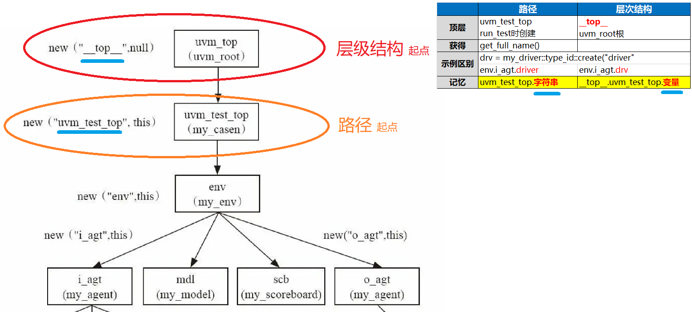


##### ◻ config_db::set / get

###### ▨ `set` & `get `

- 3.5.2 set与get函数的参数

  | 函数                                                         | 注释                                                         |
  | ------------------------------------------------------------ | ------------------------------------------------------------ |
  | uvm_config_db#(int)::set(this,   "env.i_agt.drv",   "pre_num",   100); | 设置参数值（寄信）                                           |
  | uvm_config_db#(int)::get(this,   "",   "pre_num",   pre_num); | 获得参数值（收信）                                           |
  | <font color=blue>**参数说明**</font>                         | 第1参数： `component`<font color=red>实例指针</font><br />第2参数：<string> <font color=blue>相对</font>此实例的<font color=blue>路径</font><br />第3参数：<string> 目标参数记号<br />第4参数：【set】要设置的 <font color=blue>值</font><br />                 【get】get值后要设置的 <font color=blue>变量</font> |
  | <font color=blue>补充说明</font>                             | ① 第1+第2 个参数 = 组成<font color=blue>目标路径</font><br />② <font color=red>`null` = `uvm_root::get()`</font><br />③  <font color=red>`this`</font> 指的是 <font color=red>当前实例指针</font><br />④  `set`和`get`中<font color=blue> 第三个参数 </font>可以不一致，但最好一致  [(这样`file_automation` 可以省略`get`语句)](#Ctrl跳转4) |


- 3.5.3 省略get语句

  <font color=red>**省略 `config_db::get`**</font>，及其3个前提条件：[参见【field_automation机制-自动获得参数值】 ](#Ctrl跳转4)

  

###### ▨ 场景：跨层多次set

——看：① 权威；② 时间

- 3.5.4 跨层次的多重设置

  - 标准：先看 **<font color=red>发信人</font>** 的权威，看<font color=blue>高</font>的；当权威一致时，看 **<font color=red>时间</font>**，看<font color=blue>近</font>的； 

  - <font color=red>发信人权威</font> 的鉴别：
    ① `set` 第一参数为`this`， `component`树结构就是发信人，树结构越高，越权威；   <font color=red><推荐></font>

    ②  `set` 第一参数为 `null`或者 `uvm_root：：get（）`, 不管`component`， 调用`set`的权威最高

  - 示例：

    ```verilog
    """发信人权威 + 时间  -案例"""
    ##《case代码》build_phase
    function void my_case0::build_phase(uvm_phase phase);
    	super.build_phase(phase);
    	…
        uvm_config_db#(int)::set(uvm_root::get(),              //@@ 此处就不管test了，就是 根（uvm_top）
                                 "uvm_test_top.env.i_agt.drv",
                                 "pre_num",
                                 999);
    	`uvm_info("my_case0", "in my_case0, env.i_agt.drv.pre_num is set to 999", UVM_LOW)
    endfunction
        
        
    ##《env代码》build_phase
    virtual function void build_phase(uvm_phase phase);
        super.build_phase(phase);
        …
        uvm_config_db#(int)::set(uvm_root::get(),              //@@ 此处就不管test了，就是 根（uvm_top）
                                 "uvm_test_top.env.i_agt.drv",
                                 "pre_num",
                                 100);
    	`uvm_info("my_env", "in my_env, env.i_agt.drv.pre_num is set to 100",UVM_LOW)
    endfunction
        
       
    //@@  输出 
        driver得到的pre_num的值是100。[env的结果]
    //@@ 分析：
       1） test和env的set的第一参数都是uvm_root::get()，他们的权威都是 根uvm_top（相同）。这种情况下，需要进一步比较时间，而[UVM的build_phase是自上而下执行的]，所以 env后执行，所以是100
       2）若将上述2处，都修改为 this，那么结果就是 test的权威比 env的高，结果等于999
    ```


###### ▨ 场景：同层多次set

——权威相同，看：时间

- 3.5.5 同一层次的多重设置

  - 标准： 看 **<font color=red>时间</font>** <font color=blue>近</font>的

  - 应用场景：派生自`base_test` 的 `case` 激励-`build_phase` 的 `set` 更新 

  - 代码：

    ```verilog
    """`case` 激励-`build_phase` 的 `set` 更新"""
    //@@ 同一层次，权威相同，看时间近的
    //@@ 而，build_phase 是 由上至下 执行的，派生出来的会在后面执行
    ##《base_test代码》父类-build_phase
    classs base_test extends uvm_test;
    	function void build_phase(uvm_phase phase);
            super.build_phase(phase);
            uvm_config_db#(int)::set(this, 
                                     "env.i_agt.drv",
                                     pre_num_max, 
                                     7); 
        endfunction
    endclass
    
    ##《正常的case：case1~case99代码》子类-直接继承-build_phase
    class case1 extends base_test;
        function void build_phase(uvm_phase phase);
            super.build_phase(phase); 
        endfunction
    endclass
    …
    
            
    ##《特殊的case：case100代码》子类-更新掉（可以理解为重载了）-build_phase    
    class case100 extends base_test;
        function void build_phase(uvm_phase phase); 
            super.build_phase(phase);
            uvm_config_db#(int)::set(this,        
                                     "env.i_agt.drv", 
                                     pre_num_max, 
                                     100); //@@ build_phase 是 由上至下 执行的，派生出来的会在后面执行
            							   //@@ pre_num_max 值会等于100
        endfunction
    endclass  
    ```

    


###### ▨ 场景：非直线set（x） & get（✔）

- 3.5.6 非直线的设置与获取

  - 非直线：例如：<font color=blue>**非直线的设置（set）**</font> - 通过`scoreboard` 对 `driver`的某些变量进行 `config_db::set`
                                                          `driver`的路径为`uvm_test_top.env.i_agt.drv`    <font color=red>**<不推荐>**</font>

    ​					 	<font color=blue>**非直线的获取（get）**</font> - `reference model`中获取其他`component`设置给`my_driver`的参数的值  <font color=red>**<推荐>**</font>

  - 注意点：无论是设置（set）还是获取（get）,都需要 注意 **第1参数**（例化组件实例指针）和 **第2参数**（相对此实例的路径）

  - 推荐/不推荐：

    ① **不推荐** 非直线的设置（set），会有一定的风险，应该避免这种情况，原因是： `build_phase` 同级是<font color=blue>字典序的，存在不确定性 </font>

    ② **推荐** 非直线的获取（get），可以在验证平台中 <font color=blue>多个组件</font>（UVM树结点）需要<font color=blue>使用同一个参数</font>时，<font color=blue>减少`config_db::set`的冗余</font>

  - 示例代码：

    ```verilog
    """[非直线的获取（get）]可以在某些情况下避免config_db：：set的冗余-示例"""
    //@@ reference model中获取driver的pre_num的值
    ##《reference model代码》build_phase
    function void my_model::build_phase(uvm_phase phase);
        super.build_phase(phase);
        port = new("port", this);
        ap = new("ap", this);
        `uvm_info("my_model", $sformatf("before get, the pre_num is %0d", drv_pre_num), UVM_LOW)
        void'(
            uvm_config_db#(int)::get(this.m_parent,   //@@ 非直线的获取
                                     "i_agt.drv",     //@@ reference model中获取driver的pre_num的值
                                     "pre_num", 
                                     drv_pre_num)
        );
        `uvm_info("my_model", $sformatf("after get, the pre_num is %0d", drv_pre_num), UVM_LOW)
    endfunction
    
    //@@ 上述config_db::get方式 也可以这么写
        void'(
            uvm_config_db#(int)::get(uvm_root::get(), 
                                     "uvm_test_top.env.i_agt.drv",      //@@ 和上面等价
                                     "pre_num",
                                     drv_pre_num)
            );
    
    //@@ 分析
    1、【非直线的获取】在reference model中获取driver的pre_num的值
    2、如果不这样做，而采用【直线获取】的方式，那么需要在测试用例中通过cofig_db：：set分别给reference model和driver设置pre_num的值。
    3、同样的参数值设置出现在不同的两条语句中，这大大增加了出错的可能性。
    ```

    


##### ◻ `config_db`调试

**<font color=red>`config_db`机制致命缺点</font>**：`set`函数的<font color=blue>第二个参数</font> 是字符串，如果字符串写错，那么根本就不能正确地设置参数值

如果 `set`函数的<font color=blue>第二个参数</font>设置错误，以下 各种调试方式，**<font color=red>都不会</font>** 给出错误信息。

若要解决这个问题，需要参见：[参见【10.6 参数-用自定义函数check_all 去检查第2参数】 ](#Ctrl跳转21)


- 3.5.8、3.5.10 `config_db`的调试

  - <font color=blue>`check_config_usage`</font>

    ——可以<font color=red>间接的 推测</font>：第2参数有没有写错
    **<font color=red>有写没读的情况：</font>**
    ①  `set` 和  `get` <font color=blue>路径名称（第2参数）</font>不一致 / <font color=blue>变量名称（第3参数）</font>不一致 
    ②  全都一致，但是  <font color=blue>还没到调用的 `phase ` 阶段</font>
         (例如在`connect_phase` 调用该`check_config_usage`函数，看`default_sequence`，
           结果肯定是：已写未读，因为读的`phase`阶段是`main_phase`，还没到)

    | 函数                             | 注释                                                         |
    | -------------------------------- | ------------------------------------------------------------ |
    | check_config_usage               | 显示出截止到函数调用时，系统中有哪些 参数 <font color=blue>被设置（set）过但是没有被读取（get）过</font> |
    | <font color=blue>补充说明</font> | 由于`config_db`的`set`及`get`语句一般都用于`build_phase`阶段，所以此函数一般<font color=red>在`connect_phase`被调用</font>，它也可以在`connect_phase` **<font color=red>后 </font>**的任一`phase`被调用 |

    ```verilog
    """check_config_usage 函数被调用-示例"""
    ##《case代码》build_phase：进行set、get
    function void my_case0::build_phase(uvm_phase phase);
    	…
    	uvm_config_db#(uvm_object_wrapper)::set(this,
                                                "env.i_agt.sqr.main_phase",     //@@ 发生在main_phase阶段
                                                "default_sequence",
                                                case0_sequence::type_id::get());
        
    	uvm_config_db#(int)::set(this,
                                 "env.i_atg.drv",       //@@ 【！】故意将 i_agt 错写成  i_atg
                                 "pre_num",
                                 999);
        
    	uvm_config_db#(int)::set(this,
                                 "env.mdl",
                                 "rm_value",
                                 10);
    endfunction
        
    ##《case代码》在connect_phase：进行读取【被设置但是没有被get的情况】
    virtual function void my_case0::connect_phase(uvm_phase phase);   //@@ connect_phase 或是 这之后
    	super.connect_phase(phase);
        check_config_usage();         //@@ 
    endfunction
        
    
    //@@ 输出
    ## 《控制台打印信息》
    # default_sequence [/^uvm_test_top\.env\.i_agt\.sqr\.main_phase$/] : (class uvm_pkg::uvm_object_wr 
    # 
    # uvm_test_top reads: 0 @ 0 writes: 1 @ 0    //@@ default_sequence 被设置1次，被读取0次
    #                                            //@@ 原因是：main_phase 发生在connect_phase之后，还没被读取  
    # pre_num [/^uvm_test_top\.env\.i_atg\.drv$/] : (int) 999 
    # 
    # uvm_test_top reads: 0 @ 0 writes: 1 @ 0    //@@ pre_num 被设置1次，被读取0次
                                                 //@@ 原因是：将 i_agt 错写成了 i_atg，   导致没读取到
    ```

  

  - 其他调试

    | 函数                                 | 注释                                                         |
    | ------------------------------------ | ------------------------------------------------------------ |
    | print_config(1);                     | 遍历整个验证平台的所有结点，找出哪些<font color=blue>被设置过（set）的信息 </font>对于它们是可见的<br />参数：1-递归的查询；  <br />            0-只显示当前component的信息 |
    | <font color=blue>**编译命令**</font> | <sim command> +UVM_CONFIG_DB_TRACE                           |

    

    


##### ◻ 不建议项

- 3.5.7 config_db机制对通配符的支持

  config_db机制支持通配符，但是 <font color=blue>不建议</font> 过度使用 <font color=red>通配符</font>

  ```verilog
  """config_db机制支持通配符，但是不建议过度使用通配符"""
  ##《top_tb代码》
  uvm_config_db#(virtual my_if)::set(null, "uvm_test_top.env.i_agt*", "vif", input_if);  //@@ 可以，最好不用
  uvm_config_db#(virtual my_if)::set(null, "*i_agt*", "vif", input_if);                  //@@ 应避免
  ```

  

- 3.5.9 set_config与get_config

   <font color=blue>不建议</font> 使用`set_config_*`和`get_config_*`，例如：`set_config_int`     <font color=red><已过时></font>
   
   `config_db` 对比 `set/get_config` 强大的地方在于，它设置的参数类型并不局限于以上三种（<font color=blue>int、string、object</font>）。常见的<font color=blue>枚举类型、virtual interface、bit类型、队列</font> 等都可以成为`config_db`设置的 **数据类型**。
   
   | 编译命令                                                    | 注释                                                         |
   | ----------------------------------------------------------- | ------------------------------------------------------------ |
   | <font color=blue>**等价编译命令**</font>                    |                                                              |
   | <sim command> +uvm_set_config_int=<comp>,<field>,<value>    | 例如：<sim command> +uvm_set_config_int="uvm_test_top.env.i_agt.drv,pre_num,'h8" |
   | <sim command> +uvm_set_config_string=<comp>,<field>,<value> |                                                              |
   
   

##### 补充：

- config_db 高阶：[参见【10.6 参数-用自定义函数check_all 去检查第2参数】 ](#Ctrl跳转21)
  


### Ch. 4_TLM通信

<font color=red>**要点总结**：</font>
<font color=red>**一对一**：port、export、imp   +  put、get、peek、get_peek、transport</font>
<font color=red>**一对多**：analysis   +   write 、   FIFO</font>

#### 4.1 端口介绍

- 4.1.1~4.1.3  控制流、数据流、端口
  
- 操作
  
  三者皆有阻塞、非阻塞之分
  
  | 操作      | 注释                                                         |
  | --------- | ------------------------------------------------------------ |
  | put       | 主动发送                                                     |
  | get       | 主动获取                                                     |
  | transport | transport操作相当于一次put加一次get操作，这两次操作的“发起者”都是A，也称 request-response操作。 |
  
  
  
  
  
- 端口类型
  
  | 端口                                     | 注释                                                         |
  | ---------------------------------------- | ------------------------------------------------------------ |
  | port                                     |                                                              |
  | export                                   |                                                              |
  | imp                                      |                                                              |
  | <font color=blue> <analysis系列> </font> | analysis_port<br />analysis_export<br />analysis_imp<br />analysis_fifo |
  
  UVM中三种端口 <font color=red>控制流</font>：PORT >  EXPORT > IMP。  <font color=blue><靠前为主动方，靠后为被动方></font>
  
  IMP的优先级最低，一个PORT可以连接到一个IMP，并发起三种操作，反之则不行。
  
  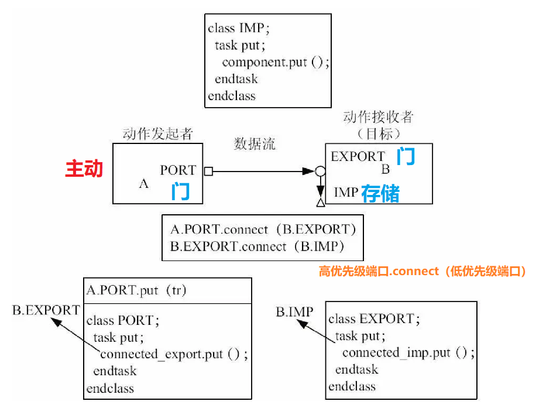
  
  - 端口 声明
  
    ① 5种操作：put、get、peek、get_peek、transport
  
    ② 3类阻塞/非阻塞：blocking、nonblocking、不写（可以是blocking，也可以是nonblocking）
  
    ③ analysis 系列端口，没有阻塞/非阻塞之分
    
    ```verilog
    //@@ export 端口 只需将下方的 port==>export
    //@@ imp 端口 只需将 port==>imp，参数多加个imp
    
    """【port】声明方法"""
    uvm_blocking_put_port#(T)       x_port;      //@@ put
    uvm_nonblocking_put_port#(T)    x_port;      //@@ T：tr
    uvm_put_port#(T)                x_port;      //不写,  可以是blocking，也可以是nonblocking
    
    uvm_blocking_get_port#(T)       x_port;      //@@ get
    uvm_nonblocking_get_port#(T)    x_port;		 
    uvm_get_port#(T)                x_port; 
    
    uvm_blocking_peek_port#(T)      x_port;     //@@ peek
    uvm_nonblocking_peek_port#(T)   x_port;
    uvm_peek_port#(T)               x_port;  
    
    uvm_blocking_get_peek_port#(T)    x_port;   //@@ get_peek = get + peek
    uvm_nonblocking_get_peek_port#(T) x_port;
    uvm_get_peek_port#(T)             x_port;
    
    uvm_blocking_transport_port#(REQ, RSP)       x_port;      //@@ transport
    uvm_nonblocking_transport_port#(REQ, RSP)    x_port;  
    uvm_transport_port#(REQ, RSP)                x_port;  
    ```
    
    ```verilog
    """【imp】声明方法"""
    uvm_blocking_put_imp#(T, IMP)           x_imp;    //@@ put
    uvm_nonblocking_put_imp#(T, IMP)        x_imp;    //@@ IMP：组件类的名称
    uvm_put_imp#(T, IMP)                    x_imp;    //不写,  可以是blocking，也可以是nonblocking
    
    uvm_blocking_get_imp#(T, IMP)           x_imp;    //@@ get
    uvm_nonblocking_get_imp#(T, IMP)        x_imp;  
    uvm_get_imp#(T, IMP)                    x_imp; 
    
    uvm_blocking_peek_imp#(T, IMP)          x_imp;        //@@ peek
    uvm_nonblocking_peek_imp#(T, IMP)       x_imp; 
    uvm_peek_imp#(T, IMP)                   x_imp; 
    
    uvm_blocking_get_peek_imp#(T, IMP)      x_imp;    //@@  get_peek
    uvm_nonblocking_get_peek_imp#(T, IMP)   x_imp; 
    uvm_get_peek_imp#(T, IMP)               x_imp; 
    
    uvm_blocking_transport_imp#(REQ, RSP, IMP)       x_imp;        //@@ transport
    uvm_nonblocking_transport_imp#(REQ, RSP, IMP)    x_imp; 
    uvm_transport_imp#(REQ, RSP, IMP)                x_imp; 
    ```
    
    
    
    ```verilog
      """【analysis系列端口】声明方法"""
    uvm_analysis_port#(T)       		  x_ap; 
    uvm_analysis_export#(T)     	 	  x_aexp; 
    uvm_analysis_imp#(T, IMP)             x_aimp;    //@@ IMP：组件类的名称
    ## 【imp后缀声明】
    step-1:   宏注册后缀，示例：   `uvm_analysis_imp_decl(_monitor)
    step-2:   后缀声明方式，示例：  uvm_analysis_imp_monitor#(my_transaction, my_scoreboard) monitor_imp; 
    step-3:   后续的write函数也要加上后缀：  function void write_monitor(my_transaction tr);
        
    ##【analysis_fifo声明】
    uvm_tlm_analysis_fifo#(T)     	 	  x1_x2_fifo; 
    uvm_tlm_fifo#(T)     	 			  x1_x2_fifo;    //@@  FIFO内部比上面的 少一个 analysis_export
    ```
    
    
  
   
  
    


#### 4.2  一对一通信

- 4.2.1~4.2.6  blocking_**put** 端口互联

  ① 编写基本过程：
  		step-1： 声明	
  		step-2： 例化  （new）
  		step-3： 连接  （connect）    <font color=blue><在env连接 / 大组件里面连接， 取决于裸露在什么空间下 ></font>
  		step-4： 发送激励  （port . put( tr )）
  		step-5： 被动方 - 构造 <font color=blue>操作任务 / 函数</font>   （put、get、peek、get_peek、transport）

  | uvm代码                                                      | 注释                                                         |
  | ------------------------------------------------------------ | ------------------------------------------------------------ |
  | function new (string name,<br />                         uvm_component parent,<br />                         int min_size = 1;<br />                         int max_size = 1); | 例化端口，创建内存空间<br /><br />参数1：端口名<br />参数2：父结点名<br />参数3、4：<br />必须连接到这个PORT的下级端口数量的最小值和最大值，<br />也即这一个PORT应该调用的connect函数的最小值和最大值，默认1 |
  | <font color=blue>主动方</font> 端口.connect( <font color=blue>被动方</font> 端口 ) | 在env中连接端口，<br /><font color=blue>高优先级</font>端口.connect ( 低优先级端口 )<br /><font color=blue>主动内组件</font>端口.connect ( 主动外组件端口 )<br /><font color=blue>被动外组件</font>端口.connect ( 被动内组件端口 ) |
  | <font color=blue><【系统自带】端口.任务/函数></font><br /><font color=red>本质是调用，被动方定义的操作任务/函数</font><br />端口可以是 port、export、imp<br /> | 端口.put（tr）<br />端口.get（tr）<br />端口.transport（req,  rsp）<br />端口.can_put( )<br />端口.try_put( tr )<br />...<br />端口.write( tr ) |
  | tr_queue 队列操作                                            | tr = tr_queue.pop_front();         //  tr 队列 操作，删除第一个<br />tr_queue.push_back(tr);            //  tr 队列 操作，放到最后 |
  
  构造 <font color=red>操作任务/函数</font> 的规律

   注意区分<font color=red> `B. port. put()` </font>  和<font color=red> `B. put()`  </font>的差别，此处是后者！！！！！

  | 序号 | A_port   情况         | B_imp   情况                         | 构造     操作任务/函数                                       |
| ---- | --------------------- | ------------------------------------ | ------------------------------------------------------------ |
  | 1    | blocking_put          | blocking_put                         | B. put                                                       |
  | 2    | nonblocking_put       | nonblocking_put                      | B. try_put、B. can_put                                       |
  | 3    | put                   | put                                  | B. put、B. try_put、B. can_put                               |
  | 4    | blocking_get          | blocking_get                         | B. get                                                       |
  | 5    | nonblocking_get       | nonblocking_get                      | B. try_get、B. can_get                                       |
  | 6    | get                   | get                                  | B. get、B. try_get、B. can_get                               |
  | 7    | blocking_peek         | blocking_peek                        | B. peek                                                      |
  | 8    | nonblocking_peek      | nonblocking_peek                     | B. try_peek、B. can_peek                                     |
  | 9    | peek                  | peek                                 | B. peek、B. try_peek、B. can_peek                            |
  | 10   | blocking_get_peek     | blocking_get_peek                    | B. get、B. peek                                              |
  | 11   | nonblocking_get_peek  | nonblocking_get_peek                 | B. try_get、   B. can_get<br />B. try_peek、B. can_peek      |
  | 12   | get_peek              | get_peek                             | B. get、   B. try_get、   B. can_get<br />B. peek、B. try_peek、B. can_peek |
  | 13   | blocking_transport    | blocking_transport                   | B. transport                                                 |
  | 14   | nonblocking_transport | nonblocking_transport                | <font color=blue>B. nb_transport</font>                      |
  | 15   | transport             | transport                            | B. transport、B. nb_transport                                |
  |      |                       | <font color=red>函数/任务说明</font> | `nonblocking`只能定义为函数<br />【函数】如下：<br /><font color=blue>try_xxx、can_xxx、nb_transport</font>      <br />其他的都是 【任务/函数】 |
  
  

  ② 通信实现过程，以blocking_put为例
			step-1：<font color=blue>A.A_port.put（transaction）</font>这个任务会调用 <font color=blue>B.B_export.put</font>
  			step-2：B.B_export.put（transaction）又会调用<font color=blue>B.B_imp. put（transaction）</font>
  			step-3：而B_imp.put最终又会调用B的相关任务，如 <font color=blue>B.put（transaction）</font>。
  
  ​	**<font color=red>终点必须是一个IMP。</font>**

  

  ③ 有以下连接组合

  ```verilog
"""优先级：port > export > imp"""
  //@@ 上级 连 下级 
      port ==> export
      port ==> imp
      export ==> imp
  //@@ 内部连接
      port ==> port
      export ==> export
  
  //@@ 外部连接在 env的connect_phase
  //@@ 内部连接在 组件自己的connect_phase
  ```

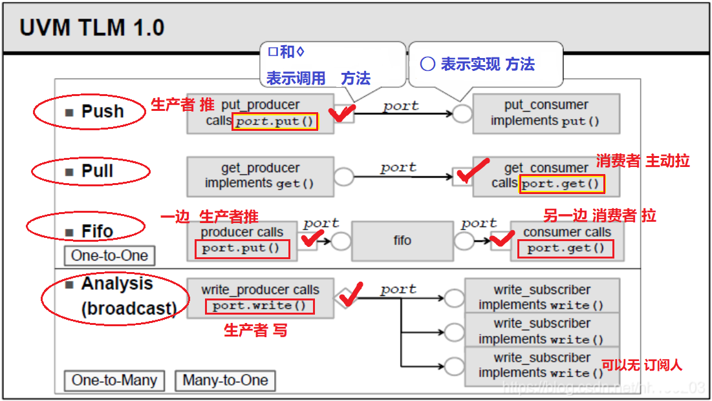

<font color=blue>**以下以 blocking_put 为例**：</font>

##### ◻ port ==> export

<font color=red>终点必须是 imp</font>， 所以本质是  port ==> export ==> imp

```verilog
"""A的port ==> B的export"""
//@@ 本质是 port ==> export ==> imp

## 《A组件代码》主动port
class A extends uvm_component;
    `uvm_component_utils(A)
    uvm_blocking_put_port#(my_transaction) A_port;   //@@ 声明一个port

    function void build_phase(uvm_phase phase);
        super.build_phase(phase);
        A_port = new("A_port", this);   //@@ 例化port创建内存空间
        								//@@ 第一个参数：名字，
        								//@@ 第二个参数：一个uvm_component类型的父结点变量
    endfunction 
    
    task main_phase(uvm_phase phase);
        my_transaction tr;
        repeat(10) begin 
        #10;
            tr = new("tr");
            assert(tr.randomize());
            A_port.put(tr);              //@@ 【系统自带：port.put(tr)】
        end
    endtask
endclass


## 《B组件代码》被动export
class B extends uvm_component;
    `uvm_component_utils(B)
    uvm_blocking_put_export#(my_transaction)	 B_export;     //@@ 声明一个export
    uvm_blocking_put_imp#(my_transaction, B) 	 B_imp;        //@@ 声明一个imp
	…
    function void build_phase(uvm_phase phase);
        super.build_phase(phase);
        B_export = new("B_export", this);     //@@ 例化new创建内存空间
        B_imp = new("B_imp", this);     //@@ 例化new创建内存空间
    endfunction 
    
	function void connect_phase(uvm_phase phase);
        super.connect_phase(phase);
        B_export.connect(B_imp);    //@@ 在内部直接将 export 连接 imp
    endfunction
    
    //@@ 构造 操作任务/函数（B.put）
	function void put(my_transaction tr);
        `uvm_info("B", "receive a transaction", UVM_LOW)
        tr.print();          //@@  B.put任务 内涵
    endfunction
    
endclass 


##《env代码》 在env中连接
class my_env extends uvm_env;
	A A_inst;
	B B_inst;
	…
	virtual function void build_phase(uvm_phase phase);
		…
        A_inst = A::type_id::create("A_inst", this);       //@@ 例化组件
		B_inst = B::type_id::create("B_inst", this); 
	endfunction
	
    function void connect_phase(uvm_phase phase);
        super.connect_phase(phase);
        A_inst.A_port.connect(B_inst.B_export);     //@@ 在env中 连接2组件的端口，主动 ==> 被动
    endfunction
endclass 
```


##### ◻ port ==> imp

```verilog
"""A的port ==> B的imp"""
## 《A组件代码》主动port
	//@@ 略，同 port==>export 《A代码》

## 《B组件代码》被动imp
class B extends uvm_component;
    `uvm_component_utils(B)
    uvm_blocking_put_imp#(my_transaction, B)	 B_imp;  //@@ 声明一个imp
	…
    //@@ 例化
    function void build_phase(uvm_phase phase);
        super.build_phase(phase);
        B_imp = new("B_imp", this);     //@@ 例化new创建内存空间
    endfunction 
    
    //@@ 构造操作任务/函数 B.put
	function void put(my_transaction tr);
        `uvm_info("B", "receive a transaction", UVM_LOW)
        tr.print(); 
    endfunction
endclass


##《env代码》 在env中连接
//@@   其他代码完全相同，只有connect_phase改一下
class my_env extends uvm_env;
	A A_inst;
	B B_inst;
	…
	virtual function void build_phase(uvm_phase phase);
		…
        A_inst = A::type_id::create("A_inst", this);       //@@ 例化组件
		B_inst = B::type_id::create("B_inst", this); 
	endfunction
	
    function void connect_phase(uvm_phase phase);
        super.connect_phase(phase);
        A_inst.A_port.connect(B_inst.B_imp);     //@@ 在env中 连接2组件的端口，主动 ==> 被动
    endfunction
endclass 
```


##### ◻ export ==> imp

```verilog
"""A的export ==> B的imp"""
## 《A组件代码》主动export
class A extends uvm_component;
    `uvm_component_utils(A)
    uvm_blocking_put_export#(my_transaction) 	A_export;      //@@ 声明export
	…
    function void build_phase(uvm_phase phase);
        super.build_phase(phase);
        A_export = new("A_export", this);   //@@ 例化export创建内存空间
        									//@@ 第一个参数：名字，
        									//@@ 第二个参数：一个uvm_component类型的父结点变量
    endfunction 
    
    task main_phase(uvm_phase phase);
        my_transaction	 tr;
        repeat(10) begin 
        #10;
            tr = new("tr");
            assert(tr.randomize());
            A_export.put(tr);          //@@ 【系统自带：export.put(tr)】
        end
    endtask
endclass


## 《B组件代码》被动imp
	//@@ 略，同 port==>imp 《B代码》

##《env代码》 在env中连接
//@@   其他代码完全相同，只有connect_phase改一下
class my_env extends uvm_env;
	A A_inst;
	B B_inst;
	…
	virtual function void build_phase(uvm_phase phase);
		…
        A_inst = A::type_id::create("A_inst", this);       //@@ 例化组件
		B_inst = B::type_id::create("B_inst", this); 
	endfunction
	
    function void connect_phase(uvm_phase phase);
        super.connect_phase(phase);
        A_inst.A_export.connect(B_inst.B_imp);     //@@ 在env中 连接2组件的端口，主动export ==> 被动imp
    endfunction
endclass 

```


##### ◻ port ==> port

内部连接 C_port ==> A_port
<font color=red>终点必须是 imp</font>， 所以本质是  port ==> port ==> imp

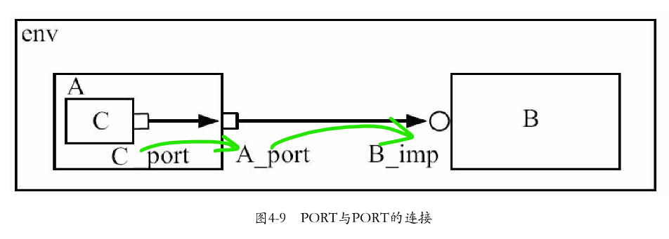

```verilog
"""A的内部组件C port ==> A组件的"""
## 《内部组件C的代码》主动port
class C extends uvm_component;
    `uvm_component_utils(C) 
    uvm_blocking_put_port#(my_transaction) 	C_port;       //@@ 声明一个port
	
    //@@ new例化
    function void build_phase(uvm_phase phase);
        super.build_phase(phase);
        C_port = new("C_port", this);      //@@ 例化port创建内存空间  
        								//@@ 第一个参数：名字，
        								//@@ 第二个参数：一个uvm_component类型的父结点变量 【存在疑问】
    endfunction 

	//@@ 发送激励
    task main_phase(uvm_phase phase);
        my_transaction tr;
        repeat(10) begin 
        #10;
            tr = new("tr");
            assert(tr.randomize());
            C_port.put(tr);      //@@ 【系统自带：port.put(tr)】
        end
    endtask
endclass


## 《外部组件A的代码》被动port+主动port
class A extends uvm_component;
    `uvm_component_utils(A) 
    C 	C_inst;
    uvm_blocking_put_port#(my_transaction) 	A_port;   //@@ 声明一个port
    
    //@@ 例化
    function void build_phase(uvm_phase phase);
        super.build_phase(phase);
        A_port = new("A_port", this);         //@@ A_port的例化
        C_inst = C::type_id::create("C_inst", this);       //@@ C组件的例化
    endfunction
    
    //@@ 连接
    function void connect_phase(uvm_phase phase);
        super.connect_phase(phase);
        C_inst.C_port.connect(this.A_port);   //@@ 在env中 连接2组件的端口，主动 port ==> 被动port
        										//@@ this 指的就是 A组件
    endfunction 

    //@@ 发送激励
    task main_phase(uvm_phase phase);
        my_transaction tr;
        repeat(10) begin 
        #10;
            tr = new("tr");
            assert(tr.randomize());
            A_port.put(tr);               //@@   【系统自带：port.put(tr)】
        end
    endtask
endclass 


## 《B组件代码》被动imp
	//@@ 略，同 port==>imp 《B代码》

##《env代码》 在env中连接
	//@@ 略，同 port==>imp 《env代码》
```


##### ◻ export ==> export

内部连接 C_export ==> B_export
<font color=red>终点必须是 imp</font>， 所以本质是  export ==> export ==> imp

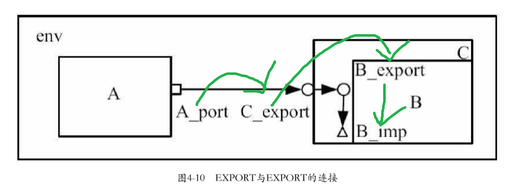

```verilog
"""C_export ==> C的内部组件B的export"""
## 《A代码》主动port
	//@@ 略，同 port==>export 《A代码》


## 《外组件C代码》被动export+主动export
class C extends uvm_component;
    `uvm_component_utils(C)
    B B_inst; 
    uvm_blocking_put_export#(my_transaction) 	C_export;  //@@ 声明export
	
    //@@ 例化
    function void build_phase(uvm_phase phase);
        super.build_phase(phase);
        C_export = new("C_export", this);                    //@@ 例化C的export
        B_inst = B::type_id::create("B_inst", this);         //@@ 例化B组件
    endfunction
    
    //@@ 连接
    function void connect_phase(uvm_phase phase);
        super.connect_phase(phase);
        this.C_export.connect(B_inst.B_export);            //@@ C_export 连接 B_export
    endfunction 
    
    //@@ 发送激励
    task main_phase(uvm_phase phase); 
        my_transaction	 tr;
        repeat(10) begin 
        #10;
            tr = new("tr");
            assert(tr.randomize());
            C_export.put(tr);           //@@ 【系统自带：export.put(tr)】
        end
	endtask
endclass 


## 《内部组件B的代码》被动export+主动export
	//@@ 略，同 port==>export 《B代码》
    
##《env代码》 在env中连接
class my_env extends uvm_env;
	A A_inst;
	C C_inst;
	…
	virtual function void build_phase(uvm_phase phase);
		…
        A_inst = A::type_id::create("A_inst", this);       //@@ 例化组件A
        C_inst = C::type_id::create("C_inst", this); 
	endfunction
	
    function void connect_phase(uvm_phase phase);
        super.connect_phase(phase);
        A_inst.A_port.connect(C_inst.C_export);     //@@ 在env中 连接2组件的端口，主动port ==> 被动export
    endfunction
endclass 
```


<font color=blue>**以上都是以 blocking_put 为例**：</font>

- 4.2.7 blocking_**get** 端口互联

##### ◻ blocking_get

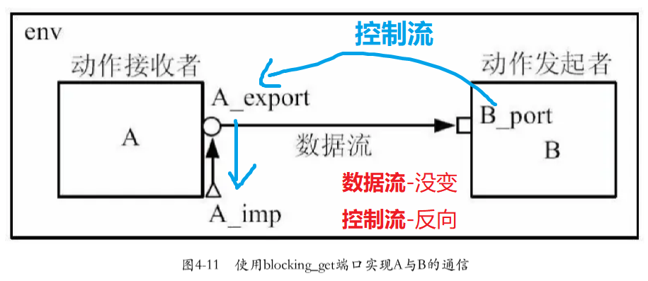

<font color=red>终点必须是 imp</font>， 所以示例的本质是  port ==>export ==> imp

```verilog
"""blocking_get 举例"""
"""控制流：port ==> export ==> imp"""
"""数据流：A ==> B"""
## 《A代码》被动方 
class A extends uvm_component;
    `uvm_component_utils(A) 
    uvm_blocking_get_export#(my_transaction)	 A_export;    //@@ 声明export
    uvm_blocking_get_imp#(my_transaction, A) 	 A_imp;       //@@ 声明imp
    my_transaction tr_q[$];

    //@@ 例化
    function void build_phase(uvm_phase phase);
        super.build_phase(phase);
        A_export = new("A_export", this);         //@@ 例化 export
        A_imp = new("A_imp", this);               //@@ 例化 imp
    endfunction
    
    //@@ 连接
    function void connect_phase(uvm_phase phase);
        super.connect_phase(phase);
        A_export.connect(A_imp);              //@@ 内部连接    主动==>被动
    endfunction
    
    //@@ 发送激励/数据
    task main_phase(uvm_phase phase);
        my_transaction tr;
        repeat(10) begin 
        #10;
            tr = new("tr");
            tr_q.push_back(tr);       //@@  【系统自带：tr_queue.push_back(tr)】
        end
    endtask
    
    //@@ 【被动方】构造 操作任务/函数
    task get(output my_transaction tr);
        while(tr_q.size() == 0) #2;     //每隔2个时间单位检查tr_q中是否有数据,   无限循环，有才跳出
        tr = tr_q.pop_front();          //@@  【系统自带：tr_queue.pop_front()】
    endtask
endclass 


## 《B代码》主动方
class B extends uvm_component;
    `uvm_component_utils(B) 
    uvm_blocking_get_port#(my_transaction)	 B_port;   //@@ 声明port

    //@@ 例化
    function void build_phase(uvm_phase phase);
        super.build_phase(phase);
        B_port = new("B_port", this);
    endfunction
    
    //@@ 获得激励/数据
    task main_phase(uvm_phase phase);
        my_transaction tr;
        while(1) begin
            B_port.get(tr);            							    //@@  【系统自带：端口.get(tr)】
            `uvm_info("B", "get a transaction", UVM_LOW)
            tr.print(); 
        end
    endtask
endclass 


##《env代码》 在env中连接
class my_env extends uvm_env;
	A A_inst;
	B B_inst;
	…
	virtual function void build_phase(uvm_phase phase);
		…
        A_inst = A::type_id::create("A_inst", this);       //@@ 例化组件A
        B_inst = B::type_id::create("B_inst", this); 
	endfunction
	
    function void connect_phase(uvm_phase phase);
        super.connect_phase(phase);
        B_inst.B_port.connect(A_inst.A_export);     //@@ 在env中 连接2组件的端口，主动port ==> 被动export
    endfunction
endclass 
```


- 4.2.8 blocking_**transport** 端口互联

##### ◻ blocking_transport

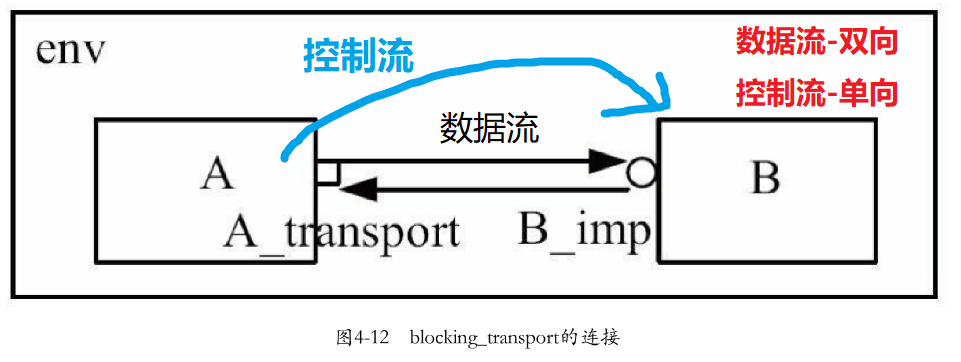
<font color=red>终点必须是 imp</font>， 所以示例的本质是 transport ==> imp

```verilog
"""transport 举例"""
"""控制流：transport ==> imp"""
"""数据流：A <==> B"""
## 《A代码》主动方 
class A extends uvm_component;
    `uvm_component_utils(A) 
    uvm_blocking_transport_port#(my_transaction, my_transaction) 		A_transport;  //@@ 声明transport
	
    //@@ 例化
    function void build_phase(uvm_phase phase);
        super.build_phase(phase);
        A_transport = new("A_transport", this);         //@@ 例化
    endfunction
    
    //@@ 发送激励
    task main_phase(uvm_phase phase);
        my_transaction 		tr;
        my_transaction 		rsp;
        repeat(10) begin 
        #10;
            tr = new("tr");
            assert(tr.randomize());
            A_transport.transport(tr, rsp);               //@@ 【系统自带】
            `uvm_info("A", "received rsp", UVM_MEDIUM)
            rsp.print();
        end
    endtask
endclass


## 《B代码》被动方
class B extends uvm_component;
    `uvm_component_utils(B) 
    uvm_blocking_transport_imp#(my_transaction, my_transaction, B) 		B_imp; //@@ 声明一个imp
    
    //@@ 例化
    function void build_phase(uvm_phase phase);
        super.build_phase(phase);
        B_imp = new("B_imp", this);         //@@ 例化
    endfunction
    
    //@@ 构造  操作任务 /函数
    task transport(my_transaction req, output my_transaction rsp);
        `uvm_info("B", "receive a transaction", UVM_LOW)
		req.print();
		//do something according to req 
		#5;
		rsp = new("rsp");
	endtask
endclass


##《env代码》 在env中连接
class my_env extends uvm_env;
	A A_inst;
	B B_inst;
	…
    //@@ 例化组件
	virtual function void build_phase(uvm_phase phase);
		…
        A_inst = A::type_id::create("A_inst", this);       //@@ 例化组件
		B_inst = B::type_id::create("B_inst", this); 
	endfunction
    
	//@@ 连接
    function void connect_phase(uvm_phase phase);
        super.connect_phase(phase);
        A_inst.A_transport.connect(B_inst.B_imp);     //@@ 在env中 连接2组件的端口，主动 ==> 被动
    endfunction
endclass 

```


- 4.2.9  **nonblocking** 端口互联

##### ◻ nonblocking_put

① 是非阻塞的，换言之，<font color=red>必须</font> 用 **<font color=blue>函数</font>** 实现，而不能用任务实现

② 由于端口变为了非阻塞的，所以在送出`tr`之前需要调用<font color=blue>`端口.can_put函数`</font>来确认是否能够执行`put`操作。`can_put`最终会调用<font color=blue>`B. can_put`</font>：

<font color=red>终点必须是 imp</font>， 所以示例的本质是 port ==> export ==> imp

```verilog
"""A的port ==nonblocking==> B的export"""
//@@ 本质是 port ==> export ==> imp

## 《A组件代码》主动port
class A extends uvm_component;
    `uvm_component_utils(A)
    uvm_nonblocking_put_port#(my_transaction)	 A_port;   //@@ 声明一个nonblocking port

    //@@ 例化
    function void build_phase(uvm_phase phase);
        super.build_phase(phase);
        A_port = new("A_port", this);   //@@ 例化port创建内存空间
        								//@@ 第一个参数：名字，
        								//@@ 第二个参数：一个uvm_component类型的父结点变量
    endfunction 
    
    //@@ 发送激励
	task main_phase(uvm_phase phase);
        my_transaction 	tr;
        repeat(10) begin
			tr = new("tr");
			assert(tr.randomize());
            while(!A_port.can_put()) #10;     //@@ 【系统自带】端口.can_put函数
            void'(A_port.try_put(tr));        //@@ 【系统自带】端口.try_put函数
        end
    endtask
endclass


## 《B组件代码》被动imp
class B extends uvm_component;
    `uvm_component_utils(B)
    uvm_nonblocking_put_imp#(my_transaction, B) 	B_imp;  //@@ 声明一个nonblocking imp
    my_transaction 		tr_q[$];
    
	//@@ 例化端口
    function void build_phase(uvm_phase phase);
        super.build_phase(phase);
        B_imp = new("B_imp", this);     //@@ 例化new创建内存空间
    endfunction 

    //@@ 构造  操作函数	B.can_put
    function bit can_put();
        if(tr_q.size() > 0)
			return 0;
		else
			return 1;
	endfunction 
    
    //@@ 构造  操作函数 B.try_put
    function bit try_put(my_transaction tr);
        `uvm_info("B", "receive a transaction", UVM_LOW)
        if(tr_q.size() > 0)
            return 0;
        else begin
            tr_q.push_back(tr);     //@@ 放队列后面
            return 1;
        end
    endfunction 
    
    //@@ 发送激励
    task main_phase(uvm_phase phase);
        my_transaction	 tr;
        while(1) begin
			if(tr_q.size() > 0)
                tr = tr_q.pop_front();   //@@ 队列前面的拿出去
			else
				#25;
        end
    endtask
endclass 


##《env代码》 在env中连接
class my_env extends uvm_env;
	A A_inst;
	B B_inst;
	…
	virtual function void build_phase(uvm_phase phase);
		…
        A_inst = A::type_id::create("A_inst", this);       //@@ 例化组件
		B_inst = B::type_id::create("B_inst", this); 
	endfunction
	
    function void connect_phase(uvm_phase phase);
        super.connect_phase(phase);
        A_inst.A_port.connect(B_inst.B_imp);     //@@ 在env中 连接2组件的端口，主动 ==> 被动
    endfunction
endclass 
```


#### 4.3  一对多广播

- 4.3.1~4.3.2  analysis port

##### ◻ analysis port

特点：①  <font color=blue>一对多</font>（广播），一个`ap`可以和多个`IMP`相连
		    ②  <font color=blue>无  阻塞/非阻塞 之分  </font>
		    ③  终点也必须是imp
			④  只有一种<font color=blue>操作函数</font>：`write()`,  也是在 <font color=blue>被动方</font>（a_imp）中需要构造 

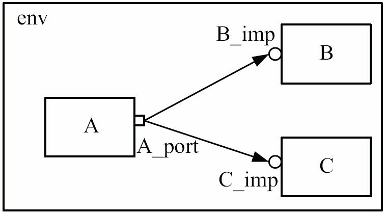


<font color=red>终点必须是 imp</font>， 所以示例的本质是 a_port  ==> a_imp

```verilog
"""analysis_port ==> analysis_imp"""
"""广播,被动方write()"""
## 主动方《A代码》
class A extends uvm_component;
    `uvm_component_utils(A) 
    uvm_analysis_port#(my_transaction)    A_ap;   //@@ 声明一个ap
    
    //@@ 例化端口
	function void build_phase(uvm_phase phase);
        super.build_phase(phase);
        A_ap = new("A_ap", this);   //@@ 例化port创建内存空间
        								//@@ 第一个参数：名字，
        								//@@ 第二个参数：一个uvm_component类型的父结点变量
    endfunction 
    
    //@@ 发送激励
    task main_phase(uvm_phase phase);
        my_transaction	 tr; 
        repeat(10) begin 
        #10;   //每隔10个时间单位写入一个tr
            tr = new("tr");
            assert(tr.randomize());
            A_ap.write(tr);             //@@ 【系统自带】端口.write()
        end
    endtask
endclass


## 被动方《B/C 代码》
class B extends uvm_component;
    `uvm_component_utils(B) 
    uvm_analysis_imp#(my_transaction, B)	B_aimp;   //@@ 声明一个 imp
    
    //@@ 例化端口
	function void build_phase(uvm_phase phase);
        super.build_phase(phase);
        B_aimp = new("B_aimp", this);   //@@ 例化port创建内存空间
        								//@@ 第一个参数：名字，
        								//@@ 第二个参数：一个uvm_component类型的父结点变量
    endfunction 
    
    //@@ 构造 操作函数 write
    function void write(my_transaction tr);
        `uvm_info("B", "receive a transaction", UVM_LOW)
        tr.print();
    endfunction   
endclass

##《env代码》 在env中连接
class my_env extends uvm_env;
	A A_inst;
	B B_inst;
    C C_inst;

    //@@ 例化组件
	virtual function void build_phase(uvm_phase phase);
		…
        A_inst = A::type_id::create("A_inst", this);       //@@ 例化组件
		B_inst = B::type_id::create("B_inst", this); 
        C_inst = C::type_id::create("C_inst", this); 
	endfunction
	
    //@@ 连接
    function void connect_phase(uvm_phase phase);
        super.connect_phase(phase);
        A_inst.A_ap.connect(B_inst.B_aimp);       //@@ 在env中 连接2组件的端口，主动 ==> 被动
        A_inst.A_ap.connect(C_inst.C_aimp);       //@@ 在env中 连接2组件的端口，主动 ==> 被动
    endfunction
endclass 
```


##### ◻<a name="Ctrl跳转12"> ap 内部连接</a>

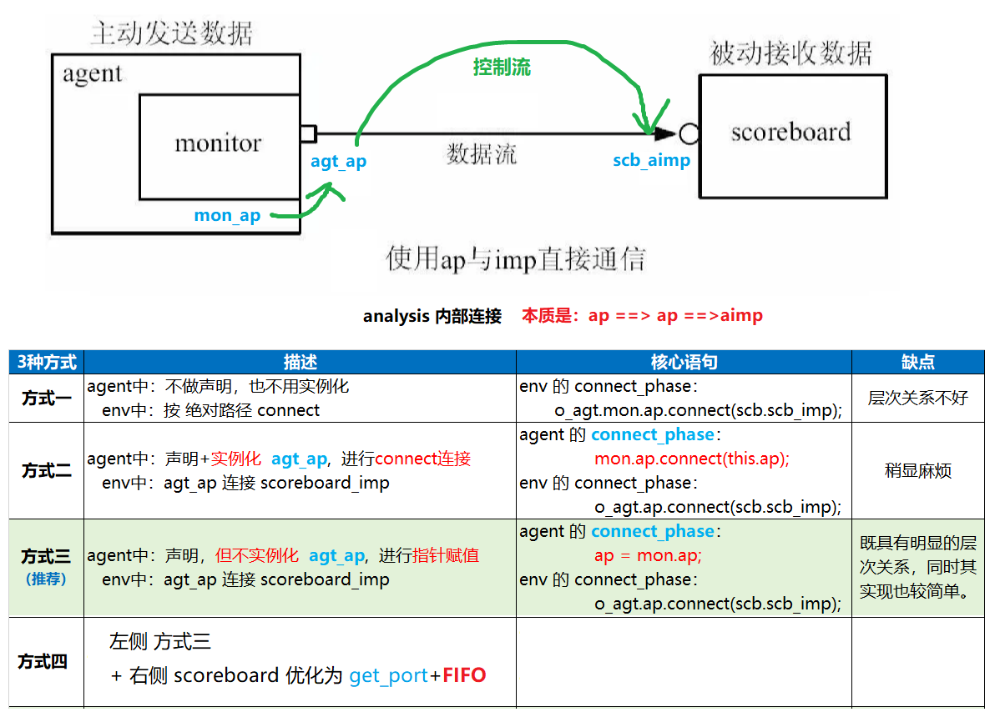

```verilog
"""analysis_port 方式三：monitor 连接 scoreboard 为例"""
//@@ 本质是 外部的ap要不要声明例化
##《monitor代码》主动方
class monitor extends uvm_monitor; 
    uvm_analysis_port#(my_transaction) 	ap;   //@@ 声明ap
    
    //@@例化端口
    function void build_phase(uvm_phase phase);
        super.build_phase(phase);
        mon_ap = new("mon_ap", this);   //@@ 例化ap创建内存空间
        								//@@ 第一个参数：名字，
        								//@@ 第二个参数：一个uvm_component类型的父结点变量
    endfunction 
	
    //@@ 发送激励
    task main_phase(uvm_phase phase);
        super.main_phase(phase); 
        my_transaction tr;
		…
        ap.write(tr);      //@@ 【系统自带】取决于被动者 去定义这个函数
		…
	endtask
endclass

##《agent代码》被动方+主动方 【三种方式主要差别点在agt】
class my_agent extends uvm_agent; 
    uvm_analysis_port #(my_transaction)	 	ap;  //@@ 声明一个agt_ap
	
    //@@  不例化端口！！！！
    function void build_phase(uvm_phase phase); 
        super.build_phase(phase);
	endfunction
	
    function void connect_phase(uvm_phase phase); 
        ap = mon.ap;        //@@ 方式三：  agt的connect_phase中，进行   句柄赋值，指针指向 mon_ap
	endfunction
endclass


##《scoreboard代码》被动方
class scoreboard extends uvm_scoreboard; 
    uvm_analysis_imp#(my_transaction, scoreboard) 	scb_imp;   //@@ 声明aimp
    
    //@@ 例化端口
    function void build_phase(uvm_phase phase);
        super.build_phase(phase);
        scb_aimp = new("scb_aimp", this);   //@@ 例化aimp创建内存空间
        									//@@ 第一个参数：名字，
        									//@@ 第二个参数：一个uvm_component类型的父结点变量
    endfunction 
    
    //@@ 构造  操作函数write
    task write(my_transaction tr);			
        //do something on tr endtask
    endtask
        
endclass

##《env代码》连接
class my_env extends uvm_env;
	scoreboard		scb; 	
	monitor			mon;
    my_agent		o_agt;
	
    //@@ 例化组件
	virtual function void build_phase(uvm_phase phase);
		…
        scb = scoreboard::type_id::create("scb", this);       //@@ 例化组件
		mon = monitor::type_id::create("mon", this); 
        o_agt = my_agent::type_id::create("o_agt", this); 
	endfunction
	
    //@@ 连接外部端口
    function void connect_phase(uvm_phase phase);
        super.connect_phase(phase);
        o_agt.ap.connect(scb.scb_imp);        //@@ 在env中 连接2组件的端口，主动 ==> 被动
    endfunction
endclass 
```


##### ◻ <a name="Ctrl跳转14"> a_imp视角(多对一)</a>

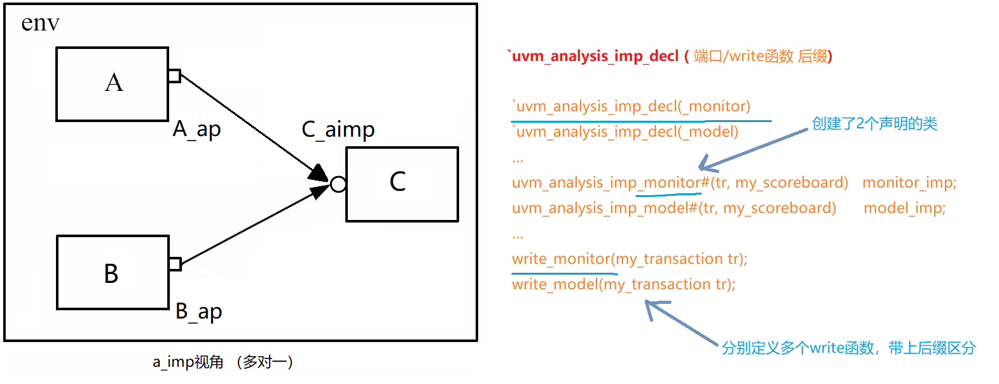

| uvm代码                           | 注释                                                         |
| --------------------------------- | ------------------------------------------------------------ |
| \`uvm_analysis_imp_decl(_monitor) | <font color=blue>【class之外，全局定义】</font><br />宏注册了一个 _monitor 后缀的类：<br />uvm_analysis_imp_monitor        用于 声明 imp |

```verilog
"""imp后缀多个write函数，多对一 代码示例""""
`uvm_analysis_imp_decl(_monitor)
`uvm_analysis_imp_decl(_model)

class my_scoreboard extends uvm_scoreboard;
    my_transaction		 expect_queue[$]; 
	uvm_analysis_imp_monitor#(my_transaction, my_scoreboard) 	monitor_imp;
    uvm_analysis_imp_model#(my_transaction, my_scoreboard)		model_imp;
    
    //@@ 构造 操作函数write_model
	function void write_model(my_transaction tr);
        expect_queue.push_back(tr);
    endfunction 
     
    //@@ 构造 操作函数write_monitor
	function void write_monitor(my_transaction tr);
        my_transaction 		tmp_tran;
        bit 				result;
        if(expect_queue.size() > 0) begin
			…
		end 
	endfunction
    
    virtual task main_phase(uvm_phase phase);
    	…
    endtask
endclass
```


- 4.3.3~4.3.5  analysis fifo

##### ◻ analysis FIFO

① `FIFO` 的本质是一块缓存加2个`IMP`
② 控制流 是从`scoreboard`到 `FIFO`，而数据流 是从 `FIFO` 到 `scoreboard`。
③ <font color=blue>`analysis_export`</font> 和<font color=blue> `blocking_get_export` </font>虽然名字中有关键字 `export`，但是其类型却是 <font color=blue>`IMP `</font>
④ `agent` 、`monitor` 依然是 <font color=blue>`analysis_port`</font>，`scoreboard`变为  **<font color=blue>`blocking_get_port`</font>**,  
⑤ `FIFO` 优势：
          a.    `scb` 可以有主动权，`scb`中不用再写`write函数`
		  b.    `FIFO`的另一大优势是：大量端口（例如：端口数组）时，可以使用<font color=blue> `for`循环</font> ，减少代码量/犯错   [参见【FIFO for循环】 ](#Ctrl跳转13)

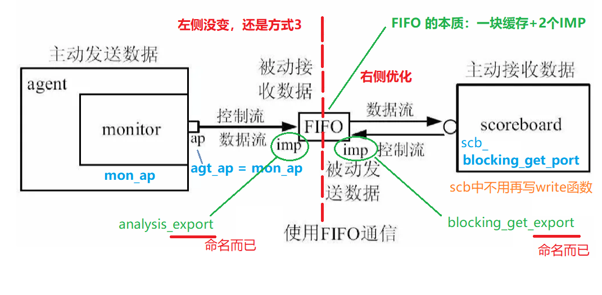

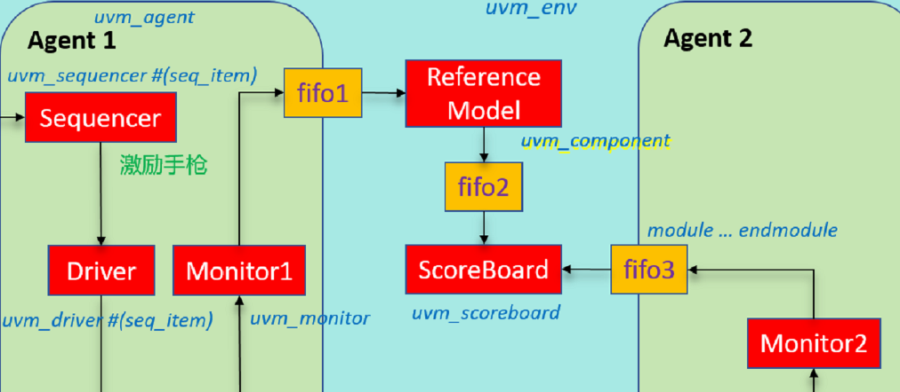


| uvm代码                                                      | 注释                                        |
| ------------------------------------------------------------ | ------------------------------------------- |
| uvm_tlm_analysis_fifo #(my_transaction) 	agt_scb_fifo;    | 声明一个agt==>fifo==>scb的 FIFO             |
| uvm_tlm_fifo #(my_transaction)                 	agt_scb_fifo; | 声明... FIFO，FIFO内部少一个analysis_export |

[左侧[方式三]参见【ap 内部连接】 ](#Ctrl跳转12)

```verilog
"""左侧[方式三]、右侧fifo+blocking_get_port实现 monitor和scb通信"""
##《monitor代码》主动方
	//@@ 略，同【ap 内部连接】方式三 示例代码

##《agent代码》被动方+主动方 【方式三】
	//@@ 略，同【ap 内部连接】方式三 示例代码

##《scoreboard代码》被动方
class my_scoreboard extends uvm_scoreboard;
    my_transaction	 expect_queue[$];
    uvm_blocking_get_port #(my_transaction) 	exp_port;      //@@ 声明port，期望输出（从输入侧输入） 
    uvm_blocking_get_port #(my_transaction) 	act_port;      //@@ 声明port，实际输出（从DUT输出侧输入） 
	…
    //@@ 例化端口
    function void build_phase(uvm_phase phase);
        super.build_phase(phase);
        exp_port = new("exp_port", this);   //@@ 例化aimp创建内存空间
        act_port = new("act_port", this);	//@@ 第一个参数：名字，
        									//@@ 第二个参数：一个uvm_component类型的父结点变量
    endfunction 
    
    
    //@@ 发送激励：不断的去要数据
    task main_phase(uvm_phase phase);
		…
		fork
			while (1) begin
                exp_port.get(get_expect);                  //@@ [系统自带]端口.get
                expect_queue.push_back(get_expect);
			end
			while (1) begin
                act_port.get(get_actual);                  //@@ [系统自带]端口.get
            end
		join
	endtask
endclass

##《env代码》连接
class my_env extends uvm_env;
	my_agent		 i_agt;
	my_agent		 o_agt;
	my_model		 mdl;
	my_scoreboard	 scb; 

    uvm_tlm_analysis_fifo #(my_transaction) 	agt_scb_fifo;   //@@ 声明一个o_agt==>scb 的fifo
    uvm_tlm_analysis_fifo #(my_transaction) 	agt_mdl_fifo;   //@@ 声明一个i_agt==>mdl 的fifo
    uvm_tlm_analysis_fifo #(my_transaction) 	mdl_scb_fifo;   //@@ 声明一个mdl==>scb 的fifo
    
	//@@ 例化组件 & 端口
    virtual function void build_phase(uvm_phase phase);
        o_agt = my_agent::type_id::create("o_agt", this);       //@@ 例化组件
        i_agt = my_agent::type_id::create("i_agt", this);
        mdl = my_model::type_id::create("mdl", this); 
        scb = my_scoreboard::type_id::create("scb", this); 
        
        
        
        
        
	endfunction
    
    //@@@ 连接端口
    function void connect_phase(uvm_phase phase);
        super.connect_phase(phase);
        i_agt.ap.connect(agt_mdl_fifo.analysis_export);       //@@ 本质 analysis_export 是一个imp
        mdl.port.connect(agt_mdl_fifo.blocking_get_export);   //@@ 本质 blocking_get_export 是一个imp

        mdl.ap.connect(mdl_scb_fifo.analysis_export);
        scb.exp_port.connect(mdl_scb_fifo.blocking_get_export);

        o_agt.ap.connect(agt_scb_fifo.analysis_export);
        scb.act_port.connect(agt_scb_fifo.blocking_get_export);
    endfunction
endclass 
```


##### ◻ FIFO 端口和函数

① `uvm_tlm_analysis_fifo`  具备下图所有 端口
     `uvm_tlm_fifo`     少一个 `analysis_export` 端口
②  `get`任务被调用时，`FIFO`内部缓存中会少一个`transaction`
      `peek`被调用时，`FIFO`会把`tr`复制一份发送出去，其内部缓存中的`tr`数量并不会减少
③  `FIFO`内部被定义的`put任务`被调用，这个`put任务`把传递过来的`tr`放在`FIFO`内部的缓存里，同时，把这个`tr`通过`put_ap`使用`write函数`发送出去
④   内部缓存，通过 `mailbox` 实现

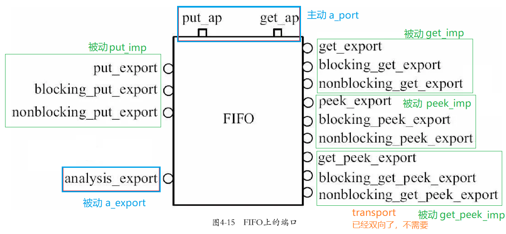

| fifo 函数                                                    | 注释                                     |
| ------------------------------------------------------------ | ---------------------------------------- |
| fifo. used（）                                               | 查询 `FIFO `缓存中有多少 `tr`            |
| fifo. is_empty（）                                           | 判断当前 `FIFO` 缓存是否为空             |
| fifo. is_full（）                                            | 判断当前 `FIFO` 缓存是否为满             |
| fifo. flush（）                                              | 清空 `FIFO` 缓存中的所有数据，常用于复位 |
| fifo = new（<string name>, <uvm_component parent = null>, <int size = 1>） | 例化fifo<br />参数三 size=0表示无穷大    |


##### ◻ <a name="Ctrl跳转13">FIFO for循环</a>                 <font color=gree>< 感觉后缀法 其实也可以 ></font>

——应对大量的端口连接（例如 数组端口），相较于后缀法（`uvm_analysis_imp_decl(_monitor)，[参见 【a_imp视角(多对一)】 ](#Ctrl跳转14)），可以使用for循环  

```verilog
"""FIFO优势：可使用for循环,声明、例化创建、连接端口"""
##《model代码》
class my_model extends uvm_component;
	uvm_blocking_get_port #(my_transaction)	 port;
    uvm_analysis_port #(my_transaction)		 ap[16];     //【？？？？？】
	
    //@@ 例化
    function void build_phase(uvm_phase phase);
        super.build_phase(phase);
        port = new("port", this); 
        for(int i = 0; i < 16; i++)
            ap[i] = new($sformatf("ap_%0d", i), this);       //【？？？？？】   
    endfunction
endclass

##《scoreboard代码》
class my_scoreboard extends uvm_scoreboard;
    my_transaction 	expect_queue[$];
    uvm_blocking_get_port #(my_transaction) 	exp_port[16];
    uvm_blocking_get_port #(my_transaction) 	act_port;
	…
    //@@ 例化端口
    function void build_phase(uvm_phase phase);
        super.build_phase(phase);
        for(int i = 0; i < 16; i++)            //@@ 
            exp_port[i] = new($sformatf("exp_port_%0d", i), this);
            act_port = new("act_port", this);
    endfunction
    
    //@@ 例化端口
    task main_phase(uvm_phase phase);
        for(int i = 0; i < 16; i++)
        fork
            automatic int k = i;
            while (1) begin
                exp_port[k].get(get_expect);      //@@ 【系统自带：port.get】被动方构造函数get
                expect_queue.push_back(get_expect);
            end
        join_none
        while (1) begin
            act_port.get(get_actual);  //@@ 【系统自带：port.get】被动方构造函数get
        end
    endtask
endclass


##《scoreboard代码》
class my_env extends uvm_env;
	…
	uvm_tlm_analysis_fifo #(my_transaction)	 agt_scb_fifo;
    uvm_tlm_analysis_fifo #(my_transaction)	 agt_mdl_fifo;
    uvm_tlm_analysis_fifo #(my_transaction)	 mdl_scb_fifo[16];         //@@ 【核心】后缀法无法这样

    //@@ 例化组件&端口
	virtual function void build_phase(uvm_phase phase);
        …
		agt_scb_fifo = new("agt_scb_fifo", this);
		agt_mdl_fifo = new("agt_mdl_fifo", this); 
		for(int i = 0; i < 16; i++)
            mdl_scb_fifo[i] = new($sformatf("mdl_scb_fifo_%0d", i), this);    //@@
	endfunction
	
    //@@ 连接
    function void connect_phase(uvm_phase phase);
        super.connect_phase(phase);
        i_agt.ap.connect(agt_mdl_fifo.analysis_export);
        mdl.port.connect(agt_mdl_fifo.blocking_get_export);
        
        for(int i = 0; i < 16; i++) begin
            mdl.ap[i].connect(mdl_scb_fifo[i].analysis_export);                 //@@ analysis_export
            scb.exp_port[i].connect(mdl_scb_fifo[i].blocking_get_export);       //@@ blocking_get_export
        end
        
        o_agt.ap.connect(agt_scb_fifo.analysis_export); 
        scb.act_port.connect(agt_scb_fifo.blocking_get_export);
    endfunction
endclass 
```


#### 补充：

- uvm_seq_item_pull_port：[参见【10.2~10.3  seq 高阶】](#Ctrl跳转17)


### Ch. 5_phase机制

<font color=red>**要点总结**：phase机制、objection机制</font>

#### 5.1 phase机制

- 5.1.1 ~ 5.1.4 function phase、task phase、执行顺序、树遍历

  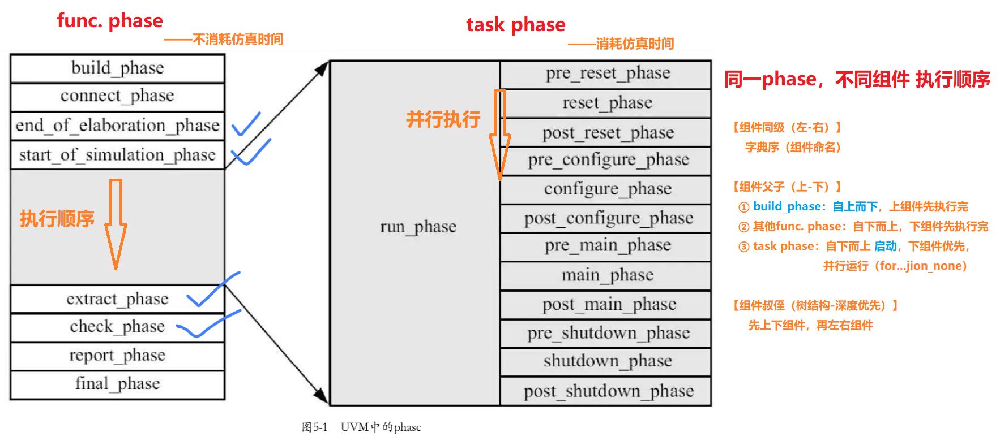

  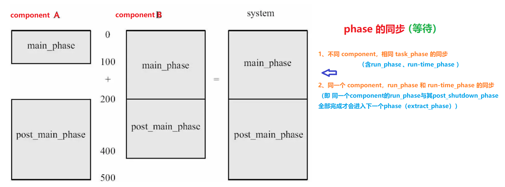


- 5.1.5 super.phase

  `super.build_phase`的目的是 获取 `config_db::set` 的参数

  不是`uvm_component`的（例如 base_test），也需要调用 `super.` ，例如：`super.connect_phase`

  <font color=blue>反正都调用就不会错了</font>


- 5.1.6 虽然是 `UVM_ERROR` 也会结束仿真

  在<font color=blue>`end_of_elaboration_phase`</font>及其前的`phase`（<font color=blue>`build_phase`、`connect_phase`</font>）中，如果出现了一个或多个`UVM_ERROR`，那么UVM就认为出现了致命错误，会调用`uvm_fatal`结束仿真。


- 5.1.7  phase 的 jump

  
  | uvm代码                                      | 注释                       | 备注 |
  | -------------------------------------------- | -------------------------- | ---- |
  | phase . jump (  uvm\_<xxx>_phase::get ( ) ); | 当前 phase跳转至 xxx_phase |      |
  
  ```verilog
    """phase的jump示例"""
    task my_driver::main_phase(uvm_phase phase);
    	begin
            @(negedge vif.rst_n);
            phase.jump(uvm_reset_phase::get());     //@@
    	end
    endtask
    
    """可选参数"""
  	uvm_xxxx_phase::get();       //@@   xxxx 可以是 func. phase 或是 task phase 中的任意一个
    
    """规则"""
    1、必须是【前-后】关系
    2、不能是并行关系（run_phase 和 run-time_phase）
    3、不能是 func.phase 跳 func.phase
  ```


- 5.1.8  phase 必要性 / 意义

  ① <font color=blue>在不同时间做不同的事情</font>，这就是 UVM 中`phase`的设计哲学;

  ② phase的引入在很大程度上解决了<font color=blue>因代码顺序杂乱</font>可能会引发的问题；
  
  ③ UVM的设计哲学就是全部<font color=blue>由`seq`来控制激励的生成</font>，因此一般情况下只在`seq`中<font color=blue>控制`objection`</font>。


- 5.1.9 phase 调试

  | sim 仿真命令     | 注释       | 备注 |
  | ---------------- | ---------- | ---- |
  | +UVM_PHASE_TRACE | phase 调试 |      |

  

- 5.1.10 超时退出

  2种方法：
  ① 方法1： uvm代码
  ② 方法2：sim 仿真命令 <font color=blue><推荐></font>

  - 方法1

  | uvm代码                                            | 注释                                                         | 备注 |
  | -------------------------------------------------- | ------------------------------------------------------------ | ---- |
  | uvm_top . set_timeout ( <timeout>, <overridable>); | 设置超时退出<br />参数1：设置时间<br />参数2：能否被覆盖 (1/0) |      |

  ```verilog
  """方法1：uvm代码 示例"""
  function void base_test::build_phase(uvm_phase phase);
  	super.build_phase(phase);
      env = my_env::type_id::create("env", this);
      uvm_top.set_timeout(500ns, 0);      //@@ 第一个参数：设置的时间
      									//@@ 第二个参数：设置是否可以被其后的其他set_timeout语句覆盖 
  endfunction
  
  """默认时间是：9200s"""
  `define UVM_DEFAULT_TIMEOUT 9200s  // uvm源代码
  ```

  - 方法2

  | sim 仿真命令                         | 注释                                                         | 备注                      |
  | ------------------------------------ | ------------------------------------------------------------ | ------------------------- |
  | +UVM_TIMEOUT=<timeout>,<overridable> | 设置超时退出<br />参数1：设置时间<br />参数2：能否被覆盖 (YES/NO) | +UVM_TIMEOUT="300ns, YES" |

  

#### 5.2 objection机制

<font color=blue>主要应用于 task phase</font> ( `run_phase` 和 `run-time_phase` )

- 5.2.1~5.2.2 task_phase的objection、参数phase

  1、如果想执行一些耗费时间的代码（`task`），那么要在 此phase下任意一个`component `中至少提起一次objection。

  2、如果UVM发现此`phase`没有提起任何`objection`，那么将会 <font color=blue>直接跳转到下一个`phase`中</font>。

  3、`run_phase` 和 `run-time_phase` 最好都有自己的 objection

  4、靠 传入的 <font color=blue>参数 phase</font> 提起 objection

  | uvm代码                       | 注释              | 备注                                     |
  | ----------------------------- | ----------------- | ---------------------------------------- |
  | phase . raise_objection(this) | 提起objection机制 | <font color=blue>多个参数</font> 见示例2 |
  | phase . drop_objection(this)  | 放下objection机制 |                                          |

  ```verilog
  """objection机制示例1""""
  task main_phase(uvm_phase phase); 
      phase.raise_objection(this);     //@@
  	…
      phase.drop_objection(this);      //@@
  endtask
  
  
  """objection机制示例2：多个参数""""
  class my_case0 extends uvm_test;
      …
      virtual task body();
          if(starting_phase != null)
              starting_phase.raise_objection(this, "case0 objection", 2);  //@@ 第二个参数是字符串，可以为空
                                                                          //@@ 第三个参数为objection的数量。
          #10000;
          if(starting_phase != null)
              starting_phase.drop_objection(this, "case0 objection", 2);
      endtask
  endclass
  ```

  

- 5.2.3 在哪控制objection

  2种选择：
  ① 在 `scoreboard` 中提起 `objection`
  ② 在 **`seq`** 中提起 **`sqr`** 的 `objection` （在 顶层 virtual seq  提起 ） <font color=red>（推荐) </font> 
     <font color=blue>因为UVM的设计哲学就是：全部由`seq`来控制激励的生成，因此一般情况下只在`sqr`中控制`objection`。 </font>
  
  - 在 `scoreboard` 种 提起 `objection`
  
    ```verilog
    """【不推荐，仅仅科普】在 scoreboard 中提起 objection 的示例"""
    task my_scoreboard::main_phase(uvm_phase phase); 
        phase.raise_objection(this);         //@@
        fork
            while (1) begin 
                exp_port.get(get_expect); 
                expect_queue.push_back(get_expect);
            end
            for(int i = 0; i < pkt_num; i++) begin 
                act_port.get(get_actual);
    			…
    		end 
    	join_any
        phase.drop_objection(this);      //@@
    endtask
    ```
  
    
  
  - <a name="Ctrl跳转10">在 顶层 `v_seq`种 提起 `objection`</a>、`starting_phase`
  
    因为`virtual seq`是起统一调度作用的，这种统一调度不只体现在`transaction`上，也应该体现在`objection`的控制上。
  
    -  <font color=bule>`starting_phase`</font>
  
       ① 在`seq`中可以使用`starting_phase`来控制 <font color=red>**验证平台的关闭**</font>。
  
       ② `starting_phase` 值 <font color=blue>不为 `null`  </font>的情况有以下2种，其他时候都为`null`（例如<font color=green>``uvm_do(seq)` </font>时）：
  
      ​		a.  <font color=blue>手工启动`seq`时为`starting_phase`赋值</font>
  
      ​		b.  将此`seq`作为`sqr`的某`task phase `的 <font color=blue>`default_sequence`</font>
  
      ③ <font color=red>当 `starting_phase`=`null` 的时候，使用`starting_phase.raise_objection`是没有任何用处的</font>。
  
      ④ ``uvm_do系列 `宏并不提供 `starting_phase`的传递功能。
  
      | uvm代码                               | 注释                                |
      | ------------------------------------- | ----------------------------------- |
      | if(starting_phase != null)            | 判断`stating_phase`是否为`null`     |
      | starting_phase.raise_objection(this); | 利用`stating_phase`提起 `objection` |
      | starting_phase.drop_objection(this);  | 利用`stating_phase`放下 `objection` |
  
      ```verilog
      """starting_phase = null, raise_objection 没有用 示例""""
      //@@   drv0_seq中的starting_phase为null，从而不会对objection进行操作
      ## 《seq0》
      class drv0_seq extends uvm_sequence #(my_transaction);
          …
      	virtual task body();
      		if(starting_phase != null) begin
      			starting_phase.raise_objection(this);
      			`uvm_info("drv0_seq", "raise objection", UVM_MEDIUM)
      		end
      		else begin
      			`uvm_info("drv0_seq", "starting_phase is null, can't raise objection", UVM_MEDIUM)
      		end
      		…
      	endtask
      endclass
      
      
      ##《v_seq》
      class case0_vseq extends uvm_sequence;
      	virtual task body();
      		drv0_seq 	seq0;
      		if(starting_phase != null)
      			starting_phase.raise_objection(this);
      			`uvm_do_on(seq0, p_sequencer.p_sqr0); 
      		#100;
      		if(starting_phase != null)
                  starting_phase.drop_objection(this);
          endtask
      endclass
      ```


- 5.2.4  objection的延时关闭属性

  一个 `phase` 对应一个`drain_time`，并不是所有的`phase`共享一个drain_time。

  | uvm代码                                         | 注释                                   | 备注 |
  | ----------------------------------------------- | -------------------------------------- | ---- |
  | phase . phase_done . set_drain_time(this, 200); | 为当前phase，设置objection延时关闭时间 |      |

  ```verilog
  """objection的延时关闭属性示例"""
  task base_test::main_phase(uvm_phase phase);
      phase.phase_done.set_drain_time(this, 200);  //@@ 为当前phase，设置objection延时关闭时间为200个时间单位
  endtask
  ```

  

- 5.2.5  objection调试

  | sim 仿真命令         | 注释           | 备注 |
  | -------------------- | -------------- | ---- |
  | +UVM_OBJECTION_TRACE | objection 调试 |      |


#### 5.3 domain

- 5.3.1~5.3.3 

  ① domain 把<font color=blue>两块时钟域隔开</font>，之后两个时钟域内的各个动态运行（run_time）的phase就可以不必同步。

  ② 注意，这里 domain **只能隔离** **`run-time phase`**，对于其他phase，其实还是同步的

  ​             （即两个domain的 `run_phase`依然是同步的，其他的`function phase`也是同步的）

  ③ domain的应用使得 phase的跳转 可以**只局限于验证平台的一部分**。

  ​			 （例如：B 两次进入了reset_phase和main_phase，而A只进入了一次）

  | uvm代码                         | 注释                                                         | 备注 |
  | ------------------------------- | ------------------------------------------------------------ | ---- |
  | uvm_domain xxx;                 | 在组件A的类中，声明一个domain指针xxx                         |      |
  | xxx = new("xxx");               | 在组件A的类中，在**new func.**中new                          |      |
  | set_domain (xxx，<int hier=1>); | 在组件A的类中，在**connect_phase**中  将A domain出去<br />参数2：为1时，表示递归其所有子类也加入该domain |      |

  ```verilog
  """完整domain示例代码"""
  class A extends uvm_component;
      uvm_domain new_domain;      //@@ 声明
      `uvm_component_utils(A) 
  	
      function new(string name="A", uvm_component parent=null);
  		super.new(name, parent);
          new_domain = new("new_domain");     //@@  new例化
      endfunction 
  
  	virtual function void connect_phase(uvm_phase phase);	
          set_domain(new_domain);         //@@ 设置启动
      endfunction
  	…
  endclass
  ```

  


### Ch. 6_sequence机制

<font color=red>**要点总结**：</font>

<font color=red>**seq内部**：启动（uvm_do）、例化（uvm_create） 、发送（uvm_send）、tr优先级（pri）、rsp</font>

<font color=red>**seq-seq**：seq优先级（start）、lock、grab、seq嵌套、m_sqr、p_sqr、同步</font>

<font color=red>**seq外部**：v_seq、seq_lib、config_db</font>

#### 6.1 sequence 启动

- 6.1.1 sequence 的意义/作用

  为了避免重复定义**激励函数 **`gen_pkt函数`，有以下3种方法：

  ① ``gen_pkt`定义为`virtual`类型的<font color=blue>虚函数</font>，重载 `gen_pkt函数` 

  ​	**缺陷：**新的问题产生，如何在这个测试用例中实例化这个新的driver呢？需要重新定义一个my_agent 
  ​		        为了实例化这个新的agent，又只能重新定义一个my_env。

  ② 定义一个<font color=blue>名称不一样</font>的 `gen_pkt函数` 

  ​	**缺陷：**driver的main_phase中又无法执行这种具有不同名字的函数，需要修改driver代码

  ③ 采用<font color=blue>sequence机制</font>：
  		在不同的测试用例中，将不同的 `sequence` 设置成 `sequencer` 的 `main_phase` 的 <font color=blue>`default_sequence`</font>。
  		当 `sequencer` 执行到 `main_phase` 时，发现有 `default_sequence`，那么它就启动`sequence`。


- 6.1.2 sequence 的启动

  在 <font color=blue>**test_case **</font>中有3种方法 **启动sequence**:

  ① 方法1：手动启动 `seq.start`
  ② 方法2：通过 `default_sequence`启动，   `uvm_config_db#(uvm_object_wrapper)::set` + `seq::type_id::get()`
  ③ 方法3：通过 `default_sequence`启动，   `uvm_config_db#(uvm_sequence_base)::set`   + 例化后的`seq`

  | uvm代码                                       | 注释                                                         | 备注                                                         |
  | --------------------------------------------- | ------------------------------------------------------------ | ------------------------------------------------------------ |
  | seq . start ( <sqr>,<parent seq>,<priority>); | 启动sequence，将seq发送给sqr<br />参数1：sequencer<br />参数2：seq的父seq<br />参数3：优先级，默认-1 | seq . start (sqr);                                           |
  | uvm_config_db#(uvm_object_wrapper)::set（略） |                                                              | <font color=blue>default_sequence 启动有2种办法，详见代码示例</font> |
  | uvm_config_db#(uvm_sequence_base)::set（略）  |                                                              |                                                              |

  ```verilog
  """方法1：手动启动seq.start示例1"""
  my_sequence my_seq;
  my_seq = my_sequence::type_id::create("my_seq");
  my_seq.start(sequencer);           //@@
  
  
  
  """方法1：手动启动seq.start示例2"""
  task my_case0::main_phase(uvm_phase phase);
  	…
      env.i_agt.sqr.set_arbitration(SEQ_ARB_STRICT_FIFO);  // 仲裁方式设定
      fork
          seq0.start(env.i_agt.sqr, null, 100);   //@@ 参数1：sequencer，参数2：seq的父seq，参数3：优先级，默认-1
          seq1.start(env.i_agt.sqr, null, 200);   //@@  优先级200
      join
  endtask
  
  ```

  ```verilog
  """方法2：通过 `default_sequence`启动1"""
  uvm_config_db#(uvm_object_wrapper)::set(this,                                     //@@
                                          "env.i_agt.sqr.main_phase",               //@@ 在case种设置sqr的
                                          "default_sequence",                       //@@ default_sequence
                                          case0_sequence::type_id::get());          //@@
  
  
  """方法3：通过 `default_sequence`启动2"""
  	function void my_case0::build_phase(uvm_phase phase);
          case0_sequence cseq;
          super.build_phase(phase); 
  		
          cseq = new("cseq");                                                           //@@
          uvm_config_db#(uvm_sequence_base)::set(this,                                 
                                                 "env.i_agt.sqr.main_phase",            
                                                 "default_sequence",                    
                                                 cseq);                                 //@@
  	endfunction
  ```

  


#### 6.2 sequence 仲裁机制

- 6.2.1 优先级 和 仲裁方式

  - <a name="Ctrl跳转9">tr优先级</a>

    ① 在<font color=blue> seq</font> 代码中，设置 **tr**的优先级
    ② tr  和 seq  默认优先级都是 -1

    | uvm代码                                                      | 注释                       | 备注             |
    | ------------------------------------------------------------ | -------------------------- | ---------------- |
    | \`uvm_do（<seq or item>） |seq 发送 seq  /  item\|`uvm_do(m_trans)||
    | `uvm_do_pri（<seq or item>,  <priority>）                    | ... 并设定优先级           |                  |
    | `uvm_do_with（<seq or item>,  <constraint>）                 | ... 并设定约束             |                  |
    | `uvm_do_pri_with（<seq or item>,  <priority>,  <constraint>） | ... 并设定优先级、约束     |                  |
    | `uvm_do_on（<seq or item>,  <sqr>）                          | seq 发送 (seq/item) 给 sqr |                  |
    | `uvm_do_on_pri（<seq or item>,  <sqr>,  <priority>）         | ... 并设定优先级           |                  |
    | `uvm_do_on_with（<seq or item>,  <sqr>,  <constraint>）      | ... 并设定约束             |                  |
    | `uvm_do_on_pri_with（<seq or item>,  <sqr>,  <priority>,  <constraint>） | ... 并设定优先级、约束     |                  |

    ```verilog
    """tr优先级设定示例"""
    class sequence0 extends uvm_sequence #(my_transaction);
        …
    	virtual task body();
    		…
    		repeat (5) begin
                `uvm_do_pri(m_trans, 100)             //@@ 优先级设定为100
    			`uvm_info("sequence0", "send one transaction", UVM_MEDIUM)
    		end
    
    		#100;
    		…
    	endtask
    	…
    endclass 
    
    
    
    class sequence1 extends uvm_sequence #(my_transaction);
    	…
    	virtual task body();
    		…
    		repeat (5) begin
                `uvm_do_pri_with(m_trans, 200, {m_trans.pload.size < 500;})     //@@优先级+约束
    			`uvm_info("sequence1", "send one transaction", UVM_MEDIUM)
    		end
    		…
    	endtask
    	…
    endclass
    ```

    

  - seq优先级、sqr 仲裁方式

    ① 在 <font color=blue>test_case</font>代码中，设置 seq的优先级

    ② tr  和 seq  默认优先级都是 -1

    ③ 对`sequence`设置优先级的本质即设置其内产生的 `transaction`的优先级

    | uvm代码                                        | 注释                                                         | 备注                                      |
    | ---------------------------------------------- | ------------------------------------------------------------ | ----------------------------------------- |
    | sqr . set_arbitration ( <仲裁方式选项> );      | 选择具体的仲裁方式                                           | sqr.set_arbitration(SEQ_ARB_STRICT_FIFO); |
    | <font color=blue>以下为具体仲裁方式选项</font> |                                                              |                                           |
    | SEQ_ARB_FIFO                                   | 先入先出，不考虑优先级                                       |                                           |
    | SEQ_ARB_WEIGHTED                               | 加权的仲裁，不考虑优先级                                     |                                           |
    | SEQ_ARB_RANDOM                                 | 完全随机，不考虑优先级                                       |                                           |
    | SEQ_ARB_STRICT_FIFO                            | <font color=red>先按优先级</font><br />优先级一致时，按先入先出 |                                           |
    | SEQ_ARB_STRICT_RANDOM                          | <font color=red>先按优先级</font><br />优先级一致时，<font color=red>随机从最高优先级中选择</font>> |                                           |
    | SEQ_ARB_USER                                   | 用户自定义                                                   |                                           |

    

    ```verilog
    """seq 优先级 和 仲裁方式代码示例"""
    task my_case0::main_phase(uvm_phase phase);
    	…
        env.i_agt.sqr.set_arbitration(SEQ_ARB_STRICT_FIFO); //@@ 仲裁方式设定
        													//@@ 若想按照优先级，可选SEQ_ARB_STRICT_FIFO或是SEQ_ARB_STRICT_RANDOM
        fork
            seq0.start(env.i_agt.sqr, null, 100);   //@@ 参数1：sequencer，参数2：seq的父seq，参数3：优先级，默认-1
            seq1.start(env.i_agt.sqr, null, 200);   //@@  优先级200
        join
    endtask
    ```

    

- 6.2.2~6.2.3    seq ==影响==> sqr 仲裁队列

  <font color=red>—— lock任务、grab任务</font>

  在 **<font color=blue>seq </font>**中写，去 **<font color=blue>sqr </font>**的仲裁队列 <font color=blue>排队</font>

  通过 `lock任务` 和 `grab任务`，`seq` 可以独占 `sqr`，强行使 `sqr` 发送自己产生的  `transaction`。

  仲裁算法是由 `sqr` 决定的，`seq` 除了可以在 **优先级** 上进行设置外，对 **仲裁的结果** 无能为力。

  | 项目    | <font color=red>lock</font>     vs     <font color=red>grab</font> |
  | ------- | ------------------------------------------------------------ |
  | 差异点  | 【lock】 排入sqr的仲裁队列 **最后**，**前面的都**执行完了，才能执行<br />【grab】排入sqr的仲裁队列 **最前**，**当前的**执行完了，就能开始执行 |
  | 共同点  | 开启时，只能它自己一个执行，直至它结束                       |
  | 优先级  | grab > lock                                                  |
  | uvm代码 | 【lock】在`seq`的`body()  task`中定义<br />               lock( );<br />               unlock( );<br />【grab】在`seq`的`body()  task`中定义<br />                grab( );<br />                ungrab( ); |

  ```verilog
  """lock示例（grab雷同）"""
  class sequence0 extends uvm_sequence #(my_transaction);
  	…
  	virtual task body();
  		…
  		repeat (2) begin
  			`uvm_do(m_trans)	
  			`uvm_info("sequence0", "send one transaction", UVM_MEDIUM)
  		end
          lock();         //@@ 锁住
  		repeat (5) begin
  			`uvm_do(m_trans)
  			`uvm_info("sequence0", "send one transaction", UVM_MEDIUM)
  		end
          unlock();       //@@  解锁
  		repeat (2) begin
  			`uvm_do(m_trans)	
  			`uvm_info("sequence0", "send one transaction", UVM_MEDIUM)
  		end
  		#100;
  		…
      endtask 
     	… 
  	`uvm_object_utils(sequence0)
  endclass
  ```

  

- 6.2.4   seq 失效

  <font color=red>——构造 is_relevant函数、wait_for_relevant任务</font>

   `is_relevant函数`、`wait_for_relevant任务`，也是在 **<font color=blue>seq </font>**中写

  ① 通过设置`is_relevant函数`，可以使`seq`主动放弃`sqr`的使用权，而`grab任务`和`lock任务`则强占`sqr`的所有权。

  ② `sqr`发现`seq`无效，会调用`seq`的`wait_for_relevant任务`，等待`seq`变有效，所以， `is_relevant函数`与`wait_for_relevant任务`一般应成对重载，不能只重载其中的一个，否则会进入死循环

  ```verilog
  """is_relevant函数、wait_for_relevant任务 示例"""
  class sequence0 extends uvm_sequence #(my_transaction);
  	…
      //@@ 
  	virtual function bit is_relevant();
  		if((num >= 3)&&(!has_delayed)) 
              return 0;
  		else return 1;
  	endfunction 
  
  	//@@ 
      virtual task wait_for_relevant(); 
  		#10000;	
  		has_delayed = 1;
  	endtask 
  
  	virtual task body();
  		…
  		repeat (10) begin
  			num++;
  			`uvm_do(m_trans)
  			`uvm_info("sequence0", "send one transaction", UVM_MEDIUM)
  		end
  		…
  	endtask
  	…
  endclass
  ```

  

  

#### 6.3 sequence 相关宏

- 6.3.1、6.3.4~6.3.5  uvm_do系列、start_item任务、finish_item任务、pre_do任务、mid_do函数、post_do函数

  - `uvm_do系列`

    [详细参见 tr优先级 ](#Ctrl跳转9)

    ① ``uvm_do系列 `宏并不提供 `starting_phase`的传递功能。

    <font color=blue>本质、内部构造</font>：
    
    ```apl
    uvm_do 第一个参数为 tr时，调用：  start_item任务、finish_item任务
uvm_do 第一个参数为seq时，调用 seq的 start任务
    ```
  
    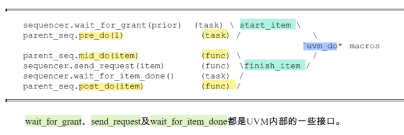
  

  - uvm_do 下1层： `start_item任务`、`finish_item任务`
  
    | uvm代码                          | 注释                        | 备注                                              |
    | -------------------------------- | --------------------------- | ------------------------------------------------- |
  | start_item(<item>, <priority>);  | seq开始处理tr，优先级默认-1 | <font color=blue>参数必须是item，不能是seq</font> |
    | finish_item(<item>, <priority>); | seq结束处理tr，优先级默认-1 | <font color=blue>参数必须是item，不能是seq</font> |
  
    ```verilog
    """uvm_do 内部封装了start_item任务、finish_item任务 """
    virtual task body();
    	…
    	tr = new("tr"); 
        start_item(tr，100);       //@@  参数2为 tr的优先级，此处为100
    	assert(tr.randomize() with {tr.pload.size() == 200;}); finish_item(tr);
        finish_item(tr，100);      //@@
    	…
  endtask
    ```

    

  - uvm_do 下2层： `pre_do任务`、`mid_do函数`、`post_do函数`
  
    | uvm代码                   | 类型 | 位置                | 参数说明                                                     |
    | ------------------------- | ---- | ------------------- | ------------------------------------------------------------ |
    | pre_do ( <bit is_item> )  | 任务 | start_item最后一行  | 表明uvm_do宏是在对一个transaction还是在对一个sequence进行操作 |
  | mid_do ( <seq or item> )  | 函数 | finish_item最开始   | 正在操作的sequence或者item的指针                             |
    | post_do ( <seq or item> ) | 函数 | finish_item最后一行 | 正在操作的sequence或者item的指针                             |
  
    ```verilog
    """ pre_do任务、mid_do函数、post_do函数 示例代码 """
    class case0_sequence extends uvm_sequence #(my_transaction);
        my_transaction m_trans;
        int num;
        
        //@@
    	virtual task pre_do(bit is_item); 
    		#100;
    		`uvm_info("sequence0", "this is pre_do", UVM_MEDIUM)
    	endtask 
        
    	//@@
    	virtual function void mid_do(uvm_sequence_item this_item);
    		my_transaction tr;
    		int p_sz;
    		`uvm_info("sequence0", "this is mid_do", UVM_MEDIUM)
    		void'($cast(tr, this_item));
    		p_sz = tr.pload.size();
    		{tr.pload[p_sz 4],
    		 tr.pload[p_sz 3],
    	     tr.pload[p_sz 2],
             tr.pload[p_sz 1]} = num;
    		 tr.crc = tr.calc_crc();
    	 	 tr.print();
    	endfunction 
    
        //@@
    	virtual function void post_do(uvm_sequence_item this_item);
    		`uvm_info("sequence0", "this is post_do", UVM_MEDIUM)
    	endfunction 
    
    	virtual task body();
    		repeat (10) begin
    			num++;
    			`uvm_do(m_trans)
    		end
    	endtask
    endclass
    ```


- 6.3.2~6.3.3  uvm_create系列、uvm_send系列

  <font color=blue>`uvm_do` 相当于 `uvm_create`  + `uvm_send`</font>

  - uvm_create系列

    | uvm代码                    | 注释                 |
    | -------------------------- | -------------------- |
    | \`uvm_create(<seq or item>) |例化tr，等价于new( )\|`uvm_create(m_trans)<br /><font color=blue>等价于 m_trans= new("m_trans");</font>|

    

  - uvm_send系列

    | uvm代码                                                      | 注释                          |
    | ------------------------------------------------------------ | ----------------------------- |
    | \`uvm_send（<seq or item>） |seq 发送 seq  /  item<br />例如：\`uvm_send(m_trans)|
    | `uvm_send_pri（<seq or item>,    <priority>）                | ... 并设定优先级              |
    | \`uvm_rand_send（<seq or item>） |seq 发送 随机化的seq  /  item<br />例如：`uvm_rand_send(m_trans)|
    | `uvm_rand_send_pri（<seq or item>,    <priority>）           | ... 并设定优先级              |
    | `uvm_rand_send_with（<seq or item>， <constraint>）          | ... 并设定约束                |
    | `uvm_rand_send_pri_with（<seq or item>,   <priority>,  <constraint>） | ... 并设定优先级、约束        |

    ```verilog
    """seq代码中uvm_send示例"""
    class sequence0 extends uvm_sequence #(my_transaction);
        …
        virtual task body();
            …
    		m_trans = new("m_trans");   	//@@ 等价于 `uvm_create(m_trans)
    		`uvm_rand_send_pri_with(m_trans, 100, {m_trans.pload.size == 100;})  //@@ 
        	…
        endtask
        …
    endclass
    ```

    


#### 6.4  seq嵌套、m_sqr、p_sqr

- 6.4.1、6.4.3  嵌套seq

  ① 一个 `sqr` 只能产生一种类型的`transaction`

  ② 一个 `seq` 如果要想在此`sqr`上启动，那么其所产生的`tr`的类型必须是这种 `transaction` 或者 派生自这种`transaction`

  ③ 若 `tr` 类型不同的2个 `seq `被嵌套，那么需要进行在<font color=blue>`driver代码`</font>中 <font color=blue>`$cast（子seq对象，父seq指针）` </font> 进行补救

  - tr类型相同的seq嵌套

    ```verilog
    """示例1：tr类型相同的seq嵌套，直接嵌套"""
    class case0_sequence extends uvm_sequence #(my_transaction);
        …
        virtual task body();
            crc_seq cseq;       //@@    此处假设 crc_seq 和 long_seq 有派生关系，属于 同一种 tr类型
            long_seq lseq;      //@@
            …
            repeat (10) begin
                `uvm_do(cseq)        //@@
                `uvm_do(lseq)        //@@
            end
            …
        endtask
        …
    endclass
    ```

    

  - tr类型不同的seq嵌套

    ```verilog
    """示例2：tr类型不同的seq嵌套，driver使用$cast补救"""
    ## 《seq代码》
    class case0_sequence extends uvm_sequence;
        my_transaction m_trans;     //@@ 两个的类型不一样
        your_transaction y_trans;   //@@
        …
        virtual task body();
            …
            repeat (10) begin
                `uvm_do(m_trans)    //@@
                `uvm_do(y_trans)    //@@
            end
            …
        endtask 
    
        `uvm_object_utils(case0_sequence)
    endclass
    
    ## 《driver代码》补救
    task my_driver::main_phase(uvm_phase phase);
        my_transaction m_tr;
        your_transaction y_tr;
        …
        while(1) begin
            seq_item_port.get_next_item(req);
            if($cast(m_tr, req)) begin          //@@ 假如[类的向下转换成功] req为父指针（item），m_tr为子对象
                drive_my_transaction(m_tr);
                `uvm_info("driver", "receive a transaction whose type is my_transaction", UVM_MEDIUM)
            end
            else if($cast(y_tr, req)) begin     //@@
                drive_your_transaction(y_tr);
                `uvm_info("driver", "receive a transaction whose type is your_transaction", UVM_MEDIUM)
            end
            else begin  
                `uvm_error("driver", "receive a transaction whose type is unknown")
            end
            seq_item_port.item_done();
        end
    endtask
    ```

    

- 6.4.2 seq 使用rand 变量

  在<font color=blue> `seq`</font> 中定义<font color=blue>`rand类型变量`</font> 以向产生的`tr`传递约束时，变量的名字一定要与<font color=blue>`tr`</font>中相应字段的 **<font color=red>名字不同</font>**。

  ```verilog
  class long_seq extends uvm_sequence#(my_transaction);
      rand bit[47:0] ldmac;   //@@
  	…
  	virtual task body();
  		my_transaction tr;
  		`uvm_do_with(tr, {tr.crc_err == 0;
  					 	  tr.pload.size() == 1500;
                            tr.dmac == ldmac;})     //@@ 命名需不一样，( dmac 和 ldmac )
  		tr.print();
  	endtask
  endclass
  ```

  

- 6.4.4~6.4.5  m_sequencer、p_sequencer

  - `m_sequencer`

    ①  <font color=red>使用 `uvm_do` 进行 相同`tr`类型的 **`seq` 嵌套时**，实际上系统自动 给 内嵌的 `seq`分配的 `sqr` 就是 `m_sequencer` 类型</font>
    
    ② `m_sequencer` 是 `uvm_sequencer_base` 类型（ `uvm_sequencer`的基类），即 <font color=blue>`m_sequencer` </font>和 <font color=blue> `uvm_sequencer` </font> 都由 <font color=blue>`uvm_sequencer_base`</font>  <font color=red>派生 </font>而来 
    
    
    
  - `p_sequencer`

    <font color=blue>`seq` </font>访问<font color=blue> `sqr.变量` </font>的值的方式有2种：

    ① 方法1：在 seq代码中，使用<font color=blue> `$cast(my_sequencer的对象, m_sequencer的指针)`</font>转换后，读取`my_sequencer的对象.变量`

    ② 方法2：在 seq代码中，使用<font color=blue> ``uvm_declare_p_sequencer(my_sequencer类型)`</font>转换后，读取`p_sequencer.变量`   **<font color=red><推荐></font>**

    | uvm代码                                | 注释                                     | 备注                                                         |
    | -------------------------------------- | ---------------------------------------- | ------------------------------------------------------------ |
    | `uvm_declare_p_sequencer(my_sequencer) | 在seq中，将my_sequencer声明为p_sequencer | <font color=blue>声明后，在seq 的pre_body（）之前 ，自动完成$cast操作：$cast(my_sequencer对象， m_sequencer );</font> |
    | p_sequencer . 变量                     | 调用p_sequencer的变量值                  | p_sequencer.dmac                                             |

    ```verilog
    """my_sqr代码"""
    // my_sequencer的父类是uvm_sequencer，uvm_sequencer与m_sequencer平级，都继承自uvm_sequencer_base
    // 即 my_sequencer例化后，就是子对象， m_sequencer 是父指针
    class my_sequencer extends uvm_sequencer #(my_transaction);
        bit[47:0] dmac;
        bit[47:0] smac;
    	…
    	virtual function void build_phase(uvm_phase phase);
    		super.build_phase(phase);
            void'(uvm_config_db#(bit[47:0])::get(this,"", "dmac", dmac));
    		void'(uvm_config_db#(bit[47:0])::get(this,"", "smac", smac));
    	endfunction 
    
    	`uvm_component_utils(my_sequencer)
    endclass
    
    """【会报错】seq直接引用"""
    class seq0 extends uvm_sequence#(tr)
        virtual task body();
        	…
        	repeat (10) begin
                `uvm_do_with(m_trans, {m_trans.dmac == m_sequencer.dmac;     //@@ 会报错
                                       m_trans.smac == m_sequencer.smac;})   //@@ 
        	end
        	…
        endtask
    endclass
    
    """【正确用法-方法1】seq使用$cast转换sqr"""
    class seq0 extends uvm_sequence#(tr)
        my_transaction m_trans;    
        …
        virtual task body();
            my_sequencer  x_sqr;
            $cast(x_sqr, m_sequencer);      //@@ x_sqr是my_sequencer例化后的子对象，m_sequencer是父指针
         								    //@@ [类的向下转换]
        	…
        	repeat (10) begin
                `uvm_do_with(m_trans, {m_trans.dmac == x_sqr.dmac;     //@@ 正确，不会报错
                                       m_trans.smac == x_sqr.smac;})   //@@ 
        	end
        	…
        endtask
    endclass
    
    
    """【正确用法-方法2】seq使用p_quencer"""
    class seq0 extends uvm_sequence#(tr)
    	my_transaction m_trans;
        `uvm_object_utils(seq0)
        `uvm_declare_p_sequencer(my_sequencer)    //@@ 声明了一个sqr类型的成员变量
        										  //@@ 声明后，在seq 的pre_body（）之前 ，自动完成$cast操作
                                                  //@@ $cast(my_sequencer对象， m_sequencer );
        …
        virtual task body();
        	…
        	repeat (10) begin
                `uvm_do_with(m_trans, {m_trans.dmac == p_sequencer.dmac;     //@@ 正确，不会报错
                                       m_trans.smac == p_sequencer.smac;})   //@@ 
        	end
        	…
        endtask
    endclass
    ```


#### 6.5 seq 同步、virtual seq

- 6.5.1~6.5.3  seq的同步

  同步的方法有2个：

  ① 方法1：在 `seq`代码中，设置 <font color=blue>全局事件</font>    <font color=red><不推荐></font>

  ② 方法2：通过 <font color=blue> `virtual seq` </font>    （**核心是**：<font color=red>**`p_sequencer`** + 事先发送**最长包**``uvm_do_on_with`</font>）

  - 通过 全局事件，达成`seq`的同步

    | uvm代码 | 注释                                             |
    | ------- | ------------------------------------------------ |
    | ->xxx;  | 触发事件xxx                                      |
    | @xxx;   | 等待该事件：  在这里暂停执行，直到 xxx事件被触发 |
    
    ```verilog
    """【不推荐】在seq代码中，设置 全局事件，实现seq同步"""
    ## 《seq0 和 seq1 代码》
    event send_over;       //@@ global event
    class drv0_seq extends uvm_sequence #(my_transaction);
    	virtual task body();
    		`uvm_do_with(m_trans, {m_trans.pload.size == 1500;})
    		->send_over;           //@@ 触发事件
    		repeat (10) begin
    			`uvm_do(m_trans)
    			`uvm_info("drv0_seq", "send one transaction", UVM_MEDIUM)
    		end
    	endtask
    endclass 
    
    class drv1_seq extends uvm_sequence #(my_transaction);
    	virtual task body();
            @send_over;              //@@ 等待该事件：  在这里暂停执行，直到 send_over 事件被触发
            repeat (10) begin
                `uvm_do(m_trans)
                `uvm_info("drv1_seq", "send one transaction", UVM_MEDIUM)
            end
            …
    	endtask
    endclass 
            
            
    ## 《case 代码》  
    //@@ 通过 default_sequence 发送激励
    function void my_case0::build_phase(uvm_phase phase);
        super.build_phase(phase); 
    	uvm_config_db#(uvm_object_wrapper)::set(this,
                                                "env0.i_agt.sqr.main_phase",   //@@ 环境0
                                                "default_sequence",
                                                drv0_seq::type_id::get());     //@@ seq0
        uvm_config_db#(uvm_object_wrapper)::set(this,
                                              "env1.i_agt.sqr.main_phase",   //@@ 环境1
                                                "default_sequence",
                                              drv1_seq::type_id::get());     //@@ seq1
    endfunction      
    ```
  

  
- 通过`virtual seq`，达成`seq`的同步
  
  ① 它根本就不发送`transaction`，它只是控制其他的`sequence`，起<font color=blue>统一调度</font>的作用。
  
  ③ 为了使用 `virtual seq`，需要有一个 <font color=blue>`virtual sqr`</font>
  
    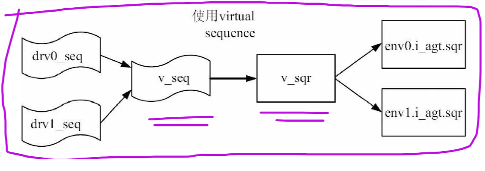
  
    **代码**：
  part1：《virtual sqr》            
    part2：《virtual seq》  <font color=blue>发送seq，有2种方法``uvm_do( ) `和 手动 `seq.start()` </font>
    part3：《seq0》、《seq1》   发送tr
  
    ```verilog
    """【part1】《virtual sqr代码》"""
    ## 《v_sqr 类》
    class my_vsqr extends uvm_sequencer;
        my_sequencer p_sqr0;        //@@ virtual sqr里面包含指向其他真实sqr的指针
        my_sequencer p_sqr1;
    endclass
    
    
    ## 《base_test_case》中例化 v_sqr 和 sqr
    class base_test extends uvm_test;
    	my_env   	 env0;
    	my_env  	 env1;
    	my_vsqr		 v_sqr;   //@@ 声明 v_sqr
        
        function void build_phase(uvm_phase phase);
            super.build_phase(phase);
            env0 = my_env::type_id::create("env0", this);
            env1 = my_env::type_id::create("env1", this);
            v_sqr = my_vsqr::type_id::create("v_sqr", this);     //@@ 例化 v_sqr
        endfunction 
       
    	function void connect_phase(uvm_phase phase);
            v_sqr.p_sqr0 = env0.i_agt.sqr;              //@@ 【直接赋值过来！！！！】
            v_sqr.p_sqr1 = env1.i_agt.sqr;
        endfunction
   
    endclass 
    ```
  
    
  
    ```verilog
    """【part2】《virtual seq代码》发送seq：方法1：uvm_do()"""
    class case0_vseq extends uvm_sequence;
        `uvm_object_utils(case0_vseq) 
        `uvm_declare_p_sequencer(my_vsqr)      //@@ 声明 my_vsqr 为 p_sequencer
        …
        virtual task body();
            my_transaction tr;
            drv0_seq seq0;
            drv1_seq seq1;
            …
            `uvm_do_on_with(tr, p_sequencer.p_sqr0, {tr.pload.size == 1500;}) //@@ 【核心】最长包≈时间最大并集
            `uvm_info("vseq", "send one longest packet on p_sequencer.p_sqr0", UVM_MEDIUM)
            fork
                `uvm_do_on(seq0, p_sequencer.p_sqr0);   //@@ seq 在 最大时间 下跑，必然是同步的
                `uvm_do_on(seq1, p_sequencer.p_sqr1);   //@@ 
            join	
            …
        endtask
    endclass
    /*
        在使用uvm_do_on宏的情况下，虽然seq0是在case0_vseq中启动，但是它最终会被交给p_sequencer.p_sqr0，也即env0.i_agt.sqr，而不是v_sqr。
        这个就是virtual sequence和virtual sequencer中virtual的来源。它们各自并不产生transaction，而只是控制其他的sequence为相应的sequencer产生transaction。【统一调度】
        */
    
    
    
    
    
    """【part2】《virtual seq代码》发送seq：方法2：手动seq.start(sqr)"""
    //@@  手动seq.start()： 好处是可以传递一些值进去
    class case0_vseq extends uvm_sequence;
        `uvm_object_utils(case0_vseq) 
        `uvm_declare_p_sequencer(my_vsqr)      //@@ 声明 my_vsqr 为 p_sequencer
        …
        virtual task body();
            my_transaction tr;
            drv0_seq seq0;
            drv1_seq seq1;
            …
            `uvm_do_on_with(tr, p_sequencer.p_sqr0, {tr.pload.size == 1500;}) //@@ 【核心】最长包≈时间最大并集
            `uvm_info("vseq", "send one longest packet on p_sequencer.p_sqr0", UVM_MEDIUM)
            seq0 = new("seq0");
            seq0.file_name = "data.txt";        //@@ 手动启动 之 手动例化的好处[传入值]
            seq1 = new("seq1");
            fork
                seq0.start(p_sequencer.p_sqr0);  //@@ 手动启动 之 seq.start
                seq1.start(p_sequencer.p_sqr1);
            join	
            …
        endtask
    endclass
    ```
  
    
  
    ```verilog
    """【part3】seq0、seq1 发送tr"""
    ## 《seq0》
    class drv0_seq extends uvm_sequence #(my_transaction);
    	…
    	virtual task body();
    		repeat (10) begin
                `uvm_do(m_trans)            //@@ 发送tr
    			`uvm_info("drv0_seq", "send one transaction", UVM_MEDIUM)
    		end
    	endtask
    endclass 
    
    ## 《seq1》
    class drv1_seq extends uvm_sequence #(my_transaction);
    	…
    	virtual task body();
    		repeat (10) begin
                `uvm_do(m_trans)               //@@ 发送tr
    			`uvm_info("drv1_seq", "send one transaction", UVM_MEDIUM)
    		end
    	endtask
    endclass
    ```
  
    
  
- <a name="Ctrl跳转11">6.5.3-2 virtual seq 另外的**好处**/特点：</a>

  ① `virtual seq` 的使用可以<font color=blue>减少`config_db`语句</font>的使用

  ② `virtual seq` 作为一种特殊的`seq`，也可以在其中启动其他的`virtual seq`：

  ```verilog
  """减少`config_db`语句的使用"""
  ## 《case代码》
  function void my_case0::build_phase(uvm_phase phase);
  	…
  	uvm_config_db#(uvm_object_wrapper)::set(this,
                                              "v_sqr.main_phase",       //@@ 一个config_db 顶很多个seq的cfg
                                              "default_sequence",
                                              case0_vseq::type_id::get());   //@@ v_seq内部的都被操作了
  endfunction
  ```

  ```verilog
  """virtual seq 启动 其他virtual seq"""
  class case0_vseq extends uvm_sequence;
  	…
  	virtual task body();
  		cfg_vseq	 cvseq;
  		…
          `uvm_do(cvseq)     //v_seq0 发送 v_seq1
  		…
  	endtask
  endclass
  ```

  

- 6.5.4  顶层`virtual seq` 提起`objection `、`starting_phase`

  [参见 objection机制 ](#Ctrl跳转10)
  
  

- 6.5.5  `seq`并发运行、 `seq` 中 慎用 `for...join_none`

  系统会新启动这些进程，但是并不等待这些`seq`执行完毕就直接返回了, 返回之后就到了`endtask`。此时系统认为这个`seq`已经执行完成了。执行完成之后，系统将会清理这个`seq`之前占据的内存空间，“杀死”掉由其启动的进程。所以，本质上 这些 `seq`并未执行完。

  解决办法有2个：

  ① 办法1：`fork...join_none` + `wait fork `      <font color=red><推荐></font>

  ② 办法2：使用 `fork...join`，缺陷是 <font color=blue>无法使用 for 循环</font>

  - `wait fork`

    | uvm代码    | 注释                       |
    | ---------- | -------------------------- |
    | wait fork; | 等待fork结束，否则一直阻塞 |

    ```verilog
    """fork...join_none + wait for"""
    class case0_vseq extends uvm_sequence;
    	virtual task body();
    		my_transaction 		tr;
    		drv_seq 	   dseq[4];
    
    		for(int i = 0; i < 4; i++)
    			fork                                                //@@
    				automatic int j = i;
    				`uvm_do_on(dseq[j], p_sequencer.p_sqr[j]);
    			join_none                                           //@@
           	wait fork;                 //@@
    	endtask
    endclass
    ```

    

  - `for...join`

    ```verilog
    """fork...join"""
    class case0_vseq extends uvm_sequence; 
        virtual task body();
            drv_seq	 dseq[4]; 
            fork      //@@ 缺点： 只是这样就无法使用for循环了（for循环会导致实际运行的是4个for...join）
                uvm_do_on(dseq[0], p_sequencer.p_sqr[0]);
                uvm_do_on(dseq[1], p_sequencer.p_sqr[1]); 
                uvm_do_on(dseq[2], p_sequencer.p_sqr[2]); 
                uvm_do_on(dseq[3], p_sequencer.p_sqr[3]);
            join   //@@
        endtask
    endclass
    ```

    


#### 6.6 在seq中使用config_db

- 6.6.1~6.6.2 获取和设置

  - 获取 get

    ① `get`函数原型中，第一个参数必须是一个`component`，而`seq`不是一个`component`，所以这里  <font color=red>不能使用`this`指针</font>，只能使用  <font color=blue>`null ` </font>或者  <font color=blue>`uvm_root：：get（）`</font>

    | uvm代码                                                      | 注释       |
    | ------------------------------------------------------------ | ---------- |
    | uvm_config_db#(数据类型)::get(组件名，例化名，变量名，变量); | 获得变量值 |
    | `get`函数的第一参数：可以是<font color=blue> `null`</font>  或是 <font color=blue> `uvm_root::get()`</font>,  不能是<font color=red> `this`</font> |            |

    ```verilog
    """获取（get）示例"""
    ##《seq代码》
    uvm_config_db#(int)::get(null,                //@@ 注意【get】seq的第一参数只能是：null / uvm_root::get()
                             get_full_name(),
                             "count",
                             count);   
    ```

    

  - 设置 set

    | uvm代码                                                      | 注释       |
    | ------------------------------------------------------------ | ---------- |
    | uvm_config_db#(数据类型)::set(组件名，例化名，变量名，值);   | 设置变量值 |
    | `set`函数的第一参数：可以是<font color=blue> `this`</font> 或是<font color=blue> `null`</font>  或是 <font color=blue> `uvm_root::get()`</font> |            |

    ```verilog
    """设置（set）示例"""
    ##《case代码》build_phase / 《seq代码》
    uvm_config_db#(int)::set(this,           //@@ 【set】seq的第一参数 可以是：this / null / uvm_root::get()
                             "env.i_agt.sqr.*",
                             "count", 
                             9);
    
    uvm_config_db#(bit)::set(uvm_root::get(),
                             "uvm_test_top.env0.scb",
                             "cmp_en", 
                             0);
    
    uvm_config_db#(bit)::set(uvm_root::get(),
                             "uvm_test_top.v_sqr.*",   //@@ 【写启动路径】seq在virtual seq中被启动
                             "first_start",
                             0);
    //@@  所以其get_full_name的结果应该是uvm_test_top.v_sqr.*，而不是uvm_test_top.env0.i_agt.sqr.*，所以在设置set 时，第二个参数应该是 uvm_test_top.v_sqr.*。
    ```

    

- 6.6.2-2 `virtual_seq` 相关的  

  ① `virtual seq` 的使用可以<font color=blue>减少`config_db`语句</font>的使用   

  [参见virtual seq 的好处 ](#Ctrl跳转11)

  ② `virtual seq` 中启动的 `seq`，在<font color=blue>设置（`set`）时，第2参数 </font> 需要 写成  `uvm_test_top.v_sqr.*`，而不是`uvm_test_top.env0.i_agt.sqr.*`，即 写  <font color=blue>启动路径</font>

  <font color=cyan>参见上面的设置（set）示例</font>


- 6.6.3 `wait_modified`

  ① 与 `config_db：：get`的前三个参数完全一样。当它检测到 <font color=blue>第三个参数的值</font> 被更新过后，它就返回，否则一直等待在那里

  ② 可以在 `seq`中 调用，也可以在 `component` 中 调用

  | uvm代码                                                      | 注释                                  |
  | ------------------------------------------------------------ | ------------------------------------- |
  | uvm_config_db#(数据类型)::wait_modified(<组件名>,<例化名>, <变量名>); | 变量值是否修改，修改则返回1，否则阻塞 |

  ```verilog
  """示例1：在seq中调用 wai_modified"""
  ##《seq代码》
  class drv0_seq extends uvm_sequence #(my_transaction);
  	…
      virtual task body();x
  		bit send_en = 1;
  		fork
              while(1) begin
                  uvm_config_db#(bit)::wait_modified(null, get_full_name(), "send_en");    //@@ seq中调用
                  void'(uvm_config_db#(bit)::get(null, get_full_name, "send_en", send_en));
                  `uvm_info("drv0_seq", $sformatf("send_en value modified, the new value is %0d", se
              end
  		join_none
          wait fork
  		…
  	endtask
  endclass
  
  
  
  """示例2：在component中调用 wai_modified"""
  task my_scoreboard::main_phase(uvm_phase phase);
  	…
  	fork
  		while(1) begin
              uvm_config_db#(bit)::wait_modified(this,"", "cmp_en");        //@@ component中调用
  			void'(uvm_config_db#(bit)::get(this,"", "cmp_en", cmp_en));
  			`uvm_info("my_scoreboard", $sformatf("cmp_en value modified, the new value is %0d", cmp
  		end
  		…
      join
  endtask
  ```

  


#### 6.7 response的使用

- 6.7.1~6.7.4  respone 的方法

  ① `response` 指的是 `driver`  返回给 `seq `的`tr` 信息

  ② `driver代码` `response` 的发送，主要有3种方法：

  ​			a.	方法1：`put_response任务` 

  ​			b.	方法2：`seq_item_port . item_done ( rsp );`   <font color=blue><缺陷：只能发一个rsp></font>

  ​			c.	方法3：`driver` 对属性变量 直接 赋值   <font color=red> <最常用></font>

  ③ `seq代码`  `response` 的获得，主要有 3 种方法：

  ​			a.	方法1：`get_response任务`  

  ​			b.	方法2：`response_handler函数`  <font color=blue><优点：drv的发送rsp 和 seq发送的tr 可以解耦开（不同进程发送，互不影响)></font>

  ​			c. 	方法3：``uvm_do(tr) `后  直接读取 `tr.属性 `<font color=red> <最常用></font>

  ④`driver` 发送 `rsp`  +   `seq` 获得 `rsp`  组合起来就有 9种方法

  ⑤ 多次发送获得`rsp`，就写多个`get_response` 和 `put_response`，两者一一对应，`sqr` 内推队列最大支持 8个

  

  

  - `driver` 发送 `rsp` 

    | 序号  | uvm代码                                           | 注释                                                         | 备注                                                         |
    | ----- | ------------------------------------------------- | ------------------------------------------------------------ | ------------------------------------------------------------ |
    |       | rsp.set_id_info(req);                             | driver将req的id等信息复制到rsp中。                           | 由于可能存在多个sequence在同一个sequencer上启动的情况，只有设置了rsp的id等信息，sequencer才知道将response返回给哪个sequence。 |
    | 方法1 | seq_item_port.put_response(rsp);                  | driver 发送rsp                                               |                                                              |
    | 方法2 | seq_item_port.item_done(rsp);                     | driver 发送rsp       <font color=blue>缺陷是只能done一次，也就只能发一次rsp</font> |                                                              |
    | 方法3 | `driver` 对之前`seq`发送的`tr` 的属性进行一个赋值 | <font color=red> <最常用></font>                             | 当一个`uvm_do`语句执行完毕后，其第一个参数并不是一个空指针，而是指向刚刚被送给`driver`的`transaction`。利用这一点，`driver`中向`req`中的成员变量赋值，而`seq`则检测这个值。 |

    - put_response(rsp)

      ```verilog
      """driver - put_response(rsp) - 发送rsp"""
      ##《driver代码》
      task my_driver::main_phase(uvm_phase phase);
      	…
      	while(1) begin
      		seq_item_port.get_next_item(req);
      		drive_one_pkt(req);
              rsp = new("rsp");    //@@ 例化rsp
              rsp.set_id_info(req);     //@@ 将req的id等信息复制到rsp中
              seq_item_port.put_response(rsp);  //@@ put_response(rsp)
      		seq_item_port.item_done();
      	end
      endtask
      ```

      

    - item_done(rsp)

      ```verilog
      """driver - item_done(rsp) - 发送rsp"""
      ##《driver代码》	
      while(1) begin 
      	seq_item_port.get_next_item(req); 
          drive_one_pkt(req);
          rsp = new("rsp");        //@@ 例化 rsp
          rsp.set_id_info(req);    //@@ 将req的id等信息复制到rsp中
          seq_item_port.item_done(rsp);   //@@ item_done(rsp)
      end
      ```

      

    

    

  - `seq` 获取  `rsp` 

    | 序号  | uvm代码                                               | 注释                             | 备注                                                         |
    | ----- | ----------------------------------------------------- | -------------------------------- | ------------------------------------------------------------ |
    | 方法1 | get_response(rsp);                                    | seq在发送tr之后，获取rsp         |                                                              |
    | 方法2 | 重载`response_handler函数`                            | 启动 `response_handler`          | <font color=blue >具体参见下方介绍</font>                    |
    | 方法3 | ``uvm_do(tr) `后  直接读取返回来的 `tr.被赋值的属性 ` | <font color=red> <最常用></font> | 当一个`uvm_do`语句执行完毕后，其第一个参数并不是一个空指针，而是指向刚刚被送给`driver`的`transaction`。利用这一点，`driver`中向`req`中的成员变量赋值，而`seq`则检测这个值。 |
    - get_response(rsp)

      ```verilog
      """seq - get_response(rsp) - 获取rsp"""
      ##《seq代码》
      class case0_sequence extends uvm_sequence #(my_transaction);
      	virtual task body();
      		repeat (10) begin
      			`uvm_do(m_trans)
                  get_response(rsp);        //@@   uvm_do 发送tr后，准备接收 rsp
      			`uvm_info("seq", "get one response", UVM_MEDIUM)
      			rsp.print();
      		end
      	endtask
          `uvm_object_utils(case0_sequence)
      endclass
      ```

      

    - 重载`response_handler函数` 

      ① [场景]: 

      ​		假如`driver`需要延时较长的一段时间才能将`transaction`传给 `seq`，在此期间，`driver`希望能够继续从`seq`得到新的`transaction`并驱动它，但是由于`seq`被阻塞在了那里，根本不可能发出新的`transaction`。

      ② [原因]: 

      ​		发生这种情况的主要原因为`seq`中发送`transaction`与`get_response`是在同一个进程中执行的，假如分开就能解决。

      ③ [解决办法]: 

      ​		分开就要启动 `response_handler`，默认是关闭的。启动的方法是用  `use_response_handler函数`

      ④ [实现rsp使用]：

      ​		当打开`response handler`功能后，用户需要重载虚函数`response_handler`：

      ​		此函数的参数是一个`uvm_sequence_item`类型的指针，需要首先将其通过`cast`转换变成`my_transaction`类型，之后就可以根据`rsp`的值来决定后续`seq`的行为

      ```verilog
      """seq - 重载response_handler函数 - 获取rsp"""
      ##《seq代码》
      class case0_sequence extends uvm_sequence #(my_transaction);
      	…
      	virtual task pre_body();
      		use_response_handler(1);
          endtask 
      
          //@@ response_handler 函数
      	virtual function void response_handler(uvm_sequence_item response);
              if(!$cast(rsp, response))        //@@  函数内部cast转换  rsp子类对象， respone父类指针
      			`uvm_error("seq", "can't cast")
      		else begin
      			`uvm_info("seq", "get one response", UVM_MEDIUM)
                  rsp.print();    //@@
      		end
      	endfunction
          
      	virtual task body();
      		if(starting_phase != null)
      			starting_phase.raise_objection(this);
      			repeat (10) begin
      				`uvm_do(m_trans)
      			end
      		#100;
              if(starting_phase != null)
      			starting_phase.drop_objection(this);
          	endtask
      	`uvm_object_utils(case0_sequence)
      endclass
      ```

      

  - 方法3 组合 示例    <font color=red><最常用></font>

    当一个<font color=blue>`uvm_do`</font>语句执行完毕后，其<font color=blue>第一个参数</font>并不是一个空指针，而是<font color=blue>指向刚刚被送给`driver`的`transaction`</font>。利用这一点，`driver`中向`req`中的成员变量赋值，而`seq`则检测这个值。

    ```verilog
    //@@ [最常用]
    """【seq】`uvm_do(tr)后直接读取返回来的 tr.被赋值的属性 + 【driver】对之前seq发送的tr的属性进行一个赋值"""
    ##《driver代码》
    task my_driver::main_phase(uvm_phase phase);
    	while(1) begin
    		seq_item_port.get_next_item(req);
    		drive_one_pkt(req);	
    		req.frm_drv = "this is information from driver"; //@@ 对之前seq发送的req的属性frm_drv进行信息赋值
    		seq_item_port.item_done();
    	end
    endtask
    
    ##《seq代码》
    class case0_sequence extends uvm_sequence #(my_transaction);
    	…
    	virtual task body();
    		…
    		repeat (10) begin
    			`uvm_do(m_trans)
                `uvm_info("seq", $sformatf("get information from driver: %0s", m_trans.frm_drv), UVM_MEDIUM）            //@@ 直接读取返回来的req被赋值的属性frm_drv的值
    		end
    		…
    	endtask 
        `uvm_object_utils(case0_sequence)
    endclass
    ```


#### 6.8 seq library、seq批量

- 6.8.1 `seq` 加入 `seq_lib`

  步骤：
  ① step-1： 构造 `seq_lib`
  ② step-2：`seq` 加入 `seq_lib`

  - 构造 `seq_lib`

    | uvm代码                                             | 注释            |
    | --------------------------------------------------- | --------------- |
    | uvm_sequence_library # ( my_transaction );          | 类继承          |
    | init_sequence_library( );                           | new函数中初始化 |
    | `uvm_sequence_library_utils ( simple_seq_library ); | 宏注册          |

    ```verilog
    """stpe-1：构造seq_lib"""
    ## 《seq_lib代码》
    class simple_seq_library extends uvm_sequence_library#(my_transaction);   //@@ 类继承
        function new(string name= "simple_seq_library");
    		super.new(name);
            init_sequence_library();       //@@ library 初始化
        endfunction 
    	`uvm_object_utils(simple_seq_library)
        `uvm_sequence_library_utils(simple_seq_library);           //@@ library 注册
    endclass
    
    ```

    

  - `seq` 加入 `seq_lib`

    | uvm代码                                         | 注释                     |
    | ----------------------------------------------- | ------------------------ |
    | \`uvm_add_to_seq_lib ( <seq>,    <seq library> ) |`seq` 加入 `seq_library`|

    ```verilog
    """stpe-2：seq 加入 seq_lib"""
    class seq0 extends uvm_sequence#(my_transaction);
    	…
    	`uvm_object_utils(seq0)
        `uvm_add_to_seq_lib(seq0, simple_seq_library)       //@@  将seq0 加入 seq_lib
    	
        virtual task body();
    		repeat(10) begin
    			`uvm_do(req)
    			`uvm_info("seq0", "this is seq0", UVM_MEDIUM)
    		end
    	endtask
    endclass
    ```


- 6.8.2~6.8.3  `seq_lib` 选择算法 、执行次数、`seq_lib `的 `config_db`

  - `seq_lib` 选择 `seq` 的算法

    在 <font color=blue>test_case </font>的 <font color=blue>build_phase</font> 中设置 选择seq算法

    | uvm代码                            | 注释                                                         |
    | ---------------------------------- | ------------------------------------------------------------ |
    | uvm_sequence_lib_mode              | config_db 数据类型                                           |
    | default_sequence . selection_mode  | 算法属性                                                     |
    | <font color=blue>参数可选项</font> |                                                              |
    | UVM_SEQ_LIB_RAND                   | 完全随机                                                     |
    | UVM_SEQ_LIB_RANDC                  | 完全随机（轮询）                                             |
    | UVM_SEQ_LIB_ITEM                   | `seq_lib`内的`seq`都不用，用`seq_lib`自己（`seq_lib`相当于一个`seq`拿来用） |
    | UVM_SEQ_LIB_USER                   | 用户自定义                                                   |

    ```verilog
    """seq_lib 通过config_db 设置 seq选择算法 示例"""
    ## 《case代码》build_phase 设置 sqr.main_phase
    function void my_case0::build_phase(uvm_phase phase);
    	…
        //@@ 将 seq_lib 设置为 default_sequence
    	uvm_config_db#(uvm_object_wrapper)::set(this,
                                                "env.i_agt.sqr.main_phase",
                                                "default_sequence",
                                                simple_seq_library::type_id::get());
        //@@ 设置 选择seq算法
        uvm_config_db#(uvm_sequence_lib_mode)::set(this,93                      //@@
                                                   "env.i_agt.sqr.main_phase",
                                                   "default_sequence.selection_mode",   //@@
                                                   UVM_SEQ_LIB_RANDC);       //@@
    endfunction
    ```

    

  - `seq_lib`执行选择的次数

    在 <font color=blue>test_case </font>的 <font color=blue>build_phase</font> 中设置 `seq_lib` 发送`seq` 执行次数

    | uvm代码                             | 注释                         |
    | ----------------------------------- | ---------------------------- |
    | default_sequence . min_random_count | seq_lib发送seq  执行最少次数 |
    | default_sequence . max_random_count | seq_lib发送seq  执行最多次数 |

    ```verilog
    """seq_lib 通过config_db 设置 seq_lib发送seq 执行次数 示例"""
    ## 《case代码》build_phase 设置 sqr.main_phase
    function void my_case0::build_phase(uvm_phase phase);
    	…
        //@@ 将 seq_lib 设置为 default_sequence
    	uvm_config_db#(uvm_object_wrapper)::set(this,
                                                "env.i_agt.sqr.main_phase",
                                                "default_sequence",
                                                simple_seq_library::type_id::get());
    	//@@ 设置 最少 seq_lib选择 执行次数
    	uvm_config_db#(int unsigned)::set(this,
                                          "env.i_agt.sqr.main_phase",
                                          "default_sequence.min_random_count",
                                          5);
        //@@ 设置 最多 seq_lib选择 执行次数
    	uvm_config_db#(int unsigned)::set(this,
                                          "env.i_agt.sqr.main_phase",
                                          "default_sequence.max_random_count",
                                          20);
    endfunction
    ```

    

  - `seq_lib` 一次性设置完 选择算法和执行次数

    2种方法：
    ① 方法1：使用 `uvm_sequence_library_cfg` 类
    ② 方法2：`seq_lib` 属性 赋值法

    -  `uvm_sequence_library_cfg` 类

      | uvm代码                  | 注释                  |
      | ------------------------ | --------------------- |
      | uvm_sequence_library_cfg | seq_lib 的 config类型 |

      ```verilog
      """seq_lib一次性设置完选择算法&执行次数:   `uvm_sequence_library_cfg` 类 法"""
      ## 《case代码》build_phase 设置 sqr.main_phase
      function void my_case0::build_phase(uvm_phase phase);
          uvm_sequence_library_cfg	 cfg;   //@@ 
          super.build_phase(phase);
          
          cfg = new("cfg", UVM_SEQ_LIB_RANDC, 5, 20);    //@@ new创建cfg空间
          
          //@@ 将 seq_lib 设置为 default_sequence
      	uvm_config_db#(uvm_object_wrapper)::set(this,
                                                  "env.i_agt.sqr.main_phase",
                                                  "default_sequence",
                                                  simple_seq_library::type_id::get());
          //@@ 
          uvm_config_db#(uvm_sequence_library_cfg)::set(this,
                                                        "env.i_agt.sqr.main_phase",
                                                        "default_sequence.config",  //@@ 
                                                        cfg);
      
      ```

      

      - `seq_lib` 属性 赋值法

        ```verilog
        """seq_lib一次性设置完选择算法&执行次数：seq_lib 属性赋值法"""
        ## 《case代码》build_phase 设置 sqr.main_phase
        function void my_case0::build_phase(uvm_phase phase);
        	simple_seq_library	 seq_lib;
            super.build_phase(phase); 
            seq_lib = new("seq_lib");         //@@  例化
            seq_lib.selection_mode = UVM_SEQ_LIB_RANDC;   //@@  直接赋值
            seq_lib.min_random_count = 10;  //@@
            seq_lib.max_random_count = 15;  //@@ 
            
            //@@ 一次性设置
            uvm_config_db#(uvm_sequence_base)::set(this, //@@ seq_lib的最上面类型是 uvm_sequence_base     
                                                   "env.i_agt.sqr.main_phase",
                                                   "default_sequence",
                                                   seq_lib);      
        endfunction
        ```


#### 补充：

- seq 高阶：[参见 【10.2~10.3  seq 高阶】 ](#Ctrl跳转16)

- 其他

  ```verilog
  1）需要哪些类：[5个类]
  	uvm_sequence_item => uvm_sequece => uvm_sequencer => uvm_driver，    uvm_agent （sqr和driver port的连接）
  2）数据流
  	用sequence去生成仿真，将sequence_item 通过sequencer 发送到 driver上。 
  a.【sequence】数据，里面实现一个body() 函数
  b.【driver】消耗
     需要有一个 seq_item_port 去获取 req, 具体是在driver的run_phase中:
  	seq_item_port.get_next_item(req);  //消耗
  	seq_item_port.item_done();
  c.【sequencer】控制
      ① set default_sequence
      ② construct default_sequence object
      ③ set sequence's starting_phase
      ④ randomizes sequence
      ⑤ call sequence's start() method
  d.【agent】port
  ```

  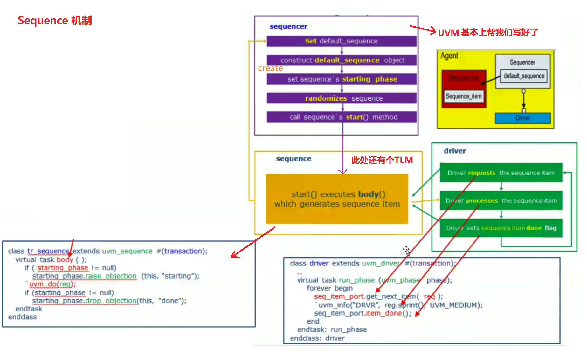


### Ch. 7_寄存器

<font color=red>**要点总结**：</font>

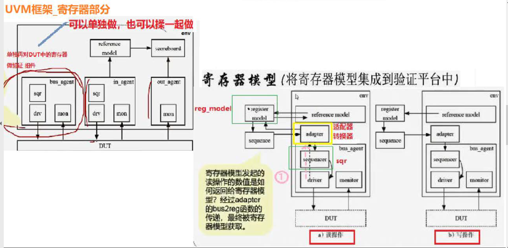

​	◇ 权限
​		RW：read & write        验证方法：先写后读
​        WO：write only            验证方法：先写一个非0值，再读为0
​	    RO：read only              验证方法：先写一个非0值，再读为0
​	    RC：read & clear          验证方法：读2次 ，第2次值为0

​    ◇ uvm寄存器的3个类：
​			① uvm_reg_block
​			② uvm_reg
​			③ uvm_reg_field

​	◇ RAL具备通用的操作需求：

​			① 读/写 寄存器：
​			② 前/后门操作： 前门（bus_agent类、adapter连接）
​										  后门（hdl_path、env.sv加上path）


#### 补充：

- 寄存器 代码重用：[参见 【9.4.1 基于env的重用】](#Ctrl跳转20)

- 寄存器模型  随机化 DUT 参数：[参见 【10.4  寄存器 `DUT` 参数 随机化】](#Ctrl跳转19)
  


### Ch. 8_factory机制

<font color=red>**要点总结**：</font><font color=red>factory机制的本质是对SV的**`new函数`**的 **重载**</font>

<font color=red>有了 factory机制后：</font>

① 除了使用new函数外，还可以<font color=red>根据`类名创建`</font>这个类的一个<font color=red>`实例`</font>
② 还可以在创建类的实例时 <font color=red>根据是否有`重载记录`</font>来决定是创建 <font color=red>`原始的类`</font>，还是创建 <font color=red>`重载的类`</font>的<font color=red>`实例`</font>。

#### 8.1  重载 override

-- 自带函数 override：OOP多态
-- 函数 override： 【callback机制】
-- 类class override：【factory机制】
            `factory`机制 **最大优势**是使得一个<font color=red>子类的指针</font>  <font color=blue>以父类的类型</font>传递时，其表现出的行为依然是<font color=blue>子类的</font>

- 8.1.1~8.1.2 task、func.、constraint 重载

  ① 父/子 <font color=blue>对象直接调用</font>，无论有/无`virtual`，都执行自己的 任务、函数、属性、约束
  ② <font color=blue>对象传参（子类对象+父类句柄）</font> ，子类 <font color=red>被隐式地转换成了父类型</font>, 所以没有`virtual`，会执行<font color=blue>父类的 任务/函数/属性</font>，<font color=red>约束除外</font>
  ③ 其实关于第2点，<font color=red>会一直上升到基类</font>，比如UVM不必理会它们具体是什么类型，统一将它们当作`uvm_component`来对待，这极大方便了管理。
<a name="Ctrl跳转15">重载汇总表</a>
  

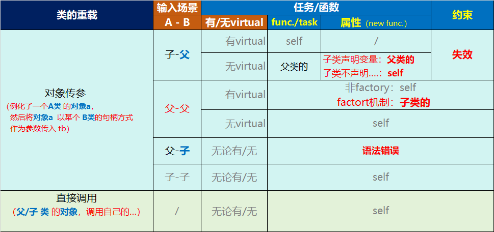

- 任务、函数、属性的重载
  
    ```verilog
    """类的重载：任务、函数、属性测试代码""""
    ##《父类bird》
    class bird;
    	int 		 kk;
      	rand int 	cnt;
        
      	//@@ 属性
        function new();
        	kk = 33;
        endfunction
    
        //@@ 虚函数 & 函数
        virtual function void vf();
        	$display("I am a bird, it's  vf");
        endfunction
        function void f();
        	$display("I am a bird, it's  f");
        endfunction
        
        //@@ 虚任务 & 任务
        virtual task vt();
        	#1ns;
        	$display("I am a bird, it's vt");
        endtask    
        task t();
            #1ns;
            $display("I am a bird, it's  t");
        endtask
        
        //@@  约束
        constraint cnt_cons{
            				cnt dist {77 := 1, 88 := 0};
        }
        
    endclass 
    
    
    
    
    
    ##《子类parrot》
    class parrot extends bird;
       	//int		 kk;          //@@【注意！！！】这里声明 / 不声明，对【对象传参】结果有影响！！！
        rand int  	cnt;
        
      	//@@ 属性
        function new();
        	kk = 44;
        endfunction
    
        //@@ 虚函数 & 函数
        virtual function void vf();
            $display("I am a parrot, it's vf");
        endfunction
        function void f();
            $display("I am a parrot, it's f");
        endfunction
        
      	//@@ 虚任务 & 任务
        virtual task vt();
            #1ns;
            $display("I am a parrot, it's vt");
        endtask
        task  t();
            #1ns;
            $display("I am a parrot, it's  t");
        endtask
        
        //@@  约束
        constraint cnt_cons{
            				cnt dist {77 := 0, 88 := 1};
        }
        
    endclass 
    
    
    
    
    ##《test case》
    module test;
        //@@ 属性
        function void print_prop(bird b_ptr);
            $display(b_ptr.kk);
        endfunction 
        
        //@@ 函数
        function void print_vff(bird b_ptr);
            b_ptr.vf();
            b_ptr.f();
        endfunction 
        
        //@@ 任务
        task print_vtt(bird b_ptr);
            #1ns;
            b_ptr.vt();
            b_ptr.t();
        endtask
           
    	//@@ 约束
        function void print_cons(bird b_ptr);
            //b_ptr.rand_mode(0);             //@@ 重新开一次 对结果没啥影响   
            //b_ptr.rand_mode(1);      
            assert (b_ptr.randomize());          
            $display(b_ptr.cnt);
        endfunction
    
    	
    	
        initial begin
            bird 		bird_inst; 
            parrot 		parrot_inst;
            
            
    		bird_inst = new();
            parrot_inst = new();
            
        $display("============start================");
            //@@ 虚函数&函数
            $display("============vf&f============");
            $display("【直接调用】");
                bird_inst.vf();
                bird_inst.f();
                parrot_inst.vf();
                parrot_inst.f();
            $display("【对象传参】");
            	print_vff(bird_inst);
           		print_vff(parrot_inst);    //@@ 对象传参-没有virtual，会调用父类的func.
            $display("============vt&t============");
            $display("【直接调用】");
                bird_inst.vt();
                bird_inst.t();
                parrot_inst.vt();
                parrot_inst.t();
            $display("【对象传参】");
                print_vtt(bird_inst);
            	print_vtt(parrot_inst);  //@@ 同 func. 没有virtual,调用父类的task
            $display("============属性============");
            $display("【直接调用】");
            	$display("it's bird's property:",bird_inst.kk);     
            	$display("it's	 parrot's property:",parrot_inst.kk);
            $display("【对象传参】");
            	print_prop(bird_inst);
            	print_prop(parrot_inst); //@@ 【注意！！！】parrot中若声明int kk; 则输出父类的33，否则输出自己的44
            $display("============约束============");
            $display("【直接调用】");
            	assert (bird_inst.randomize());          
              	$display("it's bird's constraint:",bird_inst.cnt);
            	assert (parrot_inst.randomize());        
              	$display("it's parrot's constraint:",parrot_inst.cnt);
            $display("【对象传参】");
            	print_cons(bird_inst);
            	print_cons(parrot_inst);     //@@ 【注意！！！】会约束失效
            $display("============finish================");
        end
    endmodule
        
    /*【输出】
    ============start================
    ============vf&f============
    【直接调用】
    I am a bird, it's  vf
    I am a bird, it's  f
    I am a parrot, it's vf
    I am a parrot, it's f
    【对象传参】
    I am a bird, it's  vf
    I am a bird, it's  f
    I am a parrot, it's vf
    I am a bird, it's  f
    ============vt&t============
    【直接调用】
    I am a bird, it's vt
    I am a bird, it's  t
    I am a parrot, it's vt
    I am a parrot, it's  t
    【对象传参】
    I am a bird, it's vt
    I am a bird, it's  t
    I am a parrot, it's vt
    I am a bird, it's  t
    ============属性============
    【直接调用】
    it's bird's property:         33
    it's parrot's property:         44
    【对象传参】
             33
             44                                         //@@ 变量不声明:自己     声明：父类
    ============约束============
    【直接调用】
    it's bird's constraint:         77
    it's parrot's constraint:         88
    【对象传参】
             77
     1143679858                                         //@@ 失效
    ============finish================
    
    
    */
    ```
    
    

#### 8.2~8.3 factory 重载

- 8.2.1~8.2.4 factory 重载

  - 实现效果

    <font color=blue>子类对象</font>，按照 <font color=blue>父类型句柄</font> 传参，调用 <font color=blue>virtual 任务/函数</font>，实现的是 <font color=blue>子类的</font> 任务/函数。[具体参见上表](#Ctrl跳转15)

  - 前提条件

    ①  无论是重载的类（parrot）还是被重载的类（bird），都要在定义时  <font color=blue>注册到factory机制</font> 中
    ②  被重载的类（bird）在实例化时，要使用factory机制式的实例化方式（`类名::type_id::create(“对象名”)`），<font color=red>而不能使用传统的new方式</font>
    ③  重载的类（parrot）必须   <font color=blue>派生自</font> 被重载的类（bird） 
	  最合理的描述是：放眼全部代码，<font color=red>最初被重载的类</font>  必须和  <font color=red> 最终重载的类</font> 是 <font color=red>父-子</font>  关系
    ④  `component` 与 `object` 之间互相不能重载
    

- 重载步骤：
  
     ①  `factory` 组件注册
    ②  重载函数 `set_xxx_override_xxx`
    ③  组件例化  `类名::type_id::create(“对象名”)`

  

- 重载的方式
  
  - `set_type_override`
  
    ——按 类型 （全部）重载
  
    ——常用： `set_type_override_by_type`（<font color=blue>被重载的类</font>，<font color=blue>  重载的类</font>，replace=1）
  
    ​					`replace`表示是否可以被后面的重载覆盖，1 允许， 0  不允许。
  
    | uvm代码                                                      | 注释                             |
    | ------------------------------------------------------------ | -------------------------------- |
    | <font color=red>set_type_override</font> ("bird", "parrot"); | 将`bird类型 `重载为 `parrot类型` |
    | <font color=red>set_type_override_by_type</font> (bird::<font color=blue>get_type()</font>,  parrot::<font color=blue>get_type()</font>,replace=1); | 将`bird类型 `重载为 `parrot类型` |
    | <font color=red>set_type_override_by_name</font> ("bird", "parrot",replace=1); | 将`bird类型 `重载为 `parrot类型` |
    | <font color=blue>xxx::get_type() </font>为  <font color=blue>uvm_object_wrapper型</font> 的类型参数 ,也可以直接用  字符串 |                                  |
  
    
  
  - `set_inst_override`
  
      ——按 对象 （部分）重载   
      ——常用：`set_inst_override_by_type`（ <font color=blue>被重载的类</font>，<font color=blue>  重载的类</font>，<font color=red>实例的路径</font>）
  
    | uvm代码                                                      | 注释                                                         |
    | ------------------------------------------------------------ | ------------------------------------------------------------ |
    | <font color=red>set_inst_override</font> ("env.o_agt.mon", "my_monitor", "new_monitor"); | 将 `env.o_agt.mon`路径的 `my_monitor类型` 重载 为 `new_monitor 类型` |
    | <font color=red>set_inst_override_by_type</font> (my_monitor::<font color=blue>get_type()</font>, new_monitor::<font color=blue>get_type()</font>，"env.o_agt.mon"); | 将 `env.o_agt.mon`路径的 `my_monitor类型` 重载 为 `new_monitor 类型` |
    | <font color=red>set_inst_override_by_name</font> ("my_monitor", "new_monitor"，"env.o_agt.mon"); | 将 `env.o_agt.mon`路径的 `my_monitor类型` 重载 为 `new_monitor 类型` |
    | <font color=blue>xxx::get_type() </font>为  <font color=blue>uvm_object_wrapper型</font> 的类型参数 ,也可以直接用  字符串 |                                                              |
  
  
  
- 重载的使用
  
  - tb中使用
  
    ```verilog
      """tb中直接使用"""
      initial begin
      	factory.set_type_override_by_type(bird::get_type(), parrot::get_type());
      end
    ```
  
    
  
  - compoent类中使用
  
    ```verilog
      """component中使用"""
      factory.set_type_override_by_type(bird::get_type(), parrot::get_type());
    ```
  
    
  
- 复杂的重载
  
  - 连续重载
  
    ```verilog
      """爷爷 <== 父亲 <== 孙子""" 
      """【最终实现】爷爷 <== 孙子"""
      set_type_override_by_type(bird::get_type(), parrot::get_type());
      set_type_override_by_type(parrot::get_type(), sub_parrot::get_type());
    ```
  
    
  
  - 替换重载
  
    ```verilog
      """ 爷爷 <== 父亲 """
      """ 爷爷 <== 叔叔 """ 
      """【最终实现】爷爷 <== 叔叔"""
      set_type_override_by_type(bird::get_type(), parrot::get_type());
      set_type_override_by_type(bird::get_type(), sparrow::get_type()); 
    ```
  
    
  
  - ”叔侄重载“
  
    <font color=blue>最终重载的类</font>  要与   <font color=blue>最初被重载的类 </font> 有 派生关系（父子关系）
  
    ```verilog
      """ 爷爷 <== 父亲 """
      """ 父亲 <== 叔叔 """ 
      """【最终实现】爷爷 <== 叔叔"""
      set_type_override_by_type(bird::get_type(), parrot::get_type()); set_type_override_by_type(parrot::get_type(), sparrow::get_type(), 0); 
    ```
  
    
  
- factory 重载机制的调试

  四类方法：
  ① 方法一：`build_phase` 之后，`uvm_component  `的 <font color=blue>`print_override_info`函数</font>
  ② 方法二：`uvm_factory `的 <font color=blue>`debug_create_by_name函数`</font> 或是 <font color=blue>`debug_create_by_type函数`</font>
  ③ 方法三：`uvm_factory` 的 <font color=blue>`print 函数`</font>
  ④ 方法四：`build_phase` 之后，调用`uvm_root` 的 <font color=blue>`print_topology函数` </font>

  - `print_override_info `函数

    | uvm代码                                                    | 注释                                                         |
    | ---------------------------------------------------------- | ------------------------------------------------------------ |
    | 组件. print_<font color=red>override_info</font>（原类型） | 查询 原类型被override的情况                                  |
    |                                                            | <font color=blue>在 test_case 的 connect 中调用（`build_phase` 之后）</font> |

    ```verilog
    """case 的 connect_phase 中 调用 组件的`print_override_info`函数 """
    function void my_case0::connect_phase(uvm_phase phase);
        super.connect_phase(phase);
        env.o_agt.mon.print_override_info("my_monitor");       //@@
    endfunction
    ```

    

  -  `debug_create_by_name`函数、  `debug_create_by_type`函数

    | uvm代码                                                      | 注释                                    |
    | ------------------------------------------------------------ | --------------------------------------- |
    | factory. debug_<font color=red>create</font>\_by_type(类型， 路径); | 按组件类型查询bug，顺带可以override调试 |
    | factory. debug_create_by_name(类名称，路径);                 | 按组件名称查询bug，顺带可以override调试 |

    ```verilog
    """debug_create_by_type示例"""
    factory.debug_create_by_type(my_monitor::get_type(), "uvm_test_top.env.o_agt. mon");   //@@
    ```

    

  - `uvm_factory` 的 `print` 函数

    | uvm代码                          | 注释                                                         |
    | -------------------------------- | ------------------------------------------------------------ |
    | print (int all_types=1)          | 打印工厂信息                                                 |
    | <font color=blue>参数说明</font> | <font color=red>print(0)     打印被重载的实例和类型</font><br />print(1)   ... + 所有用户创建的、注册到factory的类的名称<br />print(2)   ... + 所有用户... + 系统创建的、所有注册到factory的类的名称（如uvm_reg_item） |

    ```verilog
    """factory.print示例"""
    factory.print(0);            //@@
    ```

    

  - `build_phase` 之后，调用`uvm_root` 的 `print_topology` 函数 

    | uvm代码                    | 注释                                                 |
    | -------------------------- | ---------------------------------------------------- |
    | uvm_top. print_topology(); | 打印当前uvm的拓扑图                                  |
    |                            | <font color=blue>top调用，build_phase之后调用</font> |

    ```verilog
    """print_topology 示例"""
    uvm_top.print_topology();        
    ```

     	


- 8.3.1~8.3.4  factory重载的应用

##### ◻ 重载tr

- 应用场景：生产异常的测试用例（CRC 错误）

- 步骤：
  ① 创建 crc 类
  ②`case` 的 `build_phase`中将 `my_transaction` 重载为 `crc_tr`

  ```verilog
  """factory重载应用之——tr重载"""
  ## 《crc错误的tr代码》
  class crc_err_tr extends my_transaction;
  	…
  	constraint crc_err_cons{
  							crc_err == 1;
  	}
  endclass
  
  ##《case代码》
  function void my_case0::build_phase(uvm_phase phase);
      super.build_phase(phase); 
      //@@ 重载override
      factory.set_type_override_by_type(my_transaction::get_type(), crc_err_tr::get_type());  //@@
      //@@ 设置为default seq
      uvm_config_db#(uvm_object_wrapper)::set(this,
                                              "env.i_agt.sqr.main_phase",         //sqr的main_phase
                                              "default_sequence",
                                              normal_sequence::type_id::get());   //例化方式
  endfunction
  ```

  

##### ◻ 重载seq

- 应用场景：生产异常的测试用例（已有`normal seq`，新添 `abnormal seq`）

- 步骤：
  ① 创建 abnormal seq
  ② `case` 的 `build_phase `中将`normal seq`重载为  `abnormal seq`

  ```verilog
  """factory重载应用之——seq重载"""
  //@@ case_sequence 为default_sequence ，嵌套了 normal seq
  ##《normal_sequence代码》
  class normal_sequence extends uvm_sequence #(my_transaction);
  	…
      virtual task body();
  		`uvm_do(m_trans)
  		m_trans.print();
  	endtask 
  	`uvm_object_utils(normal_sequence)
  endclass
  
  ##《case_sequence代码》
  class case_sequence extends uvm_sequence #(my_transaction);
  	virtual task body();
          normal_sequence nseq;
          repeat(10) begin
              `uvm_do(nseq)
          end
  	endtask
  endclass
  
  //@@ setp1：引入abnormal seq
  ## 《abnormal seq 代码》
  class abnormal_sequence extends normal_sequence;
  	…
  	virtual task body();
  		m_trans = new("m_trans");
          m_trans.crc_err_cons.constraint_mode(0);    // 先关闭约束
          
          `uvm_rand_send_with(m_trans, {crc_err == 1;})     // 重新给约束
  		m_trans.print();
  	endtask
  endclass
  
  //@@  step2：修改case build_phase
  ## 《case的build_phase代码》
  function void my_case0::build_phase(uvm_phase phase
      //@@ 
      factory.set_type_override_by_type(normal_sequence::get_type(), abnorma l_sequence::get_type()); //@@ 
      
      uvm_config_db#(uvm_object_wrapper)::set(this,
                                              "env.i_agt.sqr.main_phase",
                                              "default_sequence",
                                              case_sequence::type_id::get());
  endfunction
      
  ```

  

##### ◻ 重载component【不推荐】

- 应用场景：生产异常的测试用例（重载 `driver`、`scoreboard`、`ReferenceModle`）

  - 关于重载driver

    只使用factory机制实现测试用例可能吗？答案确实是可能的。当 <font color=blue>不用sequence </font>时，那么要在driver中控制发送包的种类、数量，对于objection的控制又要从sequence中回到driver中。<font color=red><不推荐：将所有的测试用例都使用driver重载实现></font>

  - 重载ReferenceModle

    如果将所有的异常情况都用一个参考模型实现，那么这个参考模型代码量将会非常大。 将其分散为数十个参考模型，每一个处理一种异常情况，当建立相应异常的测试用例时，将正常的参考模型由它替换掉。这样，可使代码清晰，并增加了可读性。

  

- 步骤：
  ① 创建 异常 driver
  ② `case` 的 `build_phase `中 将`my_driver`  重载为  `crc_driver`

  ```verilog
  """factory重载应用之——compoent重载 driver示例"""
  ## 《crc_driver代码》
  class crc_driver extends my_driver;
  	…
  	virtual function void inject_crc_err(my_transaction tr);
  		tr.crc = $urandom_range(10000000, 0);
  	endfunction 
  
  	virtual task main_phase(uvm_phase phase);
  		vif.data <= 8'b0;
  		vif.valid <= 1'b0;
  		while(!vif.rst_n)
  			@(posedge vif.clk);
  		while(1) begin
              seq_item_port.get_next_item(req);    // 获得tr
              inject_crc_err(req);                 // 随机化tr
              drive_one_pkt(req);                  // 驱动tr
              seq_item_port.item_done();           // 结束
  		end
  	endtask
  endclass
  
  ##《case的build_phase代码》
  function void my_case0::build_phase(uvm_phase phase);
  	…
      //@@ 重载
      factory.set_type_override_by_type(my_driver::get_type(), crc_driver::g et_type());  //@@
      
      uvm_config_db#(uvm_object_wrapper)::set(this,
                                              "env.i_agt.sqr.main_phase",
                                              "default_sequence",
                                              normal_sequence::type_id::get());
  endfunction
  ```

  


#### 8.4  factory原理

——创建实例、重载class

- 8.4.1~8.4.2  创建一个类的实例的方法

  3种：
  ① 简单类直接例化
  ② 参数化的类（类参数化传递）间接例化
  ③ factory机制 <font color=blue>根据字符串 </font>创建类的实例

  - 简单类直接例化

    ```verilog
    """简单类直接例化-示例：在B中直接例化A"""
    ##《A类代码》
    class A
    … 
    endclass 
    
    ## 《B类代码》在B中直接例化A
    class B;
    	A a;             //@@
    	function new(); 
    		a = new      //@@
    	endfunction 
    endclass
    ```

    

  - 参数化的类（类参数化传递）间接例化

    ```verilog
    """参数化的类（类参数化传递）间接例化-示例：在B中通过参数化方法类去例化A"""
    ## 《参数化方法》
    class parameterized_class # (type T)    //@@
    	T 	t;
        function new(); 
        	t = new();
       	endfunction 
    endclass
    
    ##《A类代码》
    class A;
        … 
    endclass 
    
    ## 《B类代码》在B中通过参数化方法类去例化A
    class B;
        parameterized_classs#(A)	  pa;    //@@
        function new();
            pa = new();    //@@
        endfunction
    endclass
    ```

    

    

  - factory机制<font color=blue>根据字符串 </font>创建类的实例       <font color=red><内部 原理></font>

    - 过程：  当要根据类名`“my_driver”`创建一个`my_driver`的实例时

      ① 先从<font color=red>`global_tab`</font>中找到`“my_driver”`<font color=blue>索引对应的</font> `registry#（my_driver，“my_driver”）`<font color=blue>实例的指针</font>`me_ptr`，

      ② 然后调用`me_ptr.inst=new（）函数`，最终返回 `me_ptr.inst`。

    - 应用：

      `类名::type_id::create(“对象名”)`
    
      ```verilog
      """factory机制 根据字符串 创建类的实例-示例："""
      ## 内置一个《registry类》登记类
      class registry#(type T=uvm_object, string Tname=""); 
      	T inst;
      	string name = Tname; 
      endclass
      
      ## 基本过程
      //@@ 【感觉像uvm源码】【可忽略，懂上面步骤原理即可】
      function uvm_component create_component_by_name(string name) 
          registry#(uvm_object, "") 		me_ptr;
          me_ptr = global_tab[name];              //@@ 先从global_tab 中找到“my_driver”索引对应的登记的实例的指针
          me_ptr.inst = new("uvm_test_top", null);     //@@ 例化
          return me_ptr.inst;
      endfunction
      
      
      ## 实际操作应用
      A_inst = A::type_id::create(“A_inst”);      //@@ 类名::type_id::create(“对象名”)
      ```
    
      

    

  - factory创建实例接口         <font color=red><外部 接口 ></font>
  
    | uvm代码                               | 注释                                                         |
    | ------------------------------------- | ------------------------------------------------------------ |
    | create_object_by_name                 | 根据类名字创建一个object                                     |
    | create_object_by_type                 | 根据类型创建一个object                                       |
    | create_component_by_name              | 根据类名创建一个component                                    |
  | create_component_by_type              | 根据类型创建一个component                                    |
    | <font color=blue>component底层</font> | create_component 函数<br />uvm_component::create_component (string requested_type_name, <br />                                                                     string name) |

    
  
    ```verilog
    """factory创建实例接口"""
    //@@ 方式一：根据类名字创建一个object
    ## 【create_object_by_name】      
    factory.create_object_by_name("my_transaction")
    
    //@@ 方式二：根据类型创建一个object
    ## 【create_object_by_type】
    factory.create_object_by_type(my_transaction::get_type()))
    
    //@@ 方式三：根据类名创建一个component
    ## 【create_component_by_name】
    factory.create_component_by_name("my_transaction", get_full_name(), "scb", this))
    								// 参数1：字符串类型的类名
                                    // 参数2：父结点的全名
    								// 参数3：这个新的component起的名字
    								// 参数4：父结点的指针
    								// 在 一个component的 new或者build_phase中使用， 本质是 uvm_component的 create_component
    					
    //@@ 方式四：根据类型创建一个component
    ##【create_component_by_type】
    factory.create_component_by_type(my_transaction::get_type(),get_full_name(), "scb", this))
    								// 参数1：类型
    								// 其他：同 create_component_by_name
  
    ```
  
    


### Ch. 9_代码重用性

<font color=red>**要点总结**：</font><font color=red>callback机制</font>

#### 9.1  callback机制

作用：
① 代码 的可重用性
② 构建异常的测试用例

- 9.1.1~9.1.2  广义的callback

  ```verilog
  """callback函数"""
  post_randomize
  pre_body、post_body
  pre_do、mid_do、post_do
  pre_tran    // 发送transaction之前，用户可能会针对transaction做某些动作
              // VIP（Verification Intellectual Property）中的接口
  ```

  

- 9.1.3~9.1.4  callback机制原理

  - callback 开发者

    ① 定义一个<font color=blue>`新类 A` </font> 
    ② 声明一个<font color=blue>`A_pool类池子`</font> 专门存放 <font color=red>`A类`</font> 及 <font color=red>`其派生类`</font>
    ③ 在 要预留`callback函数/任务`接口的**类**中（例如<font color=blue>driver</font>）调用 <font color=red> ``uvm_register_cb宏` </font>注册`cb`
    ④ 在 要调用`callback函数/任务`接口的类的**函数/任务**中（例如 <font color=blue>driver</font> 的 <font color=blue>main_phase</font> 的 <font color=blue>pre_tran</font>），使用<font color=red>```uvm_do_callbacks`</font> 宏

    | uvm代码                                              | 注释                                                         |
    | ---------------------------------------------------- | ------------------------------------------------------------ |
    | uvm_callback                                         | uvm的callback基类                                            |
    | typedef uvm_callbacks#(my_driver, A)    A_pool;      | A_pool的声明方法<br />参数1：池子被哪个类用（driver）<br />参数2：谁的pool |
    | typedef class A;                                     | my_driver中需要声明下                                        |
    | `uvm_register_cb(my_driver, A)                       | my_driver中需要注册登记下callback<br />参数1：池子被哪个类用（driver）<br />参数2：谁的pool<br /><font color=red><预留 cb函数/任务 的地方的类register></font> |
    | \`uvm_do_callbacks(my_driver, A, pre_tran(this,req)) | `my_driver`调用 `A类`的`A_pool`池子中所有实例去执行`pre_tran`<br />参数1：调用`pre_tran`的类的名字<br />参数2：哪个类具有`pre_tran`<br />参数3：调用的是函数/任务 `pre_tran`<br />参数4：要顺便给出`pre_tran`的参数<br /><font color=red><用cb函数/任务 的地方的类do></font> |

    ```verilog
    """cb开发者的工作【callback原理】：A类、A_pool、自动执行pre_tran"""
    ##《callback.sv代码》
    //@@  【uvm_callback】
    class A extends uvm_callback;       
        virtual task pre_tran(my_driver drv, ref my_transaction tr);   //@@ virtual为了后续重载
    	endtask
    endclass
    
    typedef uvm_callbacks#(my_driver, A) A_pool;       //@@ A_pool
    
    
    ##《my_driver.sv代码》
    typedef class A;        //@@ 声明A类是自定义的
        
    class my_driver extends uvm_driver#(my_transaction);
        …
        `uvm_component_utils(my_driver)
        `uvm_register_cb(my_driver, A)        //@@ 【核心】登记到callback机制中
    	…
    
        task main_phase(uvm_phase phase);
            …
            while(1) begin 
                seq_item_port.get_next_item(req);
                `uvm_do_callbacks(my_driver, A, pre_tran(this, req))  //@@ 【核心】遍历A_pool执行pre_tran任务
                drive_one_pkt(req);
                seq_item_port.item_done();
            end  
            …
        endtask
    endclass
    ```

    

  - callback 使用者

    ① 从`A类`派生一个`my_callback`类，在此类中定义好 `callback函数/任务 `具体内容
    ② 在 <font color=blue>测试用例</font> 的 <font color=blue>`connect_phase`</font>中 将`my_callback`实例化，并将其加入`A_pool`中
    <font color=red>PS：也可以是其他`phase`,  但是一定是在使用此`callback函数/任务的` phase之前</font>

    | uvm代码                               | 注释                                                         |
    | ------------------------------------- | ------------------------------------------------------------ |
    | A_pool::add(env.i_agt.drv,    my_cb); | 将实例化cb对象加入到池子<br />参数1：组件的绝对路径<br />参数2：cb对象 |
    | <font color=blue>补充说明</font>      | +组件driver的绝对路径 的原因是可能有多个`env`和`driver`      |

    ```verilog
    """cb使用者的工作：A类派生，加入A_pool"""
    ## 《A类的派生类的代码》
    //@@ my_callback 派生自 A类
    class my_callback extends A;
        //@@ 定义好 `callback函数/任务`具体内容
    	virtual task pre_tran(my_driver drv, ref my_transaction tr);
    		`uvm_info("my_callback", "this is pre_tran task", UVM_MEDIUM)
    	endtask 
        
    	`uvm_object_utils(my_callback)
    endclass
    
    
    ##《case的connect_phase代码》
    function void my_case0::connect_phase(uvm_phase phase);
        my_callback		 my_cb;                          //@@ 声明cb句柄
        super.connect_phase(phase); 
        
        my_cb = my_callback::type_id::create("my_cb");    //@@ 例化cb对象
        A_pool::add(env.i_agt.drv, my_cb);      //@@ 将cb添加至A_pool
        										//@@ 参数1：drv的绝对路径
        										//@@ 参数2：cb对象
    endfunction
    ```


##### ◻ 应用：子类继承


- 9.1.5  子类继承`callback `机制

  - 应用场景：产品迭代，测试用例复用

  - 方法

    ① 将子类设置成超类，类型为父类类型；<font color=blue>``uvm_set_super_type`</font>
    ② 在<font color=blue>子类的`main_phase`中 </font>, 调用<font color=blue>```uvm_do_callbacks`</font>
    ③ 在<font color=blue> `agt` </font>的<font color=blue>`build_phase`</font>中，例化 new_driver , <font color=red>这样 case 代码就不用任何修改</font>

    | uvm代码                                              | 注释                                                         |
    | ---------------------------------------------------- | ------------------------------------------------------------ |
    | \`uvm_set_super_type（<type_name>，<sup_type_name>） | 将 “子类” 设置成超类，类型为“父类”<br />``uvm_set_super_type(子类, 父类)` <br />例如：`uvm_set_super_type(new_driver, my_driver) |

    ```verilog
    """子类继承`callback `机制"""
    //@@  使用方
    ##《新的driver类 代码》
    class new_driver extends my_driver;
        `uvm_component_utils(new_driver)
        `uvm_set_super_type(new_driver, my_driver)     //@@ 将 new_driver设置为超类，类型为my_driver
    	…
        //@@ 子类的main_phase 中使用 `uvm_do_callbacks(父类)
        task new_driver::main_phase(uvm_phase phase);
    		while(1) begin
    			seq_item_port.get_next_item(req);
    			`uvm_info("new_driver", "this is new driver", UVM_MEDIUM)
                `uvm_do_callbacks(my_driver, A, pre_tran(this, req))   //@@ 注意此处是  父类my_driver，
                													   //@@ 即，pre_tran是在父类中被预留接口的
                drive_one_pkt(req);
    			seq_item_port.item_done();
    		end
    	endtask  
    endclass 
    
    ## 《aget-build_phase代码》例化new_driver
    function void my_agent::build_phase(uvm_phase phase);
        super.build_phase(phase);
        if (is_active == UVM_ACTIVE) begin
            sqr = my_sequencer::type_id::create("sqr", this);   
            drv = new_driver::type_id::create("drv", this);       //@@ 例化new_driver
    	end
    	mon = my_monitor::type_id::create("mon", this);
    endfunction
    ```

​    

##### ◻ 实现所有case【不推荐】

- 9.1.6  使用`callback`函数/任务来实现所有的测试用例

  - 关系：

    `callback机制`、`sequence机制`和`factory机制`并不是互斥的，三者都能分别实现同一目的。当这三者互相结合时，又会产生许多新的解决问题的方式，提供了高扩展性

  - 缺点：

    `virtual seq` 的协调功能在`callback机制`中就很难实现

  - 方法：
    ① 示例中完全<font color=blue>丢弃了`sequence机制`</font>，在A类的`run`任务中进行控制`objection`，激励产生在`gen_tran`中。
    ② 在建立新的测试用例时，只需要从A派生一个类，并重载其`gen_tran`函数
    ③ 在这种情况下，<font color=red>新建测试用例</font>  相当于<font color=blue>重载gen_tran</font>。如果不满足要求，还可以将<font color=blue>A类的`run`任务重载</font>。

    ```verilog
    """使用`callback`函数/任务来实现所有的测试用例-示例"""
    //@@  开发方
    ##《A代码》用于构造 重载函数A_pool
    class A extends uvm_callback;   //@@
        my_transaction tr; 
    	
        virtual function bit gen_tran();
        endfunction
        
    	virtual task run(my_driver drv, uvm_phase phase);
            phase.raise_objection(drv);    //@@
                drv.vif.data <= 8'b0;
                drv.vif.valid <= 1'b0;
                while(!drv.vif.rst_n)
                    @(posedge drv.vif.clk); 
            	while(gen_tran()) begin      //@@
                    drv.drive_one_pkt(tr);    //@@
                end
            phase.drop_objection(drv);   //@@
    	endtask
    endclass
    
    //typedef uvm_callbacks#(my_driver, A)    A_pool;       //@@ A_pool
    
    
    ##《driver代码》 在my_driver的main_phase中，去掉所有其他代码，只调用A的run
    typedef class A;        //@@ 声明A类是自定义的
        
    class my_driver extends uvm_driver#(my_transaction);
        …
        `uvm_component_utils(my_driver)
        `uvm_register_cb(my_driver, A)        //@@ 【核心】登记到callback机制中
    	…
    
        task main_phase(uvm_phase phase);
            `uvm_do_callbacks(my_driver, A, run(this, phase))  //@@ 【核心】遍历A_pool执行run任务
                                            //@@ 在my_driver的main_phase中，去掉所有其他代码，只调用A的run
        endtask
    endclass
    
        
        
    //@@  使用方    
    ##《A子类代码》在建立新的测试用例时，只需要从A派生一个类，并重载其gen_tran函数：
    class my_callback extends A;
        int 	pkt_num = 0; 
    	
        virtual function bit gen_tran();
    		`uvm_info("my_callback", "gen_tran", UVM_MEDIUM)
    		if(pkt_num < 10) begin
    			tr = new("tr");
    			assert(tr.randomize());
    			pkt_num++;
    			return 1;
            end
            else
    			return 0;
        endfunction 
        `uvm_object_utils(my_callback)                 //@@ 本质是factory机制的重载
    endclass
    ```


##### ◻ 补充：

——后门机制：
提前做好接口，在要用的时候，不用修改整个验证平台，也不用去修改其他代码，通过test case 实现某些功能的仿真
可以应用于：注入error，覆盖率收集、统计...

<font color=red>和`factory机制`类似，区别在于`callback机制`修改了函数，而`factory机制`把整个`class`替换掉了</font>

```apl
"""开发者"""
step1：在其他功能类（driver或是组件），嵌入宏方法，预先留好接口
step2：空壳callback类，作为callback基类
"""使用者"""
step3：在写一个具体的test case前，做一个含有真正功能的callbacak子类
step4：在test case中 运用真正的功能，用于仿真
```

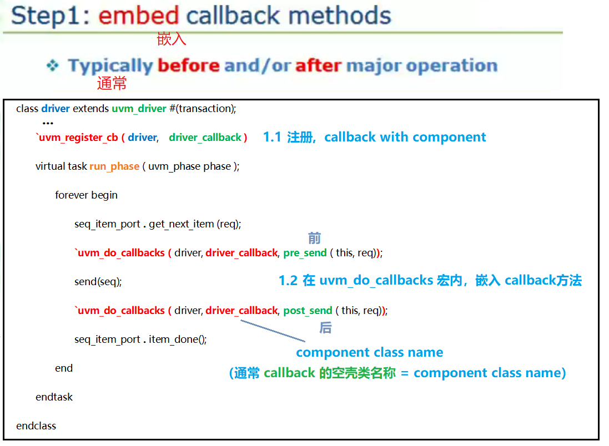

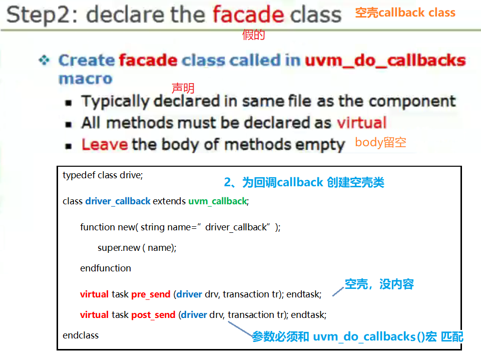

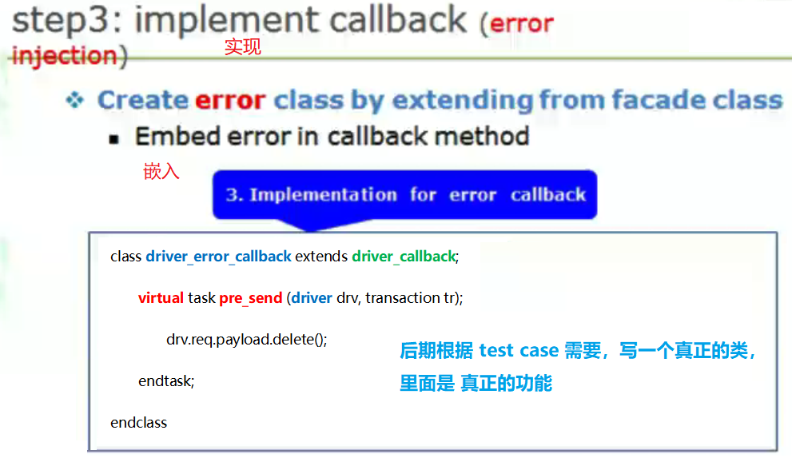

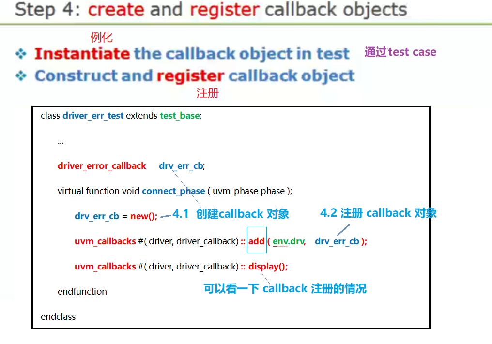


#### 9.2  seq重用

——小而美的`seq`

① factory重载，封装成可重载的函数/任务或者类，尽量 <font color=blue>避免代码的复制</font>

② <font color=blue>放弃 建造强大的通用的`seq` </font>的想法，维护是个灾难。强烈建议不要使用强大的`seq`。
      可以将一个强大的`seq`拆分成小的`seq`。<font color=blue>尽量做到一看名字就知道这个`seq` 的用处</font>

关于<font color=red>**数据包**</font>的代码重用，[参见 【10.2  seq 高阶】 ](#Ctrl跳转16)


#### 9.3  参数化的类

为了<font color=blue>增加代码的**可重用性**</font>，参数化的类是一个很好的选择。

- 9.3.1  参数化的类的必要性

  有意义的、可行的 就设置,  例如：
  ①  `my_transaction`是没有任何必要定义成一个参数化的类的。
  ②  相反，一个总线`bus_transaction`可能需要定义成参数化的类，因为总线位宽可能是16位的、32位的或64位的。

  

- 9.3.2 UVM对 <font color=red>**参数化类**</font> 的支持

  - factory机制

    ——支持参数化 注册 `object` / `component`

    | uvm代码                     | 注释                     |
    | --------------------------- | ------------------------ |
    | \`uvm_object_param_utils    | 参数化的 `object` 注册   |
    | \`uvm_component_param_utils | 参数化的 `component`注册 |

    

    factory机制在 <font color=red>例化时</font>，不支持省略 默认参数</font>（<font color=blue>声明</font>的时候，可以省略）

    ```verilog
    """factory例化时，省略默认参数-示例"""
    class bus_agent#(int ADDR_WIDTH=16, int DATA_WIDTH=16) extends uvm_agent ;
        bus_agent 	bus_agt; 						 //@@ 声明的时候，可以省略  【参数化类】
        bus_agt = bus_agent#(16, 16)::type_id::create("bus_agt", this);  	 //@@ 例化的时候，不可以省略#(16, 16)
        …
    endclass
    ```

    

  

  - SV:

    ——支持 参数化的 `interface`

    ```verilog
    """SV 支持参数化的 interface"""
    interface bus_if#(int ADDR_WIDTH=16, int DATA_WIDTH=16)(input clk, input rst_n);  //@@
    	logic bus_cmd_valid;
        logic bus_op;
        logic [ADDR_WIDTH 1:0] bus_addr;
        logic [DATA_WIDTH 1:0] bus_wr_data;
        logic [DATA_WIDTH 1:0] bus_rd_data; 
        
    endinterface
    ```

    

  - config_db机制：

    —— 支持传递参数化的 `interface`

    ```verilog
    """config_db机制支持传递参数化的interface"""
    uvm_config_db#(virtual bus_if#(16, 16))::set(null,                                //@@
                                                 "uvm_test_top.env.bus_agt.mon",
                                                 "vif", 
                                                 bif);
    
    uvm_config_db#(virtual bus_if#(ADDR_WIDTH, DATA_WIDTH))::get(this,                //@@
                                                                 "", 
                                                                 "vif",
                                                                 vif)
    ```

    

  - sequence机制：

    ——支持参数化的 `transaction`：

    ```verilog
    class bus_sequencer#(int ADDR_WIDTH=16, int DATA_WIDTH=16) extends 
                                        uvm_sequencer#(bus_transaction#(ADDR_WIDTH, DATA_WIDTH));
    ```

    


#### 9.4  模块级 & 芯片级 重用

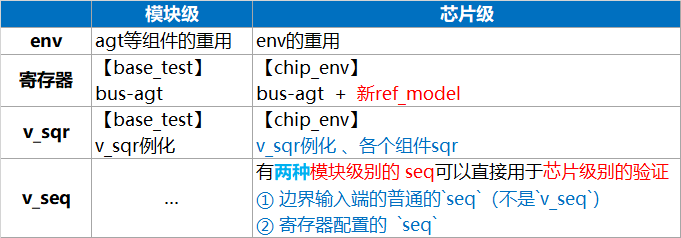

##### ◻ env重用

- 9.4.1 基于env的重用

  ① 模块级（block level，IP级别、unit级别）    【env的重用】
  ② 芯片级（SOC级别）

  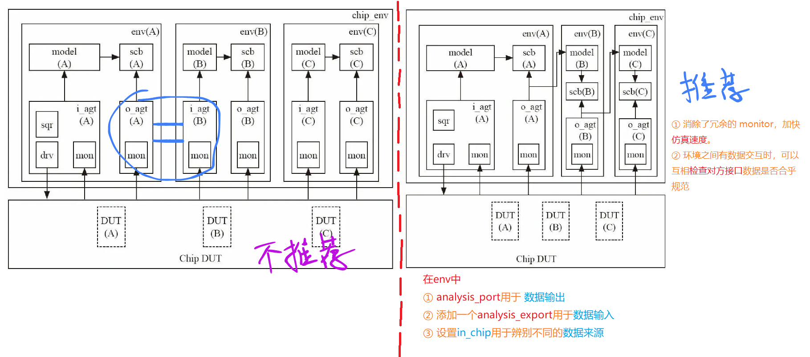

  

  ```verilog
  """上图agent重用的-代码"""
  ##《my_env代码》
  class my_env extends uvm_env;
  	…
  	bit	 in_chip;
      uvm_analysis_port#(my_transaction) 		ap;              //
      uvm_analysis_export#(my_transaction) 	i_export;        //
  	…
      
      // build_phase
  	virtual function void build_phase(uvm_phase phase);
  		super.build_phase(phase);
          if(!in_chip) begin       					  //@@ in_chip  用于标记  数据来源
              i_agt = my_agent::type_id::create("i_agt", this);    // 组件例化
              i_agt.is_active = UVM_ACTIVE;            //@@ 【核心】  is_active 
  		end
  		…
          if(in_chip)               //@@
              i_export = new("i_export", this);    // 端口例化
      endfunction
      
      // connect_phase
      function void connect_phase(uvm_phase phase);
          super.connect_phase(phase);
          ap = o_agt.ap;
          if(in_chip) begin
              i_export.connect(agt_mdl_fifo.analysis_export);    // 主动连接被动
          end
          else begin
              i_agt.ap.connect(agt_mdl_fifo.analysis_export);
          end
          …
      endfunction
      …
  endclass 
  
  
  //@@ agent代码重用
  ##《chip_env代码》
  class chip_env extends uvm_env;
  	`uvm_component_utils(chip_env)
  	my_env		env_A;
  	my_env		env_B;
  	my_env		env_C; 
      …
      // build_phase
      function void build_phase(uvm_phase phase);
          super.build_phase(phase);
          env_A = my_env::type_id::create("env_A", this);
          env_B = my_env::type_id::create("env_B", this);
          env_B.in_chip = 1;
      	env_C = my_env::type_id::create("env_C", this);
          env_C.in_chip = 1;
      endfunction 
      
      // connect_phase
      function void connect_phase(uvm_phase phase);
          super.connect_phase(phase);
          env_A.ap.connect(env_B.i_export);
          env_B.ap.connect(env_C.i_export);
      endfunction
  endclass 
  ```

  


<a name="Ctrl跳转20">◻ 寄存器重用</a>

- 9.4.2 寄存器模型的重用

  ——寄存器配置总线 `bus_agt`
  
  <font color=red>寄存器（模块级）  == 演变 ==>   寄存器（芯片级）</font>  
  
  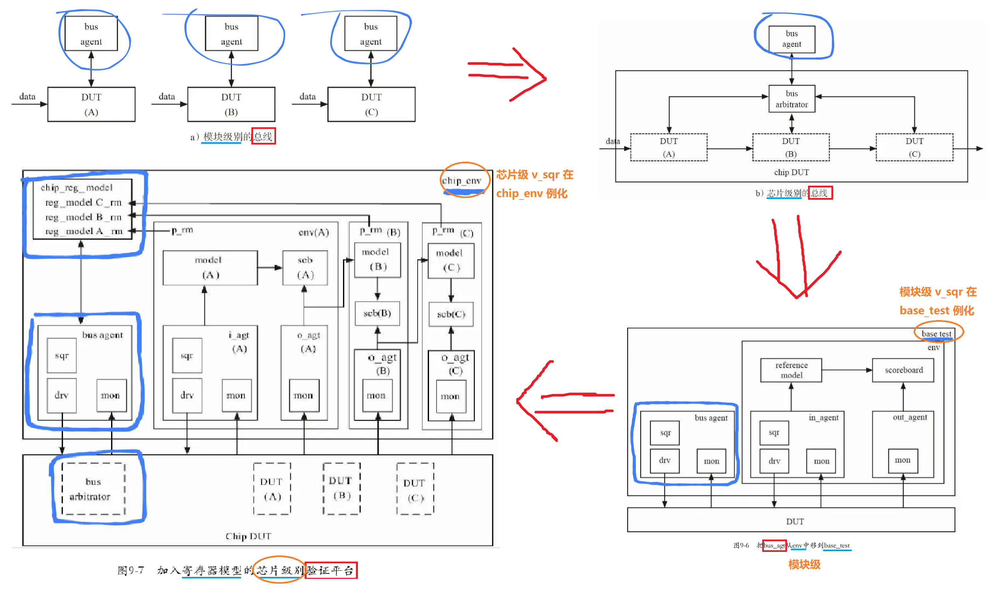
  
  - <font color=red>**模块级**</font>别的  寄存器模型
  
    ——定义在模块的env中
  
    ```verilog
    """模块级别的  寄存器模型：定义在模块的env中"""
    ##《reg_model》
    	//略
    
    ##《env代码》中含有reg_model的例化
    class my_env extends uvm_env; 
        reg_model	 rm;     //@@
        …
        function void my_env::build_phase(uvm_phase phase); 
            super.build_phase(phase);
            rm = reg_model::type_id::create("rm", this);     //@@
            … 
        endfunction
    endclass
    ```
  
    
  
  - <font color=red>**芯片级**</font>别的  寄存器模型
  
    —— 为了在芯片级别使用寄存器模型，需要建立一个<font color=blue>新的寄存器模型（reg_model）</font>：
  
    ① 加入各个不同模块的寄存器模型
    ② 并设置 <font color=blue>**偏移地址**</font> 和 <font color=blue>**后门访问路径**</font>
  
    | uvm代码                                                      | 注释                 |
    | ------------------------------------------------------------ | -------------------- |
    | uvm_reg_block                                                | uvm寄存器模型 **类** |
    | create_map (<参数1>, <参数2>  , <参数3>,  <参数4> , <参数5> ) | 设置后门访问路径     |
    | <font color=green>xxx</font>. add_submap (<参数1：参照地址>, <参数2：偏移量>) | 设置偏移地址         |
  
    
  
    ```verilog
    """芯片级别的  寄存器模型：新建reg_model，定义在模块的base_test /chip_env 中	"""
    ## 《新的reg_model》统筹调度作用
    class chip_reg_model extends uvm_reg_block;       //@@ uvm_reg_block
    	rand reg_model 	 A_rm;
        rand reg_model	 B_rm;
        rand reg_model	 C_rm; 
    	
        virtual function void build();
            default_map = create_map("default_map", 0, 2, UVM_BIG_ENDIAN, 0);     //@@ 设置后门访问路径
    		…
            default_map.add_submap(A_rm.default_map, 16'h0);   //@@ 设置偏移地址
    		…
    		default_map.add_submap(B_rm.default_map, 16'h4000);
    		…
    		default_map.add_submap(C_rm.default_map, 16'h8000);
        endfunction
    		…
    endclass
    
    ##《chip_env代码》最大的环境，例化此寄存器模型，并将各个模块的寄存器模型的指针赋值给各个env的p_rm：
    function void chip_env::build_phase(uvm_phase phase);
        super.build_phase(phase);
        // A组件的 env
        env_A = my_env::type_id::create("env_A", this);
        
        // B组件的 env
        env_B = my_env::type_id::create("env_B", this);
        env_B.in_chip = 1;
        
        // C组件的 env
        env_C = my_env::type_id::create("env_C", this);
        env_C.in_chip = 1;
        
        //@@ 总线bus_agt
        bus_agt = bus_agent::type_id::create("bus_agt", this);
        bus_agt.is_active = UVM_ACTIVE;
        
        //@@ 新的统筹寄存器
        chip_rm = chip_reg_model::type_id::create("chip_rm", this); //@@ 例化
        chip_rm.configure(null, "");    //@@ configure
        chip_rm.build();                //@@ build
        chip_rm.lock_model();           //@@ lock_model
        chip_rm.reset();                //@@ reset
        
        //@@ reg_model的适配器
        reg_sqr_adapter = new("reg_sqr_adapter");        //@@ adapter 例化
        
        //@@ 指针赋值【参考 monitor和scoreboard的三种连接方式——方式三：step2指针赋值】
        env_A.p_rm = this.chip_rm.A_rm;
        env_B.p_rm = this.chip_rm.B_rm;
        env_C.p_rm = this.chip_rm.C_rm;
    endfunction
    ```
  


##### ◻ v_seq、v_sqr 重用

- 9.4.3 `virtual sequence `与 `virtual sequencer`

  - `v_sqr` 
    		① <font color=red>**模块级**</font>：只跟自己，不能出现在 **芯片级的验证环境 **中，
      						所以，<font color=blue>`v_sqr`</font> 不应该在 `chip_env`中实例化， 而应该 <font color=blue>在`base_test`中实例化</font>

    ​	② <font color=red>**芯片级**</font>：有他自己的<font color=blue> `v_sqr`</font>，<font color=blue>在 `chip_env`中实例化</font> ，
    ​                        非边界模块（内部模块）+ 边界模块 的 `sqr` 例化，<font color=blue>均在 `base_test` 中进行</font>

    ​		例如 下图中：
    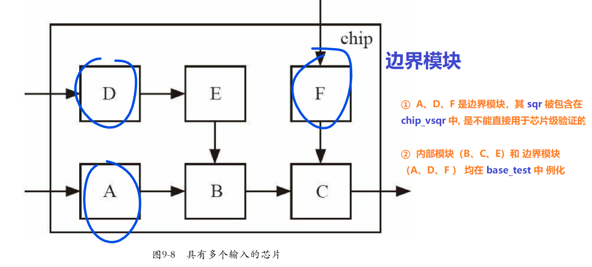

  
  - `v_seq` 

    ① 一般的`v_seq`是用来调度`seq`的，而`seq`都只在模块级别，所以这些`v_seq`无法用于芯片级别验证。

    ② <font color=red>例外</font>：有<font color=blue >**两种** </font><font color=red>**模块级别的 `seq`** </font>可以直接用于 <font color=red>**芯片级别的验证**</font>
                    =>  边界输入端的普通的`seq`（不是`v_seq`）
                    =>  寄存器配置的  `seq`

    - 边界输入端的普通的`seq`（不是`v_seq`）
    
      ```verilog
      """（模块级）边界输入端的普通的`seq`（不是`v_seq`）可以直接应用于芯片级别的验证"""
      ## 《上图中的边界模块A_seq代码》
      	// 略
      
      ##  模块级别的使用《A_vseq》
      class A_vseq extends uvm_sequence; 
          virtual task body();
              A_seq 	aseq;
              `uvm_do_on(aseq, 	p_sequencer.p_sqr)
      		…
      	endtask
      endclass
      ```
      
      ```verilog
      """芯片级别的使用"""
      ## 《chip_vseq》
      class chip_vseq extends uvm_sequence; 
        virtual task body();
              A_seq	 aseq; 
      		D_seq 	 dseq;
              F_seq fseq; 
      		fork
      			`uvm_do_on(aseq, p_sequencer.p_a_sqr)
                  `uvm_do_on(aseq, p_sequencer.p_d_sqr)
                  `uvm_do_on(aseq, p_sequencer.p_f_sqr) 
              join
      		…
      	endtask
      endclass
      ```
      
      
      ​    
    - 寄存器配置的  `seq`
    
      - 定义： <font color=red>第2种定义方式也是不能重用的</font>
      
        ```verilog
        """【定义方式】寄存器配置的  `seq` """
        ## 定义方式一：✔，可以重用
        class A_cfg_seq extends uvm_sequence;
        	A_reg_model		 p_rm;
            
        	virtual task body(); 
                p_rm.xxx.write();                 //@@  ✔✔✔
        		…
        	endtask
        endclass
        
        
        ## 定义方式二：X，不能重用
        class A_cfg_seq extends uvm_sequence;
            A_reg_model		 p_rm;
            
            virtual task body();
                p_sequencer.p_rm.xxx.write();     //@@  XXX  不能通过 p_sqr 启动，因为那样就固定了
        		…
        	endtask
        endclass
        ```
      
        
      
      - 模块级启动
      
        - 方式1：指针传递 的形式
        - 方式2：<font color=blue>`get_root_blocks`</font>
      
        ```verilog
        """【启动应用-模块级】寄存器配置的  `seq` """
        ## 模块级启动应用《模块v_seq》
        class A_vseq extends uvm_sequence; 
            virtual task body();
                A_cfg_seq	 c_seq;
                c_seq = new("c_seq");
                c_seq.p_rm = p_sequencer.p_rm;         //@@ 指针传递 的形式
                c_seq.start(null);
            endtask
        endclass
        ```
      
        
      
      - 芯片级启动
      
        - 方式1：指针传递 的形式
        - 方式2：在芯片级时，`root block`已经和模块级别不同，单纯靠`get_root_blocks`已经无法满足要求。此时需要<font color=blue>`find_blocks`、`find_block`、`get_blocks`和`get_block_by_name`</font>等函数
      
        ```verilog
        """【启动应用-芯片级】寄存器配置的  `seq` """
        ## 芯片级启动应用《芯片v_seq》
        class chip_vseq extends uvm_sequence; 
            virtual task body();
        		A_cfg_seq	 A_c_seq;
        		A_c_seq = new("A_c_seq");
                A_c_seq.p_rm = p_sequencer.p_rm.A_rm;        //@@ 指针传递 的形式
        		A_c_seq.start(null);
        		…
        	endtask
        endclass
        ```
      
        


### Ch. 10_高级应用

<font color=red>**要点总结**：</font>

#### 10.1.1 interface

<a name="Ctrl跳转3">——`interface`实现`driver`的部分功能</a>

​	`interface` 中可以做的事情 汇总：
​			① <font color=blue>声明/定义 变量</font>
​			② 定义<font color=blue>任务</font>、<font color=blue>函数</font>
​			③ <font color=blue>`always`</font>、<font color=blue>`assign`</font>、<font color=blue>`initial`</font> 语句
​			④ 实例化其他 <font color=blue>`interface`</font>（封装特定功能）
​			⑤ <font color=blue>编码转换</font>，例如：8b10b转换、曼彻斯特编码 ;   <font color=red>与transaction完全无关</font>


#### 10.1.2 可变时钟

- 3类：

  ①  不同测试用例之间：时钟频率不同
                相同测试用例：保持不变

  ②  同一个测试用例：时钟频率 **变换**， 且 <font color=blue>不关心 </font>过渡期

  ③  同一个测试用例：时钟频率 **变换**， 且 关心 <font color=blue>**过渡期**</font>  和 <font color=blue>**稳定期的波动**</font>（稳定是理论上的稳定）

  ​			a. 过渡期，验证时，需要单独一个  可变时钟模型
  ​            b. 稳定期波动，......................................................

  

- 时钟实现：

  - 一般做法：在 `top_tb` 中实现

    ```verilog
    """《top_tb代码》时钟部分"""
    initial begin 
        clk = 0;
        forever begin
        	#100 clk = ~clk; 
        end
    end
    ```

  

  - 实现第一种可变时钟：

    ① step1：将时钟模块独立成一个文件
    ② step2：通过 `inlude` 包含在 `top_tb`中
    ③ step3：构造一个可变时钟，有2种办法：
    						a.   重新编写一个《test_clk.sv》文件
    						b.   【非直线的获取法】在<font color=blue>`case`</font>中 设置  `config_db` ， 在 <font color=blue>`top_tb`</font>中 使用 `config_db`

    ```verilog
    """实现第一种可变时钟"""
    //@@ step1:将时钟模块独立成一个文件
    ##《时钟模块文件》
    `ifndef TEST_CLK     //@@ 
    `define TEST_CLK     //@@
        initial begin
            clk = 0; 
            forever begin
                #100 clk = ~clk; 
            end
        end
    `endif  //@@                     
    
    
    //@@ step2：通过 `inlude` 包含在 `top_tb`中  +//@@ ③ step3：构造一个可变时钟，第2种办法 config_db使用
    ##《top_tb代码》
    module top_tb();
    	…
    	`include "test_clk.sv"           //@@  inlude + 文件
        
        //@@ 使用可变时钟
        initial begin
        	static real clk_half_period = 100.0;
            clk = 0;
            #1;          //@@ 延迟1s，等set完
            if(uvm_config_db#(real)::get(uvm_root::get(),   // 组件名
                                         "uvm_test_top",    // 组件路径
                                         "clk_half_period", // 变量名
                                         clk_half_period))  // 变量
        		`uvm_info("top_tb", $sformatf("clk_half_period is %0f", clk_half_per iod), UVM_MEDIUM)
        	forever begin
    			#(clk_half_period*1.0ns) clk = ~clk;
            end
    	end
    endmodule
    
    
    //@@ ③ step3：构造一个可变时钟，第2种办法 config_db设置
    ##《case代码》设置可变时钟
    function void my_case0::build_phase(uvm_phase phase);
    	…
        uvm_config_db#(real)::set(this,                  // 组件
                                  "",                    // 组件路径
                                  "clk_half_period",     // 变量名
                                  200.0);                // 变量值
    endfunction
    ```

    

  - 实现第二种可变时钟：

    同第一种实现方法：`config_db` 方法

    ```verilog
    """实现第二种可变时钟：`config_db` 方法"""
    ##《case代码》设置set 
    task my_case0::main_phase(uvm_phase phase);
        #100000;
        uvm_config_db#(real)::set(this,                  // 组件
                                  "",                    // 组件路径
                                  "clk_half_period",     // 变量
                                  200.0);                // 设置的值	
        #100000;
        uvm_config_db#(real)::set(this,                 // 组件
                                  "",                   // 组件路径
                                  "clk_half_period",    // 变量
                                  150.0);               // 设置的值	
    endtask
        
        
        
    ##《top_tb代码》获得get
    	initial begin
    		static real clk_half_period = 100.0;
            clk = 0;
            fork
    			forever begin
                    uvm_config_db#(real)::wait_modified(uvm_root::get(),
                                                        "uvm_test_to p",
                                                        "clk_half_perio");
    				void'(uvm_config_db#(real)::get(uvm_root::get(),
                                                    "uvm_test_top",
                                                    "clk_half_period",
                                                     clk_half_period);
                   `uvm_info("top_tb", $sformatf("clk_half_period is %0f", clk_half_p eriod), UVM_MEDIUM)
    			end
    			forever begin
    				#(clk_half_period*1.0ns) clk = ~clk;
    			end
    	  join
    end
    ```

    

  - 实现第三种可变时钟：

    <font color=red>不能用`config_db` 方法</font>，需要 <font color=blue>**专门编写一个时钟接口**</font>

    ​		a. 过渡期，验证时，需要单独一个  <font color=blue>**可变时钟模型**</font>
    ​        b. 稳定期波动，......................................................

    在这种使用方式中，<font color=blue>时钟接口</font>被封装在了一个<font color=blue>`component`</font>中。
    在需要新的时钟模型时，只需要<font color=blue>从`clk_model`派生一个新的类</font>，然后在新的类中实现时钟模型。
    使用<font color=blue>`factory机制`的重载</font>功能将`clk_model`用新的类重载掉。通过这种方式，可以将时钟设置为任意想要的行为。

    ```verilog
    """实现第三种可变时钟：编写一个时钟接口 法"""
    ## 《时钟接口interface》
    interface clk_if();          //@@ 做成interface接口
    	logic clk;
    endinterface
        
        
    ##《top_tb代码》例化 和 引用
        clk_if   cif();                 //@@  例化
    	dut my_dut(
            .clk		(cif.clk),      //@@  引用
    		.rst_n		  (rst_n),
            …);
        
        
    ##《clk_model可变时钟模型》从uvm_component派生
    class clk_model extends uvm_component;          //@@ 继承自uvm_component
        `uvm_component_utils(clk_model)        //@@ factory注册
    	virtual clk_if	 vif;
    	real half_period = 100.0;
    	…
        // build_phase
    	function void build_phase(uvm_phase phase);
    		super.build_phase(phase);
    		if(!uvm_config_db#(virtual clk_if)::get(this,
                                                    "",
                                                    "vif",
                                                    vif))           //@@ interface正常
    			`uvm_fatal("clk_model", "must set interface for vif")
    		void'(uvm_config_db#(real)::get(this,
                                            "",
                                            "half_period",
                                             half_perio d));
    		`uvm_info("clk_model", $sformatf("clk_half_period is %0f", half_peri od), UVM_MEDIUM)
    	endfunction 
        
        // run_phase
    	virtual task run_phase(uvm_phase phase);
    		vif.clk = 0;
    		forever begin
    			#(half_period*1.0ns) vif.clk = ~vif.clk;
    		end
        endtask
    endclass
        
        
    ##《env代码》clk_model例化可变时钟模型
    class my_env extends uvm_env;
    	clk_model clk_sys;
        
        // env build_phase
    	virtual function void build_phase(uvm_phase phase);
            clk_sys = clk_model::type_id::create("clk_sys", this);    //例化 可变时钟模型 组件
    	endfunction
    endclass
    ```

    


#### <a name="Ctrl跳转16">10.2~10.3  seq 高阶</a>

##### ◻ layer sequence

- 10.2.1~10.2.2  `seq `代码重用、 `tr` 重用

  - **常见数据包**：IP包、UDP包、TCP包、<font color=blue>mac包</font>（my_transaction）、太网包（底层包）
     PS ：`IP`包整体被作为`mac`包的负荷

  - **场景**：在发送的`mac`包中指定`IP`地址等数据，这需要约束`mac`包`pload`的值。在`ip_transaction`如此多的域中，如果要对其中某一项进行约束，那么需要仔细计算每一项在`my_transaction`的`pload`中的位置，稍微一不小心就很容易搞错。如果需要约束多项，那么更加麻烦。

  - **解决办法**：
    ①   <font color=blue>`base_sequence`中独立封装 函数/任务</font>：

    ​		与`ip`相关的代码写成一个函数，而与`mac`相关的代码写成另外一个函数，将这些基本的函数放在`base_seq`中。在新建测试用例时，从`base_seq`派生新的`seq`，并调用之前写好的函数。
    ②  <font color=blue>使用`layer sequence`</font>：  

    ​		  一个`seq`负责产生`ip_transaction`，另外`seq`负责产生`my_transaction`，前者将产生的`ip_transaction`交给后者

  - **场景代码**：

    - 《ip_transaction》

      ```verilog
      """ip_transaction"""
      class ip_transaction extends uvm_sequence_item;
          //ip header
          rand bit [3:0] version;//protocol version
          rand bit [3:0] ihl;// ip header length
          rand bit [7:0] diff_service; // service type, tos(type of service)
          rand bit [15:0] total_len;// ip telecom length, include payload, byte
          rand bit [15:0] iden;//identification
          rand bit [2:0] flags;//flags
          rand bit [12:0] frag_offset;//fragment offset
          rand bit [7:0] ttl;// time to live
          rand bit [7:0] protocol;//protocol of data in payload
          rand bit [15:0] header_cks;//header checksum
          rand bit [31:0] src_ip; //source ip address
          rand bit [31:0] dest_ip;//destination ip address
          rand bit [31:0] other_opt[];//other options and padding
          rand bit [7:0] payload[];//data
       	…
      endclass
      ```

      

    - 操作A：《case代码》pload施加约束

      | uvm代码                | 注释                                                       |
      | ---------------------- | ---------------------------------------------------------- |
      | tr. pack_bytes(data_q) | 将所有数据打包成一个`tr`的<font color=blue>动态数组</font> |

      ```verilog
      """操作A：对my_transaction的pload施加约束"""
      virtual task my_case::body();
      	my_transaction	 m_tr;   //@@
      	ip_transaction 	ip_tr;   //@@
      	byte unsigned data_q[];
      	int data_size;
      
      	repeat (10) begin
      		ip_tr = new("ip_tr");
      		assert(ip_tr.randomize() with {ip_tr.src_ip == 'h9999; ip_tr.dest_ ip == 'h10000;})
      		ip_tr.print();
              data_size = ip_tr.pack_bytes(data_q) / 8;   //@@使用pack_bytes函数将所有数据打包成一个动态数组作为my_transaction的pload。
      		m_tr = new("m_tr");
      		assert(m_tr.randomize with{m_tr.pload.size() == data_size;});
      		for(int i = 0; i < data_size; i++) begin
                  m_tr.pload[i] = data_q[i];   //@@
      		end
      		`uvm_send(m_tr)
      	end
      	#100;
      endtask
      ```

      

    - 操作B：《case代码》测 CRC错误

      ```verilog
      """操作B：测 CRC错误"""
      //@@  相比操作A 只改变了一行
      virtual task my_case::body();
      	my_transaction 	m_tr; 
      	ip_transaction 	ip_tr;
          byte unsigned data_q[]; 
          int data_size;
          repeat (10) begin
              ip_tr = new("ip_tr");
              assert(ip_tr.randomize() with {ip_tr.src_ip == 'h9999; ip_tr.dest_ip = = 'h10000;}) 
              ip_tr.print();
              data_size = ip_tr.pack_bytes(data_q) / 8; 
              m_tr = new("m_tr");
              assert(m_tr.randomize with{m_tr.pload.size() == data_size; m_tr.crc_er r == 1}); //@@ 唯一差异点
              for(int i = 0; i < data_size; i++) begin
                  m_tr.pload[i] = data_q[i];
              end
      		`uvm_send(m_tr)
      	end
      	#100;
      endtask
      ```

      

    - 操作C：《case代码》施加给DUT `IP checksum`错误的包

      ```verilog
      """操作C：施加给DUT `IP checksum`错误的包"""
      //@@ 相比操作A 只是插入一句对header_cks赋随机值的语句。与mac相关的代码不需要做任何变更
      virtual task my_case::body();
      	my_transaction 	m_tr; 
          ip_transaction 	ip_tr;
          byte unsigned 	data_q[]; 
          int data_size;
          
          repeat (10) begin
      		ip_tr = new("ip_tr");
      		assert(ip_tr.randomize() with {ip_tr.src_ip == 'h9999; ip_tr.dest_ip = = 'h10000;}) 			ip_tr.header_cks = $urandom_range(10000, 0);          //@@ 唯一差异点
              ip_tr.print();
              data_size = ip_tr.pack_bytes(data_q) / 8; 
              m_tr = new("m_tr");
              assert(m_tr.randomize with{m_tr.pload.size() == data_size;});
              for(int i = 0; i < data_size; i++) begin
                  m_tr.pload[i] = data_q[i];
              end
      		`uvm_send(m_tr)
      	end
      	#100;
      endtask
      ```

      

  - **方法一**：   <font color=blue>`base_sequence`中独立封装 函数/任务</font>

    ​			略

  - **方法二**： <font color=blue>使用`layer sequence`</font>：  

    - 操作A 示例：
      - 产生`ip_transaction`的`seq` + `sqr`

        ```verilog
        """产生`ip_transaction`的`seq` 和 `sqr`"""
        //@@ 【!!!】 objection要在ip_sequence中控制
        ##《ip_seq》
        class ip_sequence extends uvm_sequence #(ip_transaction);   //@@ ip_tr传入
        	…
        	virtual task body();
        		ip_transaction 	ip_tr;
        		repeat (10) begin
        			`uvm_do_with(ip_tr, {ip_tr.src_ip == 'h9999; ip_tr.dest_ip == 'h10000;})
        		end
        		#100;
        	endtask 
            `uvm_object_utils(ip_sequence)
        endclass
        
        ##《ip_sqr》
        class ip_sequencer extends uvm_sequencer #(ip_transaction);
        	function new(string name, uvm_component parent);
        		super.new(name, parent);
            endfunction 
        	`uvm_component_utils(ip_sequencer)
        endclass
        ```

      

      - `my_transaction` 的 `sqr` +  `seq`

        | uvm代码                        | 注释                                  |
        | ------------------------------ | ------------------------------------- |
        | uvm_seq_item_pull_port #（tr） | <a name="Ctrl跳转17">sqr 端口声明</a> |

        ```verilog
        """my_sqr创建端口、例化，用于接收ip_tr"""
        //@@ 将`ip_transaction`能够交给产生`my_transaction`的 `seq` ，需要 在`my_sqr` 例化一个端口
        ##《my_sqr》
        class my_sequencer extends uvm_sequencer #(my_transaction);    //@@ my_tr传入
            uvm_seq_item_pull_port #(ip_transaction) 	ip_tr_port;    //@@ 声明 sqr 端口
            
        	function void build_phase(uvm_phase phase);
        		super.build_phase(phase);
                ip_tr_port = new("ip_tr_port", this);     //@@ 例化端口
        	endfunction
        endclass
        
        
        ##《my_seq》
        class my_sequence extends uvm_sequence #(my_transaction);
        	…
        	virtual task body();
        		my_transaction		 m_tr;
        		ip_transaction 	 	ip_tr;
        		byte unsigned 	 data_q[];
        		int data_size;
                
                while(1) begin     //@@ 故意做成无限循环，类似driver的无限循环，objection要在ip_sequence中控制
        			p_sequencer.ip_tr_port.get_next_item(ip_tr);
        			data_size = ip_tr.pack_bytes(data_q) / 8;
        			m_tr = new("m_tr");
        			assert(m_tr.randomize with{m_tr.pload.size() == data_size;});
        			for(int i = 0; i < data_size; i++) begin
        				m_tr.pload[i] = data_q[i];
        			end
        			`uvm_send(m_tr)
        			p_sequencer.ip_tr_port.item_done();
        		end
        	endtask 
        
        	`uvm_object_utils(my_sequence)
            `uvm_declare_p_sequencer(my_sequencer)    //@@ 由于需要用到sequencer中的ip_tr_port，所以要使用declare_p_sequencer宏声明sequencer
        endclass
        ```

        

      
      - `agt` ：
        ① 例化两个`sqr`
        ② 将`my_sqr`和`ip_sqr`的相关端口连接在一起

        ```verilog
        """agt例化两个sqr"""
        ##《agt》
        //@@ 例化
        function void my_agent::build_phase(uvm_phase phase);
            super.build_phase(phase);
            if (is_active == UVM_ACTIVE) begin
                ip_sqr = ip_sequencer::type_id::create("ip_sqr", this);   //@@
                sqr = my_sequencer::type_id::create("sqr", this);    //@@
        		drv = my_driver::type_id::create("drv", this);
        	end
        	mon = my_monitor::type_id::create("mon", this);
        endfunction
        
        
        //@@ 连接
        function void my_agent::connect_phase(uvm_phase phase);
        	super.connect_phase(phase);
        	if (is_active == UVM_ACTIVE) begin
                drv.seq_item_port.connect(sqr.seq_item_export);   // drv 连接 sqr
                sqr.ip_tr_port.connect(ip_sqr.seq_item_export);  //@@  sqr的 ip_tr_port 连接 ip_sqr的export
                											     //@@ 【!!!】
        	end
        	ap = mon.ap;             //@@ 指针赋值
        endfunction
        ```

        

      
      - `case` ：启动这两个`seq`

        ```verilog
        """【方式1：default_sequence】启动这2个`seq`"""
        //@@ build_phase config_db set  default_sequence 的方式启动
        ##《case》
        function void my_case0::build_phase(uvm_phase phase);
            super.build_phase(phase); 
        	uvm_config_db#(uvm_object_wrapper)::set(this,
                                                    "env.i_agt.ip_sqr.main_phase",
                                                    "default_sequence",
                                                    ip_sequence::type_id::get());
            uvm_config_db#(uvm_object_wrapper)::set(this,
                                                    "env.i_agt.sqr.main_phase",
                                                    "default_sequence",
                                                    my_sequence::type_id::get());
        endfunction
        ```

        

        ```verilog
        """【方式2：v_seq】启动这2个`seq`"""
        //@@ 前提是：vsqr中已经有成员变量指向相应的sqr
        ##《case》
        class case0_vseq extends uvm_sequence; 
            virtual task body();
                ip_sequence 	ip_seq;
            	my_sequence		 my_seq; 
                fork
        			`uvm_do_on(my_seq, p_sequencer.p_my_sqr) 
                join_none
        		`uvm_do_on(ip_seq, p_sequencer.p_ip_sqr) 
            endtask
        endclass
        ```

        

    - 接下来：操作B 和 操作C 

      操作B：
      构建CRC错误包的激励时，只需要建立`crc_seq`，并在`my_sqr`上启动。而此时`ip_sqr`上依然是`ip_seq`，不受影响。

      操作C：
      构建checksum错误的激励时，也只需要建立`cks_err_seq`，并在`ip_sqr`上启动，此时`my_sqr`上启动的是`my_seq`，不受影响。


##### ◻ `try_next_item` 、时间槽

- 10.2.3~10.2.4    `try_next_item`  vs `get_next_item`、时间槽

  - <font color=blue>`try_next_item` </font> vs <font color=blue>`get_next_item`</font>

    `get_next_item` 的劣势，也是 `try_next_item` 的优势：

    ① 某些协议并不是上电复位后马上开始发送<font color=blue>正常数据</font>，而是开始发送一些 <font color=blue>空闲数据`seq`</font>。而这些空闲数据，是有特定要求的，且不是一成不变的。`get_next_item` 在上电复位后  很难处理  发送的空闲数据`seq`。

    ② `drop_objection`后的`drain_time` 也需要发送 空闲数据，但是此时`seq` 已经停止工作，`driver`无法驱动这些空闲数据`seq`

    

  - 时间槽

    SV通过 <font color=blue>事件驱动</font> 进行仿真，通过 <font color=blue>时间槽</font> 来管理它们。    <font color=red>**<暂时没有深入看，没搞懂>**</font>

    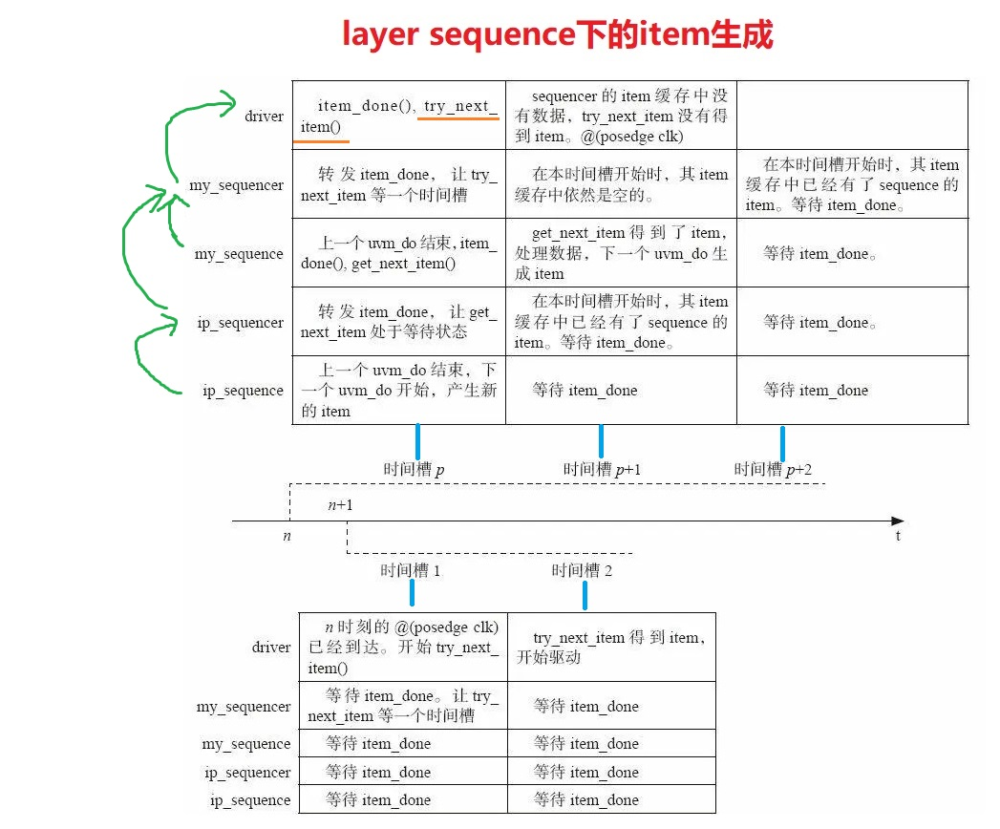

  - `try_item_item`弊端：	

    可能会导致过早的被 `driver` 调用

    解决办法：
    	①   `uvm_wait_for_nba_region();`

    ​	②  错峰技术的使用

    - 方法一：<font color=blue>`uvm_wait_for_nba_region();`</font>

      | uvm代码                    | 注释                                                         |
      | -------------------------- | ------------------------------------------------------------ |
      | uvm_wait_for_nba_region(); | 延迟一个时间槽（主动等待非激活/空闲状态）<br />避免driver的try_next_item调用过早 |

      ```verilog
      """try_next_item 优化掉get_...，且避免driver的try_next_item调用过早"""
      ##《driver》
      //@@ drive_idle 不驱动task
      task my_driver::drive_idle(); 
      	`uvm_info("my_driver", "item is null", UVM_MEDIUM)
      	@(posedge vif.clk);
      endtask 
      
      //@@ main_phase：驱动激励
      task my_driver::main_phase(uvm_phase phase);
      	…
      	while(1) begin
              uvm_wait_for_nba_region();   //@@ 延迟一个时间槽
              seq_item_port.try_next_item(req);   //try_next_item
      		if(req == null) begin
      			dirve_idle();
              end
      		else begin
      			drive_one_pkt(req);
      			seq_item_port.item_done();
              end
      	end
      endtask
      ```

      存在弊端：多一个`layer seq`，就要多用一次`uvm_wait_for_nba_region();`

      解决办法：错峰技术的使用

      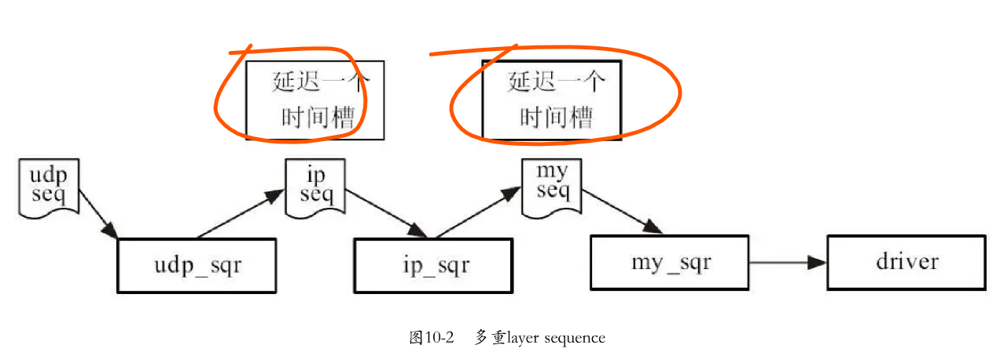

    

    

    

    - 方法二：<font color=blue>错峰技术的使用</font>

      将`item_done`和`try_next_item` 在不同时刻被调用 （之前默认是同一时刻，这回导致时间槽的竞争）

      ```verilog
      """主动错峰后的时间槽-代码"""
      ##《driver》
      //@@ driver idle
      task my_driver::drive_idle();
          `uvm_info("my_driver", "item is null", UVM_MEDIUM)
      endtask 
      
      //@@ main_phase 发送激励
      task my_driver::main_phase(uvm_phase phase);
      	…
      	while(1) begin
              @(posedge vif.clk); //@@ 【核心精髓】在item_done被调用后，并不是立即调用try_next_item，而是等待下一个时钟的上升沿到来后再调用
              seq_item_port.try_next_item(req);  //try_next_item
      		if(req == null) begin
      			drive_idle();
      		end
      		else begin
      			drive_one_pkt(req);
      			seq_item_port.item_done();
      		end
      	end
      endtask
      ```

      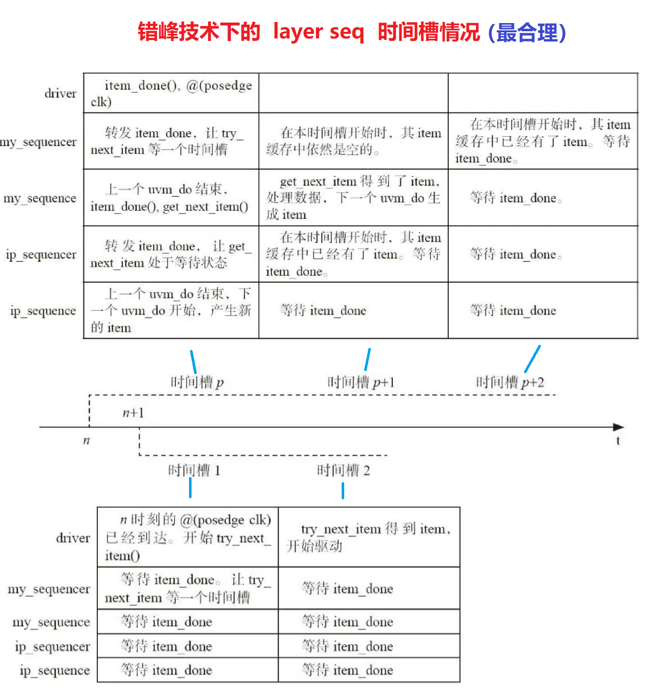

    

##### ◻ seq 心跳功能实现

- 10.3.1 心跳功能的实现

  两种方式：

  ① 方式一：`driver` 中实现，`driver`负责包 的产生、发送    <font color=red><不推荐，需要写手动仲裁></font>

  ② 方式二：在`seq`中实现，无限循环的`seq`，当需要时发送一个心跳包    <font color=red><推荐，UVM自带seq仲裁，后期还能便于修改心跳频率></font>

  ​                    方式二用到的知识点：
  ​													   a.  `seq`的启动方式： <font color=blue>`default_sequence`</font>、 <font color=blue> `virtual_sequence`</font>
  ​													   b.  uvm`seq`仲裁： <font color=blue> `grab`</font>
  ​                                                       c.  <font color=blue>  `fork...join_none`</font>
  ​                                                       d.  心跳 `seq`中 <font color=blue>  `raise_objection`</font>、 <font color=blue> `drop objection`</font>
  
  - 方式一：在`driver`实现
  
    ```verilog
    """在`driver`实现 心跳功能"""
    ##《driver》
    task my_driver::main_phase(uvm_phase phase); 
        fork
            while(1) begin 
                #delay;
                drive_heartbeat_pkt(); 
            end
            while(1) begin 
                seq_item_port.get_next_item(req); 
                drive_one_pkt(req); 
                seq_item_port.item_done();
            end 
        join
    endtask
    ```
  
    
  
  - 方式二：在 `seq`实现
  
    ```verilog
    """在`seq`实现 心跳功能"""
    ##《心跳_seq》
    class heartbeat_sequence extends uvm_sequence #(my_transaction);
        
    	virtual task body();
    		my_transaction 		heartbeat_tr;
            
    		while(1) begin
    			repeat(100) @(posedge p_sequencer.vif.clk);
                grab();   //@@ 排队到第一个位置
                starting_phase.raise_objection(this);    //@@ 
                    `uvm_do_with(heartbeat_tr, {heartbeat_tr.pload.size == 50;})
                    `uvm_info("hb_seq", "this is a heartbeat transaction", UVM_MEDIUM)
    			starting_phase.drop_objection(this);
    			ungrab();
    		end
    	endtask	
    	…
    endclass
    
    
    ##《normal_seq》
    class case0_vseq extends uvm_sequence #(my_transaction);
    	…
    	virtual task body();
    		case0_sequence 				normal_seq;
    		heartbeat_sequence		 heartbeat_seq;
            
    		heartbeat_seq = new("heartbeat_seq");
    		heartbeat_seq.starting_phase = this.starting_phase;       //@@ start_phase
            
    		fork
                heartbeat_seq.start(p_sequencer.p_sqr);   //@@ 手动启动   ,  也可以用 default_seq启动
    		join_none	  //@@  此处不能是 none，否则会一直卡在这里（因为是无限循环）
            
            `uvm_do_on(normal_seq, p_sequencer.p_sqr)      //@@ normal_seq 启动方式v_seq的uvm_do_on
    	endtask
    	…
    endclass
    ```
  
    


- 10.3.2 只将`v_seq`设置为`default_sequence`

  因为 `config_db：：set` 第2个参数是字符串，很难检查`bug`，所以应该尽量少用  `config_db：：set`,  只将`v_seq`设置为`default_sequence`              <font color='red'><只给`v_seq`设置一次></font>
  
  
  
  如果只将`virtual seq`设置为`default_sequence`，那么所有其他的`seq`都在其中<font color='blue'> 启动 </font>，这样就可以通过使用`v_seq`启动一个`seq`，然后直接赋值
  
  ```verilog
  """通过 v_seq 调用 seq，直接赋值（相当于config_db的set了）"""
  class case_vseq extends uvm_sequence; 
      virtual task body();
          normal_seq 		nseq; 
          nseq = new(); 
          nseq.xxx = yyy;             //@@ 
          nseq.start(p_sequencer.p_sqr)      //@@
      endtask
  endclass
  ```
  
  
  
  

##### <a name="Ctrl跳转18">◻`v_seq`的 进程 中断操作</a>

- 10.3.3 disable fork语句对原子操作的影响

  **错误方法**：直接使用`disable fork`  原子操作

  **问题点**：无法清除 原子操作（如 write）的标记位

  **正确方法**：针对原子操作：手动标记 + `break`

  - 错误示范

    ```verilog
    """错误做法: disable fork 原子操作"""
    ## 《v_seq代码》
    class caw_vseq extends uvm_sequence; 
        caw_seq 		demo_s;
        logic[31:0] 	rdata; 
        
        virtual task body();
            uvm_status_e 	status; 
            if(starting_phase != null)
                starting_phase.raise_objection(this);
            	demo_s = caw_seq::type_id::create("demo_s"); 
            	fork
                    begin
                        demo_s.start(p_sequencer.p_cp_sqr); 
                    end
                    while(1) begin
                        p_sequencer.p_rm.counter.write(status, 1, UVM_FRONTDOOR); //@@ write是原子操作
                    end
                join_any   //@@
            	disable fork;            //@@ write标记位未清除，会出现错误
    			p_sequencer.p_rm.counter.read(status, rdata, UVM_FRONTDOOR); 
                demo_s.start(p_sequencer.p_cp_sqr); 
                p_sequencer.p_rm.counter.read(status, rdata, UVM_FRONTDOOR);
                if(starting_phase != null)
                    starting_phase.drop_objection(this); 
        endtask
    endclass
    ```

    

  - 正确做法

    ```verilog
    """正确做法: 针对原子操作，标记+break"""
    class caw_vseq extends uvm_sequence; 
        caw_seq		 	 		demo_s;
        semaphore 	 m_atomic = new(1); 
        logic[31:0]				 rdata;
        
        virtual task body(); 
            uvm_status_e		 status;
            if(starting_phase != null)
                starting_phase.raise_objection(this);
            	demo_s = caw_seq::type_id::create("demo_s");
            	fork
        			begin
    					demo_s.start(p_sequencer.p_cp_sqr); 
                        m_atomic.get(1);         //@@ 标记下结束了 
                    end
                    while(1) begin 
                        if(m_atomic.try_get(1)) begin
                            p_sequencer.p_rm.counter.write(status, 1, UVM_FRONTDOOR);
                            m_atomic.put(1);
                        end
                        else begin
                            break;      //@@ 
                        end 
                    end
    			join       //@@ 
    			p_sequencer.p_rm.counter.read(status, rdata, UVM_FRONTDOOR); 
            	demo_s.start(p_sequencer.p_cp_sqr);
            	p_sequencer.p_rm.counter.read(status, rdata, UVM_FRONTDOOR);
            	if(starting_phase != null) 
                    starting_phase.drop_objection(this);
        		endtask 
    endclass
    ```

    

#### 10.4~10.6 参数

向 `DUT` 灌输不同的激励
为 `DUT` 配置不同的参数 -----    <font color=red>寄存器</font>
验证环境中独有的参数 -------    <font color=red>聚合参数</font> +  <font color=red>`config_db`</font>


##### <a name="Ctrl跳转19">◻ 寄存器 & DUT 参数</a>

- 10.4.1 <font color=red>寄存器模型</font>  <font color=blue>随机化 DUT参数 </font>

  如何缩小随机化的范围的方法，有3种：

  ​	① 指定寄存器 调用 `randomize函数`，其他不调用  

  ​	② 在调用整体的`randomize函数`时，为需要指定参数的寄存器指定约束     <font color=red><推荐></font>

  ​	③ 派生新`reg`类 +<font color=blue> `factory`重载</font>

  - 方法一：

    ```verilog
    """方法一：reg调用randomize()+变量约束"""
    //@@ 指定reg1 & reg2
    assert(p_rm.reg1.randomize() with {
        								reg_data.value == 5'h3;
    									});          
    assert(p_rm.reg2.randomize() with { 
        								reg_data.value >= 7'h9;
        							   });
    ```

    

  - 方法二：<font color=red><推荐></font>

    ```verilog
    """方法二：整体调用randomize()+指定reg.变量约束"""
    //@@ 指定reg1 & reg2
    assert(p_rm.randomize() with {
        						reg1.reg_data.value == 5'h3;
        						reg2.reg_data.value >= 7'h9}
          );
    ```

    

  - 方法三：

    ```verilog
    """派生新`reg`类 + `factory`重载"""
    //@@ 指定reg1 & reg2
    class dreg1 extends my_reg1;
        constraint {
            		reg_data.value == 5'h3;
        }
    endclass
    
    class dreg2 extends my_reg2; 
        constraint{
            		reg_data.value >= 7'h9;
        }
    endclass
    ```

    

- 10.4.2 单独的 <font color=blue>参数类</font>

  **需求场景**：公司脚本创建寄存器模型 + <font color=red>跨寄存器 的约束 </font>较多时（在寄存器模型中加入`constraint`就比较困难）

  **解决办法**：把 DUT中 需要随机化的参数，单独汇集出来 建立一个`dut_parm`类，并在其中指定默认约束，在`v_seq`中例化这个类、随机化变量、调用任务

  ```verilog
  """DUT参数的类-代码示例""""
  ## 《dut_parm.sv》DUT参数类
  class dut_parm extends uvm_object;
      reg_model 			p_rm;
  	rand bit[15:0] 		a_field0;
      rand bit[15:0]		b_field0; 
  	
      //@@ 特定的约束
  	constraint ab_field_cons{
  							a_field0 + b_field0 >= 100; 
      }
  	
      //@@ 操作方法
  	task update_reg();
  		p_rm.rega.write(status, a_field0, UVM_FROTDOOR);
  		p_rm.regb.write(status, b_field0, UVM_FROTDOOR);
      endtask
  endclass
  
  
  ##《v_seq》在v_seq 例化、随机化变量、调用任务
  class case0_cfg_vseq extends uvm_sequence;
  	…
      virtual task body();
  		dut_parm 	pm;            
          pm = new("pm");        //@@ 例化
          assert(pm.randomize());     //@@ 随机化 变量
          pm.p_rm = p_sequencer.p_rm;   //【寄存器本身的东西】
          pm.update_reg();         //@@ 调用变量
  	endtask
  	…
  endclass
  ```

  


##### ◻ 聚合参数

- 10.5 聚合参数的定义、优势、缺点

  - 定义：

    对于一个大的项目来说，要配置的  <font color=blue>tb参数 </font>可能有千百个。如果全部使用`config_db:set`的写法，肯定不合适。

    一种比较好的方法就是将这1000个变量放在一个  <font color=blue>专门的类 （聚合参数）</font>里面来实现

    ```verilog
    """聚合参数-代码示例"""
    ##《聚合类》定义
    class my_config extends uvm_object; 
        rand int	 var1;
    	…
    	rand int	 var1000; 
    	constraint default_cons{
            					var1 = 7;                //@@ 聚合类的约束中定义变量值
    							…
    							var1000 = 999;
        }
    
        `uvm_object_utils_begin(my_config)
            `uvm_field_int(var1, UVM_ALL_ON)
                …
            `uvm_field_int(var1000, UVM_ALL_ON)
    	`uvm_object_utils_end
    endclass
    
    ##《base_test代码》使用
    classs base_test extends uvm_test; 
    	my_config	 cfg;
    
    	//@@ 按照组件 一个一个config_db::set
    	function void build_phase(uvm_phase phase);
            super.build_phase(phase);
        	cfg = my_config::type_id::create("cfg");
            uvm_config_db#(my_config)::set(this,                    //@@ 
                                           "env.i_agt.drv", 
                                           "cfg", 
                                           cfg);
            uvm_config_db#(my_config)::set(this, 
                                           "env.i_agt.mon", 
                                           "cfg",
                                           cfg);
    		…
    	endfunction
    endclass
    
    
    ## 《driver代码》使用
    class my_driver extends uvm_driver#(my_transaction); 
        my_config	 cfg;
        `uvm_component_utils_begin(my_driver)
    		`uvm_field_object(cfg, UVM_ALL_ON UVM_REFERENCE)
    	`uvm_component_utils_end
        
        task main_phase(uvm_phase phase);
             while(1) begin
                 seq_item_port.get_next_item(req);
                 pre_num = $urand_range(cfg.pre_num_min, cfg.pre_num_max);    //@@ 调用
                 …
                 //drive this pkt, and the number of preamble is pre_num 
                 seq_item_port.item_done();
             end 
        endtask    
    endclass
            
    
    ##《case代码》使用：修改参数
    class case100 extends base_test;
        function void build_phase(uvm_phase phase); 
            super.build_phase(phase); 
            cfg.pre_num_max = 100;                //@@  直接赋值，而不是config_db::set
            cfg.pre_num_min = 8;
    		…
    	endfunction
    endclass
    ```

  

  - 进一步优化聚合类使用：<font color=blue>加入 `interface`</font>

    在`top_tb`中将`interface`通过`config_db：：set`的方式传递给`base_test`，在`base_test`中实例化`cfg`后就可以直接赋值

    【注意】`base_test`中实例化`cfg`的名字要与`top_tb`中`config_db：：set`的路径参数一致

    ```verilog
    """interface聚合类"""
    ## 《my_config.sv》
    class my_config extends uvm_object;
        `uvm_object_utils(my_config)
        virtual my_if 	vif; 
    
    	function new(string name = "my_config");
    		super.new(name);
    		$display("%s", get_full_name());
    		if(!uvm_config_db#(virtual my_if)::get(null, get_full_name(), "vif", vif))
    			`uvm_fatal("my_config", "please set interface") 
    
    	endfunction 
    endclass
                
                
    ##《driver代码》使用
    task my_driver::main_phase(uvm_phase phase);
            cfg.vif.data <= 8'b0           //@@ 
            cfg.vif.valid <= 1'b0;
            while(!cfg.vif.rst_n)
    			@(posedge cfg.vif.clk);
    endtask
      
            
    //@@  `base_test`中实例化`cfg`的名字要与`top_tb`中`config_db：：set`的路径参数一致
    ##《base_test代码》使用
    function void base_test::build_phase(uvm_phase phase);
        …
        cfg = new("cfg");         //@@ 命名一致，也可使用【方式二】 cfg = new({get_full_name(), ".cfg"});  
                                  //@@ 方式二，new里面是一个字符串拼接
    endfunction
            
    ##《top_tb代码》使用     
    module top_tb;
    	…
    	initial begin
    		uvm_config_db#(virtual my_if)::set(null,
                                               "cfg",      //@@ 命名一致，【方式二】 "uvm_test_top.cfg",  
                                               "vif",
                                               input_if);
        end 
    endmodule
    ```

    

  - 优势与问题

    - 优点：
      ①  大大方便了验证平台的搭建；
      ②  使用聚合类减少了`config_db：：set`的使用，也会大大降低出错的概率

    - 缺点：

      ① 将一些属于某个`uvm_component`的变量变成对所有的`uvm_component`可见，容易出错
      ② 降低了验证平台的 <font color=blue>可重用性</font>。
           为了优化 可重用性的问题：可以 缩小聚合参数的粒度，将一个聚合参数类分成多个小的聚合参数类，但是这样做，与直接使用`config_db`相比，优势就没了，所以这是一种平衡

      

   

##### <a name="Ctrl跳转21">◻ config_db</a>

- <font color=red>**最大问题**</font>： `config_db机制`的 最大的问题 在于：  不对`set函数`的 <font color=blue>第二个参数</font> 进行检查

- **措施**：

  - **component 类型**：

    - <font color=red>**<避免出错>**</font>`component` 的路径的第2个参数，可以通过 **<font color=red>  `get_full_name（）`</font> **来获得。

      【注意】 **前提**是 <font color=red>UVM树已经形成</font>，不然使用`env.i_agt.drv`的形式进行引用会引起<font color=red>空指针</font>的错误

      ​				确保树形成的办法有2个 <font color=blue>（但是2个办法都对`top_tb` 的 `config_db：：set`无效）</font>：

      ​						①  一种是所有的 <font color=blue>实例化工作</font>  都在各自的<font color=blue> new函数 </font>中完成           <font color=red>**<常用>**</font>
      ​						②  另一种是 将`uvm_config_db：：set ` 移到 `connect_phase`，
      ​							  在`end_of_elaboration_phase`或`start_of_simulation_phase`调用 `uvm_config_db：：get`

    - <font color=red>**<检查出错>**</font> 还可以用在`uvm_config_db：：set`之后，利用  `check_all函数` （自定义函数）对向`component`传递的参数进行 有效性检查 

    

  - **object 类型**：

  ​		暂无很好的办法


- **极端做法**：<font color=blue>完全不用  `config_db机制`</font>        <font color=red>**<不建议>**</font>

  - 结构性的参数_取代办法：

    例化组件的时候，直接赋值参数的值

  - 非结构性的参数_取代办法：

    ①  方法一：可以完全在`build_phase`之后的 <font color=blue>任意`phase`</font> 中使用 <font color=blue>绝对路径引用 </font>进行设置

    ②  方法二：..................................................................................... <font color=blue>静态变量</font>........................

    

- **相关代码**

  - 避免出错：`component` 用<font color=red>  `get_full_name（）`</font> 

    | uvm代码               | 注释               |
    | --------------------- | ------------------ |
    | 组件. get_full_name() | 获得组件的绝对路径 |

    ```verilog
    """避免出错：component 用  get_full_name（）"""
    ##《driver》
    uvm_config_db#(int)::set(null,
                             env.i_agt.drv.get_full_name(),   //@@ 
                             "pre_num", 
                             100);
    
    ##《seq》可有 sqr + 通配符 而来
    uvm_config_db#(int)::set(null,
                             {env.i_agt.sqr.get_full_name(),“.*”},       //@@ 字符串拼接
                             "pre_num", 
                             100);
    ```

    

  - 使用 `get_full_name（）` 的前提：确保UVM树已形成

    - 方法1：

      ```verilog
      """【方法1】使用 `get_full_name（）` 的前提：确保UVM树已形成"""
      //@@ 一种是所有的 实例化工作 都在各自的new函数中完成， 当整个验证平台运行到build_phase时，UVM树已经实例化完毕
      ## 《base_test代码》
      function base_test::new(string name, uvm_component parent);
          super.new(name, parent);
          env = my_env::type_id::create("env", this);
      endfunction
      
      ## 《env代码》
      function my_env::new(string name, uvm_component parent);        //@@
          super.new(name, parent);
          i_agt = my_agent::type_id::create("i_agt", this);          //@@
          o_agt = my_agent::type_id::create("o_agt", this);          //@@ 
          … 
      endfunction
      ```

      

    - 方法2：

      ```verilog
      """【方法2】使用 `get_full_name（）` 的前提：确保UVM树已形成"""
      //@@ 将`uvm_config_db：：set ` 移到 `connect_phase`
      //@@ 在`end_of_elaboration_phase`或`start_of_simulation_phase`调用 `uvm_config_db：：get`
      ##《case代码》
          function void my_case0::connect_phase(uvm_phase phase);   //@@ connect_phase中set
          uvm_config_db#(int)::set(null,
                                   env.i_agt.drv.get_full_name(),
                                   "pre_num", 
                                   100);
          
      endfunction
          
      ##《driver代码》
          function void my_driver::end_of_elaboration_phase(uvm_phase phase);   //@@ end_of_elaboration_phase  或是  start_of_simulation_phase 中 get
          void'(uvm_config_db#(int)::get(this,
                                         "",
                                         "pre_num", 
                                         pre_num
                                        ));
      endfunction
      ```

      

    

  -  <font color=red> `check_all_config函数`</font> ，检查`config_db::set`参数二有效性

    ```verilog
    """自定义函数，检查config_db::set参数二的有效性"""
    ##《check_config.sv》
    class check_config extends uvm_object;
        static uvm_component 	uvm_nodes[string];
        static bit 				is_inited = 0;
        
        //@@ check_all_config函数
        function void check_all_config();
            check_config::check_all();  //@@   这个全局函数会调用check_config的静态函数check_all：
        endfunction
    	
        //@@ check_all函数
        static function void check_all();
            uvm_component 			c;
            uvm_resource_pool 		rp;
            uvm_resource_types::rsrc_q_t 	rq;
            uvm_resource_types::rsrc_q_t 	q;
            uvm_resource_base 		r;
            uvm_resource_types::access_t 	a;
            uvm_line_printer 		printer; 
    
            c = uvm_root::get();
            if(!is_inited)
                init_uvm_nodes(c);  //@@  这个函数先根据is_inited的值来调用init_nodes函数，将uvm_nodes联合数组初始化。
    
            rp = uvm_resource_pool::get();
            q = new;
            printer=new();
    
            foreach(rp.rtab[name]) begin
                rq = rp.rtab[name];
                for(int i = 0; i < rq.size(); ++i) begin
                    r = rq.get(i);
                    //$display("r.scope = %s", r.get_scope());
                    if(!path_reachable(r.get_scope)) begin
                        `uvm_error("check_config", "the following config_db::set's path is not reachabl
                        r.print(printer);
                        r.print_accessors();
                    end
                end
            end
        endfunction
             
        //@@ init_uvm_nodes函数
        static function void init_uvm_nodes(uvm_component c);
    		uvm_component 			children[$];
    		string 					cname;
    		uvm_component 			cn;
    		uvm_sequencer_base 		sqr; 
            
    		is_inited = 1;
    		if(c != uvm_root::get()) begin
    			cname = c.get_full_name();
    			uvm_nodes[cname] = c;
    			if($cast(sqr, c)) begin
    				string 	tmp;
                    $sformat(tmp, "%s.pre_reset_phase", cname);      //@@ 对各个phase的支持
    				uvm_nodes[tmp] = c;     
                    $sformat(tmp, "%s.main_phase", cname);     //@@ tmp = cname & “.main_phase”
    				uvm_nodes[tmp] = c;
    				$sformat(tmp, "%s.post_shutdown_phase", cname);
    				uvm_nodes[tmp] = c;
                end
    		end
    		c.get_children(children);
    		while(children.size() > 0) begin
    			cn = children.pop_front();
    			init_uvm_nodes(cn);
    		end
        endfunction
                                   
        //@@ path_reachable 函数
        static function bit path_reachable(string scope);
    		bit 	err;
    		int 	match_num; 
            
    		match_num = 0;
    		foreach(uvm_nodes[i]) begin
                err = uvm_re_match(scope, i);  //@@ config_db：：set的第二个参数支持通配符，所以path_reachable通过调用uvm_re_match函数来检查路径是否匹配。
    			if(err) begin
    				//$display("not_match: name is %s, scope is %s", i, scope);
    			end
    			else begin
    				//$display("match: name is %s, scope is %s", i, scope);
    				match_num++;
    			end
    		end
    		return (match_num > 0);
        endfunction
    endclass                 
    ```

    

  - 完全不用  `config_db机制`

    - 结构性的参数-取代

      ——例化的时候，赋值其值

      ```verilog
      """结构性参数的取代：例化的时候，赋值其值"""
      ##《env代码》
      virtual function void build_phase(uvm_phase phase); 
          super.build_phase(phase);
          if(!in_chip) begin
              i_agt = my_agent::type_id::create("i_agt", this);       //@@ 例化组件
              i_agt.is_active = UVM_ACTIVE;        //@@ 
          end
          …
      endfunction
      ```

      

    - 非结构性参数-取代

      - 方法1：绝对路径引用

        ```verilog
        """【示例1】方法1：非结构性参数取代：绝对路径引用"""
        ## 《case代码》
        function void my_case0::connect_phase(uvm_phase phase); 
            //uvm_config_db#(int)::set(this, "env.i_agt.drv", "pre_num", 100);   
            env.i_agt.drv.pre_num = 100;      //@@ 替换上面的句子
        endfunction
        ```

        

        ```verilog
        """【示例2】方法1：非结构性参数取代：绝对路径引用"""
        //@@  v_seq 应用场景，前提是v_seq已经启动（启动方式2种default_sequence 和手动start）
        ## 《case代码》启动v_seq 
        //@@ 方式一：default_sequence
        function void my_case0::build_phase(uvm_phase phase); 
            super.build_phase(phase); 
            uvm_config_db#(uvm_object_wrapper)::set(this,
                                                    "v_sqr.main_phase",
                                                    "default_sequence",
                                                    case0_vseq::type_id::get());
        endfunction
            
        //@@ 方式二：手动start
        task my_case0::main_phase(uvm_phase phase); 
            case0_vseq 		vseq;
            
            super.main_phase(phase);
            vseq = new("vseq"); 
            vseq.starting_phase = phase;     //@@
            vseq.start(vsqr);  //@@
        endtask
            
        
            
        ##《v_seq代码》
        class case0_vseq extends uvm_sequence;
        	virtual task 		body();
        	my_transaction 		tr;
        	drv0_seq 			seq0;
        	drv1_seq 			seq1;
        	base_test 			test_top;
            uvm_component 		children[$];
                
        	uvm_top.get_children(children);
        	foreach(children[i]) begin
        		if($cast(test_top, children[i])) ;
        	end
        
        	if(test_top == null)
        		`uvm_fatal("case0_vseq", "can't find base_test 's instance")
        		fork
        			`uvm_do_on(seq0, p_sequencer.p_sqr0);
        			`uvm_do_on(seq1, p_sequencer.p_sqr1);
        			begin
        			#10000;
        				//uvm_config_db#(bit)::set(uvm_root::get(), "uvm_test_top.env0.scb", "cmp_en", 0);
        				test_top.env0.scb.cmp_en = 0;
        			#10000;
        				//uvm_config_db#(bit)::set(uvm_root::get(), "uvm_test_top.env0.scb", "cmp_en", 1);
        				test_top.env0.scb.cmp_en = 1;
        			end
        		join  
            #100;
        	endtask
        endclass
        ```

        

        ```verilog
        """【示例3】方法1：非结构性参数取代：绝对路径引用"""
        //@@ 在top_tb中使用config_db对interface进行的传递，可以使用绝对路径的方式
        ##《base_test代码》
        function void base_test::connect_phase(uvm_phase phase); 
        	env0.i_agt.drv.vif = testbench.input_if0;
        	… 
        endfunction
        ```

        

      - 方法2：静态变量   

        ```verilog
        """方法2：非结构性参数取代：静态变量"""
        ##《interface代码》
        class if_object extends uvm_object;
        	…
            static if_object 	me;   //@@ 【？？？】
            static function if_object get();          //@@ get函数是if_object的一个静态函数，通过它可以得到if_object的一个实例，并对此实例中的interface进行赋值
        		if(me == null) begin
        			me = new("me");
        		end
        		return me;
        	endfunction 
            
        	virtual my_if 	input_vif0;
            virtual my_if 	output_vif0;
            virtual my_if 	input_vif1;
            virtual my_if 	output_vif1;
        endclass
            
        //@@ 在top_tb中为这个类的interface赋值
        ##《top_tb代码》
        module top_tb;
        	initial begin
        		if_object 	if_obj;
                
                if_obj = if_object::get();
                if_obj.input_vif0 = input_if0;
                if_obj.input_vif1 = input_if1;
                if_obj.output_vif0 = output_if0;
                if_obj.output_vif1 = output_if1;
        	end 
        endmodule
            
        //@@  在base_test的connect_phase（或build_phase之后的其他任一phase）对所有的interface进行赋值
        ##《base_test代码》
        function void base_test::connect_phase(uvm_phase phase);
            if_object		 if_obj;
            if_obj = if_object::get();  //@@ get函数是if_object的一个静态函数，通过它可以得到if_object的一个实例，并对此实例中的interface进行赋值
            v_sqr.p_sqr0 = env0.i_agt.sqr;
            v_sqr.p_sqr1 = env1.i_agt.sqr;x
            env0.i_agt.drv.vif = if_obj.input_vif0;
            env0.i_agt.mon.vif = if_obj.input_vif0;
            env0.o_agt.mon.vif = if_obj.output_vif0;
            env1.i_agt.drv.vif = if_obj.input_vif1;
            env1.i_agt.mon.vif = if_obj.input_vif1;
            env1.o_agt.mon.vif = if_obj.output_vif1;
        endfunction
        ```

        

    

    


